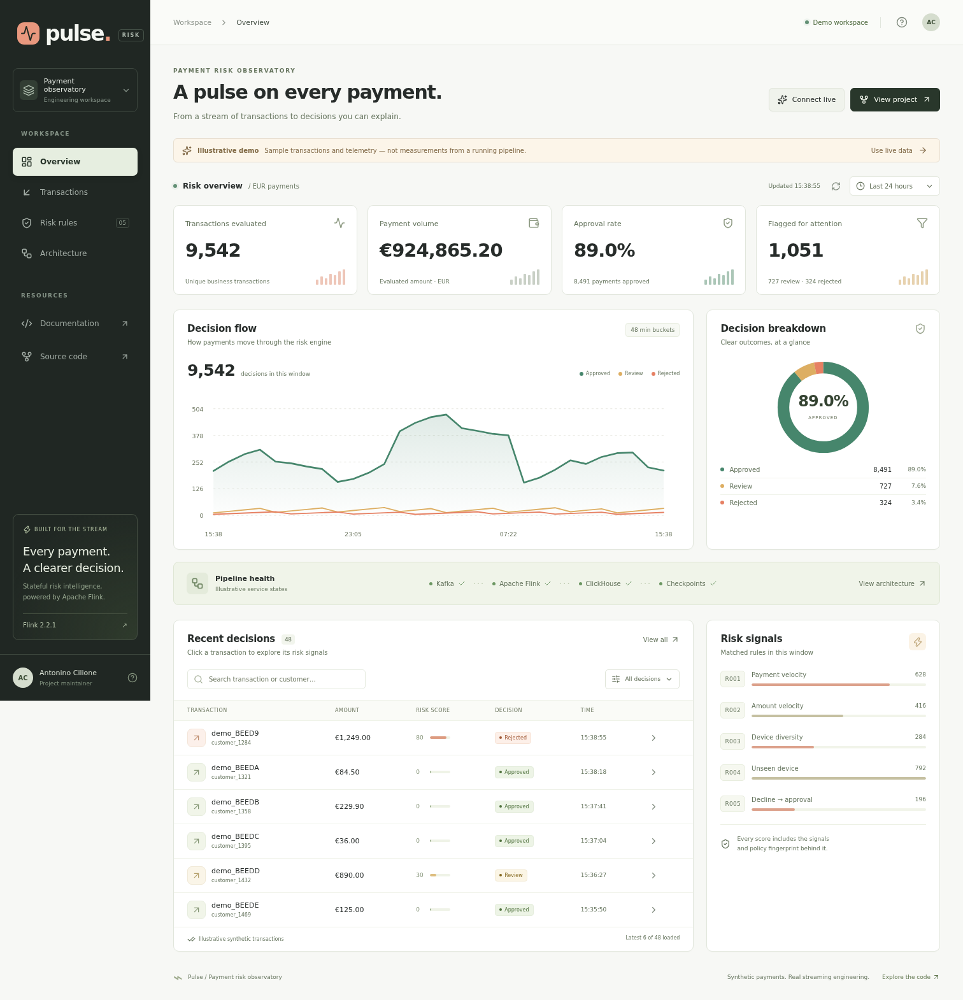
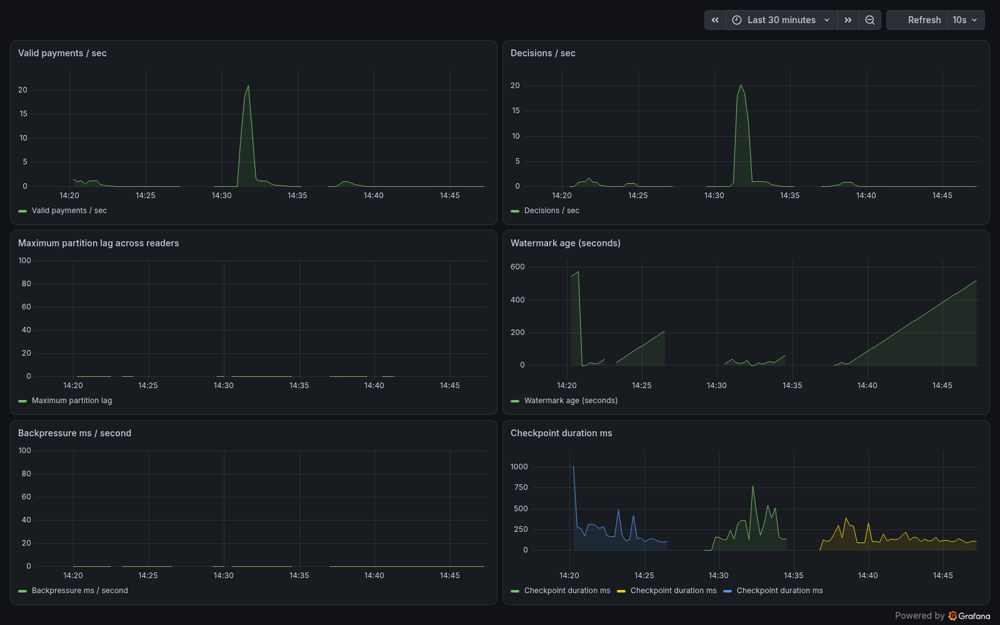

# Real-time payment risk

A Java/Flink DataStream application that turns synthetic Kafka payments into explainable decisions. It includes global event deduplication, event-time ordering, five stateful rules, broadcast updates, transactional Kafka output, and an independent ClickHouse materializer.

The original [technical specification](flink-payment-risk-functional-technical-spec.md) is preserved. [Architecture decisions](docs/architecture.md) define the implemented semantics and limits. This is a production-oriented reference implementation; see [verification evidence](docs/acceptance.md) for qualification status.

## Visual dashboard

**[Open the interactive demo](https://acilione.github.io/payment-risk/)** · [Website guide](docs/website.md)

Pulse is a dedicated dashboard with decision trends, transaction search and inspection, five explainable risk signals, pipeline health, and an architecture walkthrough. The hosted demo uses clearly labeled synthetic data; the local website reads your running ClickHouse/Flink pipeline.



After `make up`, open **http://localhost:23001**. To add the website to an already running stack, use `make website`. Grafana remains available for detailed operational monitoring.

## Run locally

Local validation includes real Kafka/Flink transactions, worker recovery and a durable savepoint restore. A bounded run reconciled 1,000/1,000 payments at 100 events/sec with no duplicate decisions. Committed-output p95 was 20.8 seconds with ten-second watermarks and checkpoints; [measurement details](docs/performance.md) distinguish that from sub-millisecond rule evaluation. The [ADRs](docs/adr/README.md) record the design choices.

Use Linux or WSL, Docker Compose, Python 3, Java 17+ and at least 8 GB available memory. Containers use Java 21. Service ports are separated from `marketplace_lakehouse` and bind to localhost.

Allow approximately 15 GB free disk space for initial images, build cache and local data. Check Windows host space as well as the Linux guest filesystem when using WSL.

```bash
make test
make up
make run-job
make integration-test
make generate-load
```

`make up` generates uncommitted random local credentials, builds the image, creates topics/schemas and starts infrastructure. Submission is explicit. Behind a corporate TLS proxy, pass the trusted Java certificate store as a build secret:

```bash
docker build --secret id=maven_truststore,src=/etc/ssl/certs/java/cacerts \
  -f infrastructure/docker/Dockerfile -t payment-risk:0.1.0 .
docker compose build website
docker compose up -d --no-build
```

Alternatively, `make image-local` packages the tested host-built JAR into the same runtime image, avoiding Maven downloads inside Docker. Build the website with `docker compose build website`, then use `docker compose up -d --no-build`.

| Service | Local endpoint |
|---|---|
| Pulse website | http://localhost:23001 |
| Flink | http://localhost:28082 |
| Grafana | http://localhost:23000 |
| Prometheus | http://localhost:29090 |
| Registry compatibility API | http://localhost:28081/apis/ccompat/v7 |
| ClickHouse | http://localhost:28123 |
| MinIO console | http://localhost:29001 |
| Kafka | localhost:29092 |

Grafana uses `admin` and `GRAFANA_ADMIN_PASSWORD` from `.env`. Two dashboards are provisioned. `make down` preserves data volumes.



Additional captures: [risk dashboard](docs/screenshots/risk-business.png) and [running Flink job](docs/screenshots/flink-running.png). Recreate them with `scripts/capture-dashboards.py` using Playwright/Chromium.

## Decision semantics

Avro payments use integer EUR cents. Valid events are deduplicated by event ID for 24 hours of processing time, then keyed by customer. Accepted events wait for the watermark and are ordered by `(event_time, event_id)`. Events at or behind the watermark go to `payments.late`.

Windows are `(event_time - horizon, event_time]`. Count, amount and unique-device features include current; new-device and decline-sequence rules inspect preceding activity. Scores cap at 100: below 30 approves, 30–69 reviews, and 70+ rejects.

| Rule | Default condition | Score |
|---|---|---:|
| R001 | More than 5 payments in 2 minutes | 25 |
| R002 | More than EUR 3,000 in 10 minutes | 35 |
| R003 | At least 3 devices in 15 minutes | 20 |
| R004 | Device unseen for 30 days; amount at least EUR 800 | 30 |
| R005 | Approval following at least 4 declines in 10 minutes | 40 |

Buffered events retain their admitted rule snapshot. SHA-256 fingerprints cover full rule payloads and score thresholds. Built-in rules start at version 1; updates begin at version 2 and affect subsequently admitted events. Separate rule/payment inputs have no global activation order; details are in the architecture document.

```bash
docker compose cp config/rule-count-v2.json jobmanager:/tmp/rule.json
docker compose exec -T jobmanager java -cp /opt/flink/usrlib/risk-engine.jar \
  com.portfolio.paymentrisk.tools.PlatformCli rule /tmp/rule.json
```

## Verify and operate

The live rule integration scenario uses monotonic timestamp versions and restores baseline parameters afterward. Once it has run, the example version-2 update is stale; assign a version greater than the latest accepted update before publishing another manual change.

```bash
make check
make integration-test
make recovery-test
make stop-job       # non-draining stop with savepoint
make restore
make integration-test
```

`make benchmark` records acknowledged/committed IDs, latency, environment and checkpoint evidence in `artifacts/benchmark.json`. `make verify-observability` checks all provisioned dashboard queries against live metrics. `make verify-deployment` requires Helm and the Python dependencies listed in CI.

The load CLI supports `steady`, `burst`, `hot-key`, `high-cardinality`, `duplicates`, `out-of-order`, `late`, `malformed`, and `fixture`: `generate SCENARIO COUNT RATE [RUN_ID]`. Keep traffic advancing: bounded event-time watermarks do not finalize the last ten seconds of an idle unbounded source. Acceptance fixtures explicitly advance all partitions.

Consumers requiring transactional visibility use `read_committed`. ClickHouse inserts precede offset commits; replay is resolved by `ReplacingMergeTree(source_offset)` keyed by transaction ID. Query `risk.decisions_current` (using `FINAL`) for business counts. Transaction-to-customer mapping and topic partition counts must stay stable, or the materializer needs a migration.

| Path | Purpose |
|---|---|
| `src/main/java/com/portfolio/paymentrisk` | Job, engine, operators, codecs, CLI, materializer |
| `src/test` | Rules, state/restore, TTL, contracts |
| `schemas` | Avro contracts and historical writers |
| `infrastructure` | Containers, Helm and Terraform |
| `web` | React/TypeScript dashboard and read-only Fastify API |
| `observability`, `dashboards` | Prometheus and Grafana |
| `scripts`, `docs` | Operations, verification and design |

Read [operations](docs/operations-runbook.md), [deployment](docs/deployment.md), [dependency policy](docs/version-policy.md), [performance](docs/performance.md).
