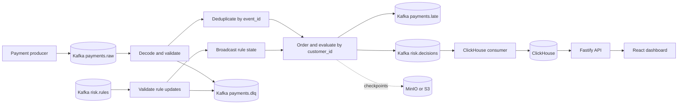

# Payment risk

A Java application that evaluates payment events with Apache Flink. Kafka carries the payments and rule updates; Flink checks each customer's recent activity and writes an `APPROVE`, `REVIEW`, or `REJECT` decision. A separate consumer stores those decisions in ClickHouse, and a React dashboard displays the results.

The included producer generates synthetic EUR payments. The application calculates risk scores; it does not authorize payments or move money. [View the dashboard demo](https://acilione.github.io/payment-risk/).

## Contents

- [Technologies](#technologies)
- [Processing flow](#processing-flow)
- [Feature implementation](#feature-implementation)
- [Data model](#data-model)
- [Run locally](#run-locally)
- [Configuration](#configuration)
- [Operations](#operations)
- [Deployment](#deployment)
- [Tests and CI](#tests-and-ci)
- [Performance](#performance)

## Technologies

| Technology | How this project uses it |
|---|---|
| Java 17 bytecode / Java 21 containers | Implements the Flink job, rule engine, Avro codec, Kafka producer, and ClickHouse consumer. |
| Apache Flink 2.2.1, DataStream API | Connects the payment and rule streams, partitions customer state, evaluates event-time timers, and coordinates checkpoints with Kafka transactions. |
| Apache Kafka 4.3.1 and Flink Kafka connector 5.0.0-2.2 | Stores input payments, rule updates, decisions, invalid records, and late payments in separate topics. |
| Avro 1.12.1 and Apicurio Registry 3.3.2 | Define and validate the wire format. Schema IDs let consumers resolve the writer schema against the application's reader schema. PostgreSQL stores registry metadata. |
| Jackson 2.21.7 | Represents decoded records, serializes the pending/history state, and constructs the canonical rule payload used for fingerprints. |
| Embedded RocksDB | Stores Flink's keyed event, customer-history, and device state. Incremental checkpoints copy state to object storage. |
| MinIO / Amazon S3 | Hold checkpoints and savepoints. Compose uses MinIO through Flink's S3 filesystem plugin; the Kubernetes configuration uses an S3 bucket. |
| ClickHouse 26.8.2.7 | Stores decisions in `ReplacingMergeTree` and provides aggregates and transaction queries through a `FINAL` view. |
| React 19, TypeScript, Vite 8 | Implement and build the dashboard. Charts are rendered with SVG and CSS; Lucide provides icons. |
| Node.js 24 and Fastify 5 | Serve the dashboard and its read-only API. The API queries ClickHouse, Flink REST, and Prometheus. |
| Prometheus 3 and Grafana 13 | Collect Flink and application metrics, evaluate alerts, and display provisioned operational and risk dashboards. |
| Docker Compose, Helm, Flink Kubernetes Operator, Terraform | Start the local stack, describe the Kubernetes Flink deployment, and provision S3 state storage. |
| Maven, JUnit, Playwright, GitHub Actions | Package the Java application, test rules and managed state, check browser behavior, and run build, integration, and image checks. |

Exact dependency and image versions are declared in [pom.xml](pom.xml), [web/package.json](web/package.json), [web/package-lock.json](web/package-lock.json), [docker-compose.yml](docker-compose.yml), and the Dockerfiles. The web runtime version is also recorded in [web/.nvmrc](web/.nvmrc).

Compose builds the MinIO server and client from pinned upstream source commits using [minio.Dockerfile](infrastructure/docker/minio.Dockerfile), because the community images are no longer available. The server uses release `RELEASE.2025-10-15T17-29-55Z`; the client uses `RELEASE.2025-08-13T08-35-41Z`. Each image includes the upstream license. These containers provide S3 storage for local development and integration tests; the Kubernetes deployment uses Amazon S3.

## Processing flow


```mermaid
flowchart LR
  P[Payment producer] --> K[(Kafka payments.raw)]
  K --> V[Decode and validate]
  V --> D[Deduplicate by event_id]
  D --> E[Order and evaluate by customer_id]
  R[(Kafka risk.rules)] --> RV[Validate rule updates]
  RV --> B[Broadcast rule state]
  B --> E
  V --> Q[(Kafka payments.dlq)]
  RV --> Q
  E --> L[(Kafka payments.late)]
  E --> O[(Kafka risk.decisions)]
  O --> M[ClickHouse consumer]
  M --> C[(ClickHouse)]
  C --> A[Fastify API]
  A --> W[React dashboard]
  E -. checkpoints .-> S[(MinIO or S3)]
```

[PaymentRiskJob.java](src/main/java/com/portfolio/paymentrisk/PaymentRiskJob.java) builds this pipeline. Payments first use `keyBy(event_id)` for deduplication, then `keyBy(customer_id)` for rule evaluation. The second partitioning step places one customer's payments on the same processing task. Rule updates use broadcast state so every risk-processing task receives them.

## Feature implementation

### Payment ingestion, schemas, and validation

Kafka values use Confluent-compatible framing: a zero magic byte, a four-byte schema ID, and the Avro binary record. [AvroCodec.java](src/main/java/com/portfolio/paymentrisk/serialization/AvroCodec.java) looks up the writer schema through Apicurio's compatibility API and uses `GenericDatumReader` with the application's packaged reader schema. It caches up to 256 writer schemas. Runtime serializers look up registered schemas; topic and schema creation belong to the bootstrap command.

[RawDeserializer.java](src/main/java/com/portfolio/paymentrisk/source/RawDeserializer.java) calls validation before assigning the source event timestamp. This prevents malformed or far-future timestamps from advancing the watermark. [Validate.java](src/main/java/com/portfolio/paymentrisk/processor/Validate.java) checks the Avro record and the payment fields: nonblank identifiers, positive bounded amounts, EUR currency, ISO country codes, supported payment statuses, and positive event times no more than five minutes ahead of the validation clock. Payloads larger than 1 MiB are rejected.

Invalid payments and invalid rule updates go to the `payments.dlq` side output. Each record includes the original topic, partition, offset, schema ID, error code, and up to 4,096 bytes of the Kafka value encoded as base64. Registry connection, authentication, and server failures propagate to Flink recovery instead of labeling valid payments as bad data.

### Duplicate detection

[Deduplicate.java](src/main/java/com/portfolio/paymentrisk/processor/Deduplicate.java) is a `KeyedProcessFunction` with `ValueState<Boolean>` named `event-seen-v1`. Because the input is keyed by `event_id`, the same event is suppressed even if it is submitted with a different customer ID or Kafka offset.

The first occurrence writes `true` and passes downstream. Later occurrences increment a duplicate counter and produce no output. Flink's processing-time TTL defaults to 24 hours, uses `OnCreateAndWrite`, and never returns expired values. Reading a duplicate does not refresh the TTL, and downtime counts toward expiry. The state is checkpointed, so a restored job remembers IDs still within that period.

Deduplication checks event IDs, not transaction IDs. Two different events for one transaction can both be evaluated. The ClickHouse replacement key handles their query representation separately.

### Event-time ordering and late payments

[CustomerRiskProcessor.java](src/main/java/com/portfolio/paymentrisk/processor/CustomerRiskProcessor.java) stores accepted payments in `MapState<Long, String>`, where the key is `event_time` and the value is a JSON array of payments at that timestamp. It registers an event-time timer for each timestamp. When that timer fires, it sorts the bucket by `event_id`, evaluates the payments, and adds each one to customer history before evaluating the next.

Each Kafka payment partition has a bounded-out-of-order watermark with a default ten-second allowance and sixty-second idleness timeout. The minimum watermark across active partitions determines how far the job can advance. This lets an event that arrives slightly out of order contribute to the correct customer's history before later events are evaluated.

The processor compares incoming timestamps with both the current watermark and a checkpointed `finalized-through-v1` timestamp for that customer. A payment at or behind either cutoff goes to `payments.late` with the original payment, cutoff, lateness, and observation time. It does not revise a decision or update customer history. Keeping the finalized timestamp in managed state prevents old input from changing retained history after a source watermark resets during recovery.

The rule stream marks itself idle because rule updates cannot define payment time. If all payment partitions become idle, the remaining buffered payments wait until valid input advances event time. Processing-time timers do not force them through. This is why a finite load run can leave its last few seconds pending.

### Five risk rules and decision scoring

[RiskEngine.java](src/main/java/com/portfolio/paymentrisk/domain/RiskEngine.java) is a pure calculation: it receives the current payment, previously evaluated customer history, device last-seen timestamps, and the payment's rule snapshot. It does not perform network calls. [Rules.java](src/main/java/com/portfolio/paymentrisk/domain/Rules.java) defines the defaults and validates updates.

For an event at time `t`, each rule uses the interval `(t - window, t]`. The lower boundary is excluded. Payments already evaluated at the same timestamp are part of the preceding history because the processor orders them by event ID.

| Rule | Implementation | Default condition | Points |
|---|---|---|---:|
| R001: payment frequency | Filter retained history to the rule window, then add one for the current payment. | More than 5 payments in 2 minutes. | 25 |
| R002: total payment amount | Sum amounts from the current payment and same-currency history using integer cents and `Math.addExact`. | More than EUR 3,000 in 10 minutes. | 35 |
| R003: multiple devices | Build a `HashSet` of device IDs in the window and add the current device. | At least 3 devices in 15 minutes. | 20 |
| R004: new device and high amount | Look up the current device's last evaluated timestamp before updating device state. An absent timestamp, or one at or before the window boundary, counts as unseen. | Device not seen within 30 days and amount at least EUR 800. | 30 |
| R005: approval after declines | Check that the current input status is `APPROVED`, then count preceding `DECLINED` payments in the window. Declines need not be consecutive. | At least 4 declines in the previous 10 minutes. | 40 |

Matching rule weights are added and capped at 100. The default result is `APPROVE` below 30, `REVIEW` from 30 to 69, and `REJECT` from 70 upward. For example, a new-device payment of EUR 900 scores 30 and receives `REVIEW` if no other rule matches. If all five rules match, their 150 points are capped at 100 and the result is `REJECT`.

Every decision includes the score, matched rule IDs sorted by ID, corresponding rule types in `reason_codes`, payment identifiers, timestamps, and a rule-settings fingerprint. The input payment status (`APPROVED` or `DECLINED`) is distinct from the risk engine's output decision.

### Rule updates without restarting the job

The `risk.rules` topic is compacted by `rule_id`. The CLI validates a JSON rule file, encodes it as Avro, and publishes it with that key. Flink connects this stream to the customer stream through `KeyedBroadcastProcessFunction`; `processBroadcastElement` stores the latest accepted JSON configuration in broadcast `MapState` named `rules-json-v1`.

Packaged rules start at version 1. An update must have a higher version than the current value; equal or older versions are ignored and counted. Setting `enabled: false` in a higher version disables a rule. Validation limits IDs to R001-R005, accepts only the five implemented types, and checks the score, currency, threshold, and window against retained history. `updated_at` is metadata, not a scheduled activation time.

Each accepted payment stores a full rule snapshot alongside its pending record. A rule update therefore affects subsequently admitted payments without changing already buffered payments. `Rules.fingerprint` sorts rules and their fields and hashes the full payload plus the review/reject thresholds with SHA-256. The decision carries that fingerprint, not the full snapshot.

Payments and rules are separate Kafka inputs with no shared activation order. After recovery, records replayed since the last checkpoint can arrive in a different cross-input order and receive a different snapshot. The fingerprint identifies the settings actually used; it does not make historical rule activation deterministic.

### Customer state and recovery

The processor keeps three kinds of keyed state in embedded RocksDB:

| State | Stored data | Default retention or limit |
|---|---|---|
| Pending payments | Timestamp buckets containing complete payments and their rule snapshots. | Until evaluation; at most 100,000 pending events per customer. |
| Payment history | Timestamp buckets containing event time, amount, currency, device, and status. | One hour of event time; at most 100,000 retained events per customer. |
| Devices | Device ID to last evaluated event timestamp. | Thirty days of event time; at most 10,000 devices per customer. |

Additional `ValueState` tracks counts, the next cleanup timer, and the last finalized timestamp. One cleanup timer per customer schedules the next history or device expiry. Cleanup uses the timer's logical time so a jumped watermark cannot remove history before older pending payments are evaluated. When all customer data expires, the finalized timestamp is also cleared. Exceeding a state limit fails the job instead of discarding history and computing an incomplete score.

Compose configures incremental RocksDB checkpoints in MinIO every ten seconds. The Helm deployment uses S3 and a thirty-second interval. Flink restores managed state, timers, and source positions from checkpoints after failure. A non-draining savepoint preserves pending payments for an intentional stop and upgrade.

State descriptors use explicit string, long, and integer serializers; JSON holds the payment and rule structures. Stable operator UIDs and maximum parallelism 128 identify the state during restore. Changing descriptor names, serializers, or JSON meaning requires a tested migration; a JSON string is still a state schema.

### Transactional Kafka output

`PaymentRiskJob` creates three `KafkaSink` instances with `DeliveryGuarantee.EXACTLY_ONCE`: decisions, invalid records, and late records. Each sink uses a transaction prefix derived from the deployment prefix and topic. Flink coordinates Kafka transaction commits with completed checkpoints, and consumers use `isolation.level=read_committed` to hide uncommitted output.

This coordinates Kafka source positions, Flink state, and Kafka output across recovery. Producer duplicate detection remains a separate feature, and ClickHouse inserts are outside that transaction. Each active deployment must have a unique transaction prefix. Kafka transactions allow fifteen minutes; checkpoint delays and recovery must fit within that timeout.

### ClickHouse storage and repeated inserts

[DecisionMaterializer.java](src/main/java/com/portfolio/paymentrisk/tools/DecisionMaterializer.java) is a separate Java Kafka consumer. Auto-commit is disabled, isolation is `read_committed`, and each poll retrieves at most 500 decisions. The consumer decodes Avro, adds the decision topic's partition and offset, and sends a synchronous HTTP `INSERT ... FORMAT JSONEachRow` request to ClickHouse. It commits Kafka offsets only after a successful insert.

A crash between insertion and offset commit causes the same batch to be read and inserted again. [clickhouse.sql](infrastructure/docker/clickhouse.sql) handles this with `ReplacingMergeTree(source_offset) ORDER BY transaction_id`. The `risk.decisions_current` view runs `SELECT * FROM risk.decisions FINAL`, selecting the greatest offset for each transaction before background merges have removed repeated physical rows.

Use that view for counts, sums, and transaction queries. The stored `source_partition` is tracing metadata; it is not part of the replacement key. Kafka offsets are comparable only within one partition, so a transaction must continue mapping to the same customer and decision partition. Changing the decision topic's partition count or producer partitioning requires a storage migration. The table has no time partition that could separate versions of the same transaction.

### Dashboard and read-only API

[web/src/main.tsx](web/src/main.tsx) implements the React views for totals, decision trends, transaction inspection, rule descriptions, and architecture. TypeScript defines the API response types, Vite builds the frontend, and SVG/CSS render the charts. The rule screen displays packaged defaults; it is not an editor or a live view of broadcast state.

[web/server/overview.mjs](web/server/overview.mjs) queries ClickHouse for totals, 30 time buckets, rule-match counts using `arrayJoin(matched_rules)`, and the latest 100 decisions. Time windows use `processed_at` and are limited to 15 minutes, one hour, or 24 hours. The browser filters the loaded decisions by decision type or a case-insensitive match on transaction ID, customer ID, and matched rule IDs. Search therefore covers the latest 100 loaded decisions, not the complete database.

The API also reads Flink REST for the running job and latest checkpoint, and Prometheus for Kafka source lag. Kafka status is inferred from source metrics; it is not a direct broker probe. A checkpoint is marked current when it completed within three minutes. The reported finalization p95 is `processed_at - event_time`, which excludes the subsequent Kafka commit wait.

[web/server/app.mjs](web/server/app.mjs) serves `GET /api/overview?window=...` and the built frontend through Fastify. It validates the window, shares concurrent reads, caches each window for five seconds, and uses fixed SQL with read-only settings and query deadlines. The browser refreshes every fifteen seconds. A failed analytics request returns 503; previously loaded data remains visibly stale. Failed health probes do not replace successful decision queries.

The hosted demo is a separate static build using `VITE_DEMO_MODE=true`. [web/src/demo.ts](web/src/demo.ts) supplies 48 sample decisions and sample chart/status data. It makes no requests to the local pipeline. Live mode does not silently switch to sample data after a failure.

### Metrics and alerts

Validation, deduplication, and customer processing register Flink counters for valid/invalid input, suppressed duplicates, late payments, accepted/stale rule updates, decision types, rule matches, and processed amounts. A 1,024-sample histogram measures the `RiskEngine.evaluate` call in microseconds, excluding state preparation, buffering, and transaction commit waits. Labels use the fixed rule IDs and decision types rather than customer or transaction IDs.

Flink's Prometheus reporter exposes metrics on port 9249. [prometheus.yml](observability/prometheus/prometheus.yml) scrapes the JobManager and TaskManager every ten seconds. [Grafana provisioning](observability/grafana/provisioning) loads the dashboards from [dashboards/](dashboards).

[alerts.yml](observability/prometheus/alerts.yml) detects unavailable Flink metrics, no completed checkpoint for three minutes, invalid or late input above one event per second, and backpressure above 500 ms per second. Each expression also has a sustained-duration condition. `make verify-observability` executes the provisioned panel queries against live metrics.

### Topic setup and test data generation

[PlatformCli.java](src/main/java/com/portfolio/paymentrisk/tools/PlatformCli.java) uses Kafka's `Admin` client to create missing topics and registers the five Avro schemas. The rule topic has one compacted partition; other topics have three partitions. Local replication and minimum in-sync replicas are both one. Bootstrap leaves existing topic configuration unchanged. Apicurio's global compatibility rule is `BACKWARD`, and its metadata persists in PostgreSQL.

The producer uses Kafka's idempotent producer, `acks=all`, and Zstandard compression. Each run gets an ID prefix, values use a fixed random seed, and sends wait for acknowledgments before the rate limiter advances.

| Scenario | What the producer changes |
|---|---|
| `steady` | Distributes payments across 100 customer IDs at the requested rate. |
| `hot-key`, `burst` | Sends all payments to one customer; the rate argument controls load. `make spike-load` requests 1,000 events/second. |
| `high-cardinality` | Uses a different customer ID for every payment. |
| `duplicates` | Publishes each event twice with the same event ID and value. |
| `out-of-order` | Adds 100 ms to alternate event timestamps, allowing event-time inversions at sufficiently high input rates. |
| `late` | Subtracts one hour from event timestamps; classification still depends on the current watermark. |
| `malformed` | Sends a non-Avro payload. |
| `fixture` | Uses one customer, EUR 900 payments, rotating devices, and four initial declines to exercise the rules. |

The CLI syntax is `generate SCENARIO COUNT RATE [RUN_ID]`. Integration scenarios use additional records to advance every partition's watermark, then compare committed IDs and expected scores rather than just checking that the job is running.

### Credentials and access controls

[scripts/init-env.py](scripts/init-env.py) creates random local service credentials in the ignored `.env` file. Compose injects them into the services that need them. The website keeps ClickHouse credentials on the server; frontend `VITE_*` variables are compiled into public JavaScript and must not contain secrets.

The Fastify API uses Helmet security headers, a 1 KiB request-body limit, and a limit of 120 requests per minute. SQL uses an allowlisted time window, fixed query templates, read-only execution, and timeouts. The website container runs as a non-root user with a read-only filesystem and dropped capabilities. Compose exposes service ports on localhost.

The local API has no authentication. Hosting live payment data for other users requires authentication and authorization in front of it and a ClickHouse identity restricted to the required reads. For the Java services, `APP_ENVIRONMENT=production` checks HTTPS registry access, Kafka `SSL` or `SASL_SSL`, committed payment offsets, and a deployment-specific transaction prefix. The materializer also requires HTTPS for ClickHouse in production.

## Data model

Kafka carries five Avro record types: payments, rule updates, decisions, rejected records and late payments. Flink maintains the customer history needed to evaluate payments. ClickHouse stores decisions for queries and dashboards.

Customer, merchant and device IDs are references supplied by the payment producer. This project does not maintain separate customer, merchant or device tables.

### Identifiers and relationships

| Identifier | Meaning |
| --- | --- |
| `event_id` | Identifies a payment event. Flink suppresses repeated event IDs across all customers for the configured deduplication period. |
| `transaction_id` | Identifies the business transaction. ClickHouse uses it to select one current decision per transaction. |
| `customer_id` | Groups payments for risk evaluation. It is also the Kafka key for payment producers provided by this project and for decision and late-event outputs. |
| `decision_id` | Generated as `risk_` followed by `transaction_id`. It is not an independently generated identifier. |
| `rule_id` | Identifies one rule configuration. Supported IDs are `R001` through `R005`. |
| `error_id` | Identifies a rejected source record as `<topic>:<partition>:<offset>`. |

A customer can have many payment events. Each evaluated event produces a decision containing its event, transaction and customer IDs. Invalid payments go to the dead-letter topic; late payments go to the late-event topic; duplicates are suppressed.

Deduplication checks `event_id`, not `transaction_id`. Two events with different event IDs and the same transaction ID can both be evaluated, but ClickHouse will expose one current row for that transaction. Producers must therefore keep the meaning and customer assignment of each transaction ID consistent.

### Types and timestamps

The schemas are defined in [`schemas/`](schemas). Avro `long` and `int` are signed 64-bit and 32-bit integers. All fields are non-null. Only the dead-letter fields `source_timestamp` and `schema_id` have defaults, both `-1`.

Timestamps are Unix epoch milliseconds. `Transaction.event_time` explicitly uses Avro's `timestamp-millis` logical type; other timestamps use plain `long`. `window_seconds` is a duration in seconds, and `lateness_ms` is a duration in milliseconds.

Amounts use integer minor units. The application accepts EUR only, so `amount_minor: 12345` means €123.45.

### Payment event

Schema: [`transaction.avsc`](schemas/transaction.avsc).

| Field | Avro type | Meaning and validation |
| --- | --- | --- |
| `event_id` | `string` | Event identifier; nonblank, at most 128 characters. |
| `transaction_id` | `string` | Business transaction identifier; nonblank, at most 128 characters. |
| `customer_id` | `string` | Customer whose history is evaluated; nonblank, at most 128 characters. |
| `merchant_id` | `string` | Merchant reference; nonblank, at most 128 characters. |
| `amount_minor` | `long` | Amount in cents, from 1 to 1,000,000,000,000 inclusive. |
| `currency` | `string` | Must be `EUR`. |
| `country` | `string` | Must be a country code in Java's ISO country list. |
| `device_id` | `string` | Device reference; nonblank, at most 128 characters. |
| `status` | `PaymentStatus` enum | `APPROVED` or `DECLINED`, supplied by the payment source. |
| `event_time` | `long`, `timestamp-millis` | Business event time. Must be positive and no more than five minutes ahead of validation time. |
| `producer_time` | `long` | Producer-supplied timestamp. The risk calculation and event-time ordering do not use it; there is no additional range validation. |

The input `status` describes the payment event. It is separate from the risk engine's output `decision`.

Merchant and country values remain in the pending payment record but are not used by the current rules or copied into the decision. After evaluation, customer history retains only the fields needed for later calculations.

### Rule configuration

Schema: [`risk-rule.avsc`](schemas/risk-rule.avsc). The JSON file supplied to the rule-update CLI has the same fields.

| Field | Avro type | Meaning and validation |
| --- | --- | --- |
| `rule_id` | `string` | `R001` through `R005`. |
| `version` | `long` | Positive configuration version. An update must exceed the stored version to take effect. |
| `type` | `RuleType` enum | `TX_COUNT_VELOCITY`, `AMOUNT_VELOCITY`, `UNIQUE_DEVICES`, `NEW_DEVICE_HIGH_AMOUNT` or `DECLINE_THEN_APPROVAL`. |
| `enabled` | `boolean` | Whether the rule contributes to decisions. |
| `score` | `int` | Points added when the rule matches, from 0 to 100. |
| `window_seconds` | `long` | Positive lookback duration. Cannot exceed retained device history for `NEW_DEVICE_HIGH_AMOUNT`, or retained transaction history for other types. |
| `threshold` | `long` | Nonnegative trigger value. Its meaning depends on the rule type: event count, device count or amount in cents. |
| `currency` | `string` | Must be `EUR`. |
| `updated_at` | `long` | Nonnegative update timestamp. It does not schedule activation. |

The application starts with version 1 of each rule. Higher versions replace the current configuration; equal or older versions are ignored. Disable a rule by publishing a higher version with `enabled: false`.

Each admitted payment stores a complete rule snapshot in pending state. A later update does not alter that snapshot. Decisions record the snapshot's fingerprint, not its full contents. The fingerprint includes all rule fields and the review and reject thresholds.

### Risk decision

Schema: [`risk-decision.avsc`](schemas/risk-decision.avsc).

| Field | Avro type | Meaning |
| --- | --- | --- |
| `decision_id` | `string` | `risk_` followed by the transaction ID. |
| `event_id` | `string` | Input event identifier. |
| `transaction_id` | `string` | Input business transaction identifier. |
| `customer_id` | `string` | Input customer identifier. |
| `amount_minor` | `long` | Input amount in cents. |
| `currency` | `string` | Input currency, currently `EUR`. |
| `risk_score` | `int` | Sum of matching rule scores, capped at 100. |
| `decision` | `string` | `APPROVE`, `REVIEW` or `REJECT`, based on the configured score thresholds. |
| `matched_rules` | `array<string>` | IDs of matching rules, sorted by rule ID. Empty when no rules match. |
| `reason_codes` | `array<string>` | Rule types corresponding to `matched_rules`, in the same order. |
| `rules_fingerprint` | `string` | SHA-256 fingerprint of the rule snapshot and classification thresholds, encoded as 64 hexadecimal characters. |
| `event_time` | `long` | Copied from the payment. |
| `processed_at` | `long` | Time at which the engine evaluated the payment. |

### Rejected and late records

Schema: [`dead-letter.avsc`](schemas/dead-letter.avsc). Payment and rule validation failures share this record type.

| Field | Avro type | Meaning |
| --- | --- | --- |
| `error_id` | `string` | Source topic, partition and offset joined with colons. |
| `source_topic` | `string` | Topic containing the rejected record. |
| `source_partition` | `int` | Source Kafka partition. |
| `source_offset` | `long` | Source Kafka offset. |
| `observed_at` | `long` | Time the rejection was recorded. |
| `error_code` | `string` | Validation category, such as `INVALID_AMOUNT`, `SCHEMA_ERROR` or `DESERIALIZATION_ERROR`. |
| `error_message` | `string` | `Rejected payment record` or `Rejected rule record`. |
| `raw_payload` | `string` | Base64 encoding of up to the first 4,096 bytes of the original Kafka value. Empty for a null value. |
| `payload_truncated` | `boolean` | Whether the original value exceeded 4,096 bytes. |
| `source_timestamp` | `long` | Kafka record timestamp, or `-1` when unavailable. |
| `schema_id` | `int` | Schema ID read from a valid-looking wire header, or `-1` when unavailable. It need not refer to a registered schema. |

Schema: [`late-event.avsc`](schemas/late-event.avsc).

| Field | Avro type | Meaning |
| --- | --- | --- |
| `transaction` | `string` | Complete decoded payment serialized as JSON inside a string. |
| `customer_id` | `string` | Input customer identifier. |
| `watermark` | `long` | Effective event-time cutoff used to reject the payment. |
| `lateness_ms` | `long` | `watermark - event_time`; zero for an event exactly at the cutoff. |
| `observed_at` | `long` | Time the payment was classified as late. |
| `reason` | `string` | Currently `TOO_LATE`. |

The effective cutoff is the greater of the current watermark and the customer's retained last evaluation timestamp. Late records do not modify customer history or produce a new risk decision.

### Kafka contracts

| Default topic | Value schema | Kafka key | Purpose |
| --- | --- | --- | --- |
| `payments.raw` | `Transaction` | `customer_id` in the provided producers | Payment input. |
| `risk.rules` | `RiskRule` | `rule_id` in the rule-update CLI | Compacted rule configuration topic. |
| `risk.decisions` | `RiskDecision` | `customer_id` | Decision output. |
| `payments.dlq` | `DeadLetter` | `error_id` | Rejected payment and rule records. |
| `payments.late` | `LateEvent` | `customer_id` | Payments that arrived after their evaluation cutoff. |

Keys are UTF-8 strings. The Flink source reads identifiers from the decoded value and does not validate input Kafka keys. Producers must supply the documented keys, especially for rule-topic compaction.

Values use Confluent-compatible framing: a zero magic byte, a four-byte schema ID, then the Avro binary record. Registry subjects use `<topic>-value`. Topic names are configurable. Output consumers must use `read_committed` to exclude uncommitted Kafka transactions.

## Run locally

Use Linux or WSL with Docker Compose, Python 3, Java 17 or later, Maven, and Make. Containers use Java 21. Allow at least 8 GB of available memory and approximately 15 GB of disk space for images, build cache, and data. On WSL, check free space on both the Windows host and Linux filesystem.

```bash
make test
make up
make run-job
make integration-test
make generate-load
```

`make up` creates credentials, builds the containers, starts infrastructure, creates missing topics and schemas, and initializes the MinIO bucket. `make run-job` submits the Flink job. `make generate-load` sends 10,000 events at a requested rate of 100 events per second. Open the dashboard at http://localhost:23001 after decisions start arriving.

| Service | Local address |
|---|---|
| Dashboard | http://localhost:23001 |
| Flink | http://localhost:28082 |
| Grafana | http://localhost:23000 |
| Prometheus | http://localhost:29090 |
| Schema Registry compatibility API | http://localhost:28081/apis/ccompat/v7 |
| ClickHouse HTTP | http://localhost:28123 |
| MinIO console | http://localhost:29001 |
| Kafka | `localhost:29092` |

Grafana uses `admin` and the `GRAFANA_ADMIN_PASSWORD` value in `.env`. `make down` stops the stack and preserves data volumes. `make website` builds and starts only the website against an existing stack.

### Build options

`make build` runs Maven verification and produces `target/risk-engine.jar`. Maven Shade bundles application dependencies and sets `PaymentRiskJob` as the entry point; Flink runtime libraries are provided by the container. `make image-local` uses this tested host-built JAR to build the runtime image without downloading Maven dependencies inside Docker.

Behind a corporate TLS proxy, supply the trusted Java certificate store as a Docker build secret:

```bash
python3 scripts/init-env.py
docker build --secret id=maven_truststore,src=/etc/ssl/certs/java/cacerts \
  -f infrastructure/docker/Dockerfile -t payment-risk:0.1.0 .
docker compose build website
docker compose up -d --no-build
```

### Frontend development

Use the Node version in `web/.nvmrc`. Stop the Compose website before using its port for development:

```bash
docker compose stop website
npm --prefix web ci
npm --prefix web run dev
```

Vite serves port 23001 and proxies `/api` to port 23002. Start the API in another terminal:

```bash
node --env-file=.env web/server/index.mjs
```

To build and preview the standalone demo:

```bash
VITE_DEMO_MODE=true npm --prefix web run build
npm --prefix web run preview
```

## Configuration

Application settings are parsed and validated by [AppConfig.java](src/main/java/com/portfolio/paymentrisk/config/AppConfig.java). Flink runtime settings are in [Compose](docker-compose.yml) and the [Helm chart](infrastructure/helm/payment-risk/templates/deployment.yaml). Keep secrets in the generated local environment file or an environment-managed Secret.

| Variable | Default or requirement |
|---|---|
| `KAFKA_BOOTSTRAP_SERVERS` | `localhost:29092` |
| `SCHEMA_REGISTRY_URL` | `http://localhost:28081/apis/ccompat/v7` |
| `KAFKA_GROUP` | `payment-risk-v1`; the sources add `-payments` and `-rules` |
| `TRANSACTIONAL_PREFIX` | `payment-risk-local-v1`; use a unique deployment value in production |
| `PAYMENTS_TOPIC` / `RULES_TOPIC` / `DECISIONS_TOPIC` | `payments.raw` / `risk.rules` / `risk.decisions` |
| `DLQ_TOPIC` / `LATE_TOPIC` | `payments.dlq` / `payments.late` |
| `STARTUP_OFFSETS` | `earliest`; production payment input requires `committed` |
| `OUT_OF_ORDER_MS` / `IDLE_TIMEOUT_MS` | `10000` / `60000` |
| `DEDUP_TTL_MS` | `86400000` (24 hours) |
| `HISTORY_MS` / `DEVICE_HISTORY_MS` | `3600000` (1 hour) / `2592000000` (30 days) |
| `MAX_EVENTS_PER_CUSTOMER` / `MAX_DEVICES_PER_CUSTOMER` | `100000` / `10000` |
| `REVIEW_THRESHOLD` / `REJECT_THRESHOLD` | `30` / `70` |
| `APP_ENVIRONMENT` | `local` |
| `KAFKA_PROPERTIES_FILE` | Optional mounted Java properties file; production requires `SSL` or `SASL_SSL` |
| `REGISTRY_BEARER_TOKEN` | Optional secret |
| `CLICKHOUSE_URL` / `CLICKHOUSE_USER` | `http://localhost:28123` / `risk`; Compose supplies the internal URL |
| `CLICKHOUSE_PASSWORD` | Required secret |
| `MATERIALIZER_GROUP` | `risk-clickhouse-v1` |
| `KAFKA_REPLICATION_FACTOR` / `KAFKA_MIN_ISR` | `1` / `1` for local bootstrap; use environment-appropriate replicated settings for production |

Configuration requires `HISTORY_MS >= 15 minutes`, `DEVICE_HISTORY_MS >= 30 days`, and `HISTORY_MS <= DEVICE_HISTORY_MS <= 365 days`. These limits cover the packaged rule windows. Validation rejects invalid thresholds, limits and topic names; topic names must be distinct. Production configuration requires an HTTPS registry, TLS Kafka settings, committed payment offsets and an explicit deployment transaction prefix.

Runtime workers look up existing schemas; they do not register them. `PlatformCli bootstrap` creates missing topics and registers schema versions. It does not change the configuration of existing topics. Run it under a separate provisioning identity, and register a new output contract before submitting the corresponding job. The registry enforces backward compatibility; tests also check every historical writer schema stored in the repository against the current reader.

### Flink runtime defaults

| Setting | Compose | Helm |
|---|---|---|
| Parallelism / worker slots | 2 / 2 per worker | 4 / 2 per worker |
| TaskManagers | 1 | 2 |
| JobManager / TaskManager process memory | `1600m` / `2048m` | `2048m` / `4096m` |
| State backend | RocksDB, incremental | RocksDB, incremental |
| Checkpoint interval / minimum pause | 10 seconds / 2 seconds | 30 seconds / 10 seconds |
| Checkpoint timeout / concurrent checkpoints | 2 minutes / 1 | 2 minutes / 1 |
| Checkpoint mode | `EXACTLY_ONCE` | `EXACTLY_ONCE` |
| Restart policy | 10 attempts, 5-second delay | 10 attempts, 10-second delay |
| Checkpoints / savepoints | `s3://payment-risk/checkpoints` / `s3://payment-risk/savepoints` | Configured bucket, `/checkpoints` and `/savepoints` |
| JobManager high availability | None | Kubernetes HA; recovery data at `s3://<bucket>/ha` |

Retained external checkpoints survive job cancellation. When no runtime checkpoint interval is set, the job enables checkpoints at thirty seconds.

## Operations

### Publish a rule update

The example file changes R001's count threshold. Publish it through the CLI:

```bash
docker compose cp config/rule-count-v2.json jobmanager:/tmp/rule.json
docker compose exec -T jobmanager java -cp /opt/flink/usrlib/risk-engine.jar \
  com.portfolio.paymentrisk.tools.PlatformCli rule /tmp/rule.json
```

[config/rule-count-v2.json](config/rule-count-v2.json) uses version 2. The integration scenario publishes larger timestamp-based versions and restores the default parameters afterward. If that scenario has already run, set a version greater than the latest accepted version before publishing the example. Disabling or restoring a rule also requires a higher version.

### Stop, restore, and upgrade

[scripts/operations.py](scripts/operations.py) submits jobs, polls Flink REST, triggers savepoints, and checks recovery. For a controlled upgrade:

```bash
make stop-job
# Deploy the replacement application image here.
make restore
make integration-test
```

`make stop-job` requests a savepoint with `drain: false` and stores its path in `artifacts/last-savepoint.txt`. Not draining preserves the pending event-time timers. Restore uses that path and rejects unmatched state. `make savepoint` takes a savepoint while the job continues; it does not stop the original deployment.

Preserve operator UIDs, state descriptor names, serializer behavior, and maximum parallelism across compatible upgrades. Test restoration before discarding an old image or savepoint. Keep the Kafka data needed by the saved source offsets. Incremental checkpoints can share state files, so deleting individual checkpoint objects can break later restores.

### Diagnose missing output

| Symptom | What to inspect |
|---|---|
| Input arrives but decisions do not | Watermarks, active Kafka partitions, completed checkpoints, and whether the last buffered events are waiting for more input. An active partition containing only invalid records can hold back event time. |
| Invalid or late input increases | DLQ error codes and source positions; producer clocks, event IDs, partition activity, and the configured disorder allowance. |
| Checkpoints fail or stop completing | Object-store connectivity and credentials, the Flink S3 plugin, disk space, state size, and backpressure. Kafka's broker transaction timeout must allow 900,000 ms. |
| Customer state hits a limit | A heavily used customer, stalled watermarks, retention settings, and pending/history/device counts. Adding partitions cannot split one customer's keyed state across tasks. |
| ClickHouse rows stop arriving | Materializer logs, ClickHouse availability, and decision-topic consumer lag. Failed inserts leave offsets uncommitted so records can be replayed. |
| Raw ClickHouse counts seem too high | Query `risk.decisions_current`; physical rows can include retries and older versions of a transaction. |

Use the Flink UI and `docker compose logs --tail=100 jobmanager taskmanager materializer` to inspect failures. Compose uses one standalone JobManager, so JobManager loss requires resubmission from retained state. `make recovery-test` exercises worker recovery; `python3 scripts/operations.py kafka-interruption` tests a broker interruption.

Late events have already passed deduplication. Reusing the same ID within the TTL suppresses them; they require reconciliation outside the job rather than resubmission as a way to change a finalized decision.

## Deployment

### Local containers

[Docker Compose](docker-compose.yml) runs one Kafka broker/controller in KRaft mode, Apicurio with PostgreSQL, one Flink JobManager and TaskManager, MinIO, ClickHouse, the materializer, the website, Prometheus, and Grafana. Named volumes keep Kafka records, schemas, checkpoints, analytics, and monitoring data across restarts. Health checks and bootstrap dependencies order service startup; job submission remains an explicit command.

[infrastructure/docker/Dockerfile](infrastructure/docker/Dockerfile) builds the Java JAR and copies it into the Flink Java 21 image. It enables the S3 filesystem plugin and checks that the Prometheus reporter is available. [web/Dockerfile](web/Dockerfile) builds the Vite assets in one stage, then copies them and the server into a Node runtime with production dependencies.

### Kubernetes and object storage

The [Helm chart](infrastructure/helm/payment-risk) creates a `FlinkDeployment` for an existing Flink Kubernetes Operator 1.15.0 installation. It configures RocksDB, object-store checkpoints and savepoints, Kubernetes JobManager recovery metadata, resource limits, savepoint-based upgrades, RBAC, restricted egress, and non-root pods. `allowNonRestoredState: false` prevents an upgrade from silently dropping state.

The chart requires an immutable application image digest, Kafka and registry endpoints, an S3 bucket, a unique transaction prefix, an existing credentials Secret, and allowed egress CIDRs. The Secret supplies `kafka.properties` and any registry token. Payment groups must already have committed offsets or be restored from a savepoint; the rules source starts from the earliest available compacted records. Kafka, the registry, analytics services, and the operator are provisioned separately.

```bash
helm repo add flink-operator https://downloads.apache.org/flink/flink-kubernetes-operator-1.15.0/
helm upgrade --install flink-kubernetes-operator flink-operator/flink-kubernetes-operator \
  --version 1.15.0 --namespace flink-system --create-namespace
helm template payment-risk infrastructure/helm/payment-risk \
  --namespace payment-risk --values environment-values.yaml > rendered.yaml
kubectl apply --dry-run=server -f rendered.yaml
```

Create `environment-values.yaml` from the chart's [values.yaml](infrastructure/helm/payment-risk/values.yaml) with values for the target environment. Kafka replication and minimum in-sync replicas must be configured for that environment; Compose's one-broker settings provide no broker redundancy. The supplied Flink image needs writable configuration directories.

[Terraform](infrastructure/terraform/main.tf) creates an S3 bucket with versioning, encryption, blocked public access, an HTTPS-only policy, and deletion protection. It outputs an IAM policy for the checkpoint, savepoint, and HA prefixes. Attach that policy to the Flink workload identity and configure federation in the owning cluster. The module does not create static access keys or age-based deletion of checkpoint objects.

The recorded deployment checks cover Helm rendering, Operator CRD validation, and Terraform initialization/validation. Kubernetes failover, workload identity, rescaling, and cross-version restores still need testing in the deployment environment; no cloud deployment is recorded in this repository.

## Tests and CI

### Automated tests

| Test | What it checks and how |
|---|---|
| [RiskEngineTest](src/test/java/com/portfolio/paymentrisk/RiskEngineTest.java) | Calls the pure evaluator with controlled history to check all five rules, exact window boundaries, score thresholds, disabled rules, currency handling, and fingerprints. |
| [StateOperatorsTest](src/test/java/com/portfolio/paymentrisk/StateOperatorsTest.java) | Uses Flink operator test harnesses to advance watermarks and processing time, snapshot/restore managed state, and check ordering, late output, rule snapshots, cleanup, idleness, and deduplication TTL. |
| [SourceValidationTest](src/test/java/com/portfolio/paymentrisk/SourceValidationTest.java) | Checks validation before source watermark assignment, preservation of source metadata, and propagation of registry outages. |
| [SchemaCompatibilityTest](src/test/java/com/portfolio/paymentrisk/SchemaCompatibilityTest.java) | Checks every stored historical writer schema against the current reader, Avro framing round-trips, and invalid enum rejection. |
| [KafkaMiniClusterTest](src/test/java/com/portfolio/paymentrisk/KafkaMiniClusterTest.java) | Runs embedded Flink against real Kafka and registry services when `RUN_KAFKA_IT=true`. |
| [Website API tests](web/server/app.test.mjs) | Inject requests into Fastify and stub upstream readers to check window validation, caching, error handling, numeric conversion, and unavailable health data. |
| [Browser checks](scripts/verify-website.py) | Use Playwright to exercise navigation, filters, search, transaction dialogs, keyboard dismissal, mobile overflow, and live-mode failure behavior. |

```bash
make check             # Java formatting, build, and tests
make website-check     # Install web dependencies, run API tests, type-check, build
```

### Integration and failure tests

With the local stack and Flink job running:

```bash
make integration-test
make recovery-test
make stop-job
make restore
make integration-test
make idle-resume-test
make verify-observability
```

[IntegrationScenario.java](src/main/java/com/portfolio/paymentrisk/tools/IntegrationScenario.java) publishes known records and consumes transactional outputs with `read_committed`. It checks exact decision IDs and scores, duplicate suppression, malformed-record metadata, and late output. [RuleUpdateScenario.java](src/main/java/com/portfolio/paymentrisk/tools/RuleUpdateScenario.java) checks live updates, disablement, stale versions, and restoration of baseline parameters.

Recovery scripts interrupt the worker, wait for restored checkpoints and running tasks, and reconcile committed IDs. The idle/resume test pauses input for 75 seconds to check that idleness does not prematurely finalize pending payments. Run it without other load producers so all payment partitions can become idle.

`make verify-deployment` renders the chart and validates it against the Operator CRD; it needs Helm and the Python packages declared in CI. Prometheus alert tests run with `promtool test rules alerts.test.yml` from `observability/prometheus`. The website browser script accepts `--static` for a running static demo and otherwise checks the live API as well.

### Build and release workflows

[GitHub Actions](.github/workflows) runs Java formatting/tests, Compose and schema checks, integration/recovery scenarios, alert and dashboard-query checks, and Helm/Terraform validation. Maven CycloneDX creates a software bill of materials, and Trivy scans dependencies and images. The website workflow runs API tests, TypeScript compilation, formatting, npm audit, and Playwright checks before publishing the static build to GitHub Pages.

The tagged release workflow builds and scans an application image, runs integration and recovery checks against that image, then pushes the same image to GitHub Container Registry. Maven dependencies, npm's lockfile, Terraform's provider lock, and commit-pinned Actions define the build inputs.

## Performance

Rule evaluation scans the retained history for each customer's configured windows. Its cost grows with the number of retained payments, and events sharing a timestamp require rewriting their JSON bucket. One heavily used customer remains on one processing task regardless of total parallelism. The load generator also waits for each Kafka acknowledgment, so its configured rate is a request rather than proof of pipeline capacity.

A recorded local run on 2026-09-09 used 1,000 events at a requested 100 events/second, three payment partitions, Flink parallelism 2, a ten-second watermark allowance, and ten-second checkpoints. It ran on WSL2 with 20 logical CPUs and 15.46 GiB guest memory, alongside other development services.

| Measurement | Recorded result |
|---|---:|
| Acknowledged / committed / duplicate IDs | 1,000 / 1,000 / 0 |
| Acknowledged input rate | 99.99 events/second |
| Arrival to committed Kafka visibility, p50 / p95 / p99 | 16.329 / 20.793 / 21.192 seconds |
| Event time to evaluation, p50 / p95 / p99 | 10.797 / 11.257 / 11.334 seconds |
| Rolling evaluation p95 for the two subtasks | 541.6 / 530 microseconds |

These are separate measurements. The evaluation histogram covers the rule calculation, while visible output also waits for event ordering and checkpoint-driven Kafka commits. The short run does not establish sustained capacity or long-term state size.

Run `make benchmark`, or `python3 scripts/benchmark.py --count 1000 --rate 100`, to record another measurement in `artifacts/benchmark.json`. Compare exact acknowledged and committed IDs, duplicates, lag, latency, state size, and checkpoint duration while keeping every input partition advancing. Test steady traffic, bursts, heavily used customers, many distinct customers, duplicates, and out-of-order events separately.
