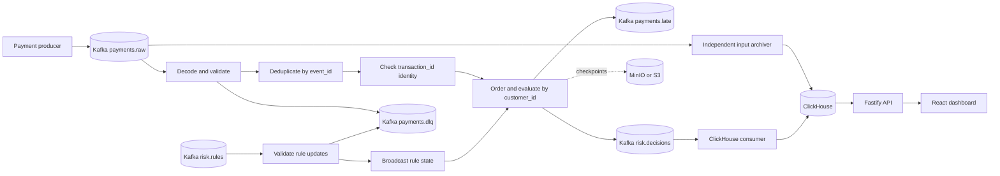

# Payment risk

A Java application that evaluates payment events with Apache Flink. Kafka carries the payments and rule updates; Flink checks each customer's recent activity and writes an `APPROVE`, `REVIEW`, or `REJECT` decision. Separate consumers archive payment inputs and store decisions in ClickHouse. A React dashboard displays the results.

The included producer generates synthetic EUR payments. The application calculates risk scores; it does not authorize payments or move money. [View the dashboard demo](https://acilione.github.io/payment-risk/).

## Contents

- [Technologies](#technologies)
- [Processing flow](#processing-flow)
- [Feature implementation](#feature-implementation)
- [Data model](#data-model)
- [Run locally](#run-locally)
- [Configuration](#configuration)
- [Operations](#operations)
- [Deployment](#deployment)
- [Tests and CI](#tests-and-ci)
- [Performance](#performance)

## Technologies

| Technology | How this project uses it |
|---|---|
| Java 17 bytecode / Java 21 containers | Implements the Flink job, rule engine, Avro codec, Kafka producer, and ClickHouse consumers. |
| Apache Flink 2.2.1, DataStream API | Connects the payment and rule streams, partitions customer state, evaluates event-time timers, and coordinates checkpoints with Kafka transactions. |
| Apache Kafka 4.3.1 and Flink Kafka connector 5.0.0-2.2 | Stores input payments, rule updates, decisions, invalid records, and late payments in separate topics. |
| Avro 1.12.1 and Apicurio Registry 3.3.2 | Define and validate the wire format. Schema IDs let consumers resolve the writer schema against the application's reader schema. PostgreSQL stores registry metadata. |
| Jackson 2.21.7 | Represents decoded records, serializes the pending/history state, and constructs the canonical rule payload used for fingerprints. |
| Embedded RocksDB | Stores Flink's keyed event, customer-history, and device state. Incremental checkpoints copy state to object storage. |
| MinIO / Amazon S3 | Hold checkpoints and savepoints. Compose uses MinIO through Flink's S3 filesystem plugin; the Kubernetes configuration uses an S3 bucket. |
| ClickHouse 26.8.2.7 | Stores original inputs and evaluation deliveries in `MergeTree`; SQL views deduplicate logical evaluations and expose identity conflicts. |
| React 19, TypeScript, Vite 8 | Implement and build the dashboard. Charts are rendered with SVG and CSS; Lucide provides icons. |
| Node.js 24 and Fastify 5 | Serve the dashboard and its read-only API. The API queries ClickHouse, Flink REST, and Prometheus. |
| Prometheus 3 and Grafana 13 | Collect Flink and application metrics, evaluate alerts, and display provisioned operational and risk dashboards. |
| Docker Compose, Helm, Flink Kubernetes Operator, Terraform | Start the local stack, describe the Kubernetes Flink deployment, and provision S3 state storage. |
| Maven, JUnit, Playwright, GitHub Actions | Package the Java application, test rules and managed state, check browser behavior, and run build, integration, and image checks. |

Exact dependency and image versions are declared in [pom.xml](pom.xml), [web/package.json](web/package.json), [web/package-lock.json](web/package-lock.json), [docker-compose.yml](docker-compose.yml), and the Dockerfiles. The web runtime version is also recorded in [web/.nvmrc](web/.nvmrc).

Compose builds its local MinIO server and client from pinned upstream source commits in [minio.Dockerfile](infrastructure/docker/minio.Dockerfile). Kubernetes uses Amazon S3 for state storage.

## Processing flow


```mermaid
flowchart LR
  P[Payment producer] --> K[(Kafka payments.raw)]
  K --> I[Independent input archiver]
  I --> C[(ClickHouse)]
  K --> V[Decode and validate]
  V --> D[Deduplicate by event_id]
  D --> T[Check transaction_id identity]
  T --> E[Order and evaluate by customer_id]
  R[(Kafka risk.rules)] --> RV[Validate rule updates]
  RV --> B[Broadcast rule state]
  B --> E
  V --> Q[(Kafka payments.dlq)]
  RV --> Q
  E --> L[(Kafka payments.late)]
  E --> O[(Kafka risk.decisions)]
  O --> M[ClickHouse consumer]
  M --> C
  C --> A[Fastify API]
  A --> W[React dashboard]
  E -. checkpoints .-> S[(MinIO or S3)]
```

[PaymentRiskJob.java](src/main/java/com/portfolio/paymentrisk/PaymentRiskJob.java) builds this pipeline. Payments use `keyBy(event_id)` for deduplication, `keyBy(transaction_id)` to reject conflicting authorization results, then `keyBy(customer_id)` for rule evaluation. The final partitioning step places one customer's payments on the same processing task. Rule updates use broadcast state so every risk-processing task receives them.

The implementation separates state management, calculation and storage:

| Component | Responsibility |
|---|---|
| `CustomerRiskProcessor` / `StateHistory` | Manage customer state, timers, policy snapshots and iteration over stored history. |
| `RiskFeatures` / `RiskEngine` | Calculate observations, scores and explanations without storage calls. |
| `PaymentArchiver` / `DecisionMaterializer` | Persist original inputs and evaluated decisions through independent consumers. |
| `KafkaIngestion` / `DurableKafkaBatch` / `ClickHouseWriter` | Configure consumers, bound batches, coordinate offset commits and retry database writes. |

## Feature implementation

### Payment ingestion, schemas, and validation

Kafka values use Confluent-compatible framing: a zero magic byte, a four-byte schema ID, and the Avro binary record. [AvroCodec.java](src/main/java/com/portfolio/paymentrisk/serialization/AvroCodec.java) looks up the writer schema through Apicurio's compatibility API and uses `GenericDatumReader` with the application's packaged reader schema. It caches up to 256 writer schemas. Runtime serializers look up registered schemas; topic and schema creation belong to the bootstrap command.

[RawDeserializer.java](src/main/java/com/portfolio/paymentrisk/source/RawDeserializer.java) calls validation before assigning the source event timestamp. This prevents malformed or far-future timestamps from advancing the watermark. [Validate.java](src/main/java/com/portfolio/paymentrisk/processor/Validate.java) checks the Avro record and the payment fields: nonblank identifiers, positive bounded amounts, EUR currency, ISO country codes, supported payment statuses, and positive event times no more than five minutes ahead of the validation clock. Payloads larger than 1 MiB are rejected.

Invalid payments and invalid rule updates go to the `payments.dlq` side output. Each record includes the original topic, partition, offset, schema ID, error code, a SHA-256 payload fingerprint and byte count. Raw payloads are omitted by default. `DLQ_PAYLOAD_MODE=capture` retains a base64 prefix of at most 4,096 bytes and is accepted only in local mode. Registry connection, authentication, and server failures propagate to Flink recovery instead of labeling valid payments as bad data.

### Duplicate detection

[Deduplicate.java](src/main/java/com/portfolio/paymentrisk/processor/Deduplicate.java) stores a seen flag and a SHA-256 fingerprint keyed by `event_id`. The fingerprint covers the payment fields except `producer_time`. An identical retry is suppressed; changed content under the same ID fails with `EVENT_IDENTITY_CONFLICT`. A second operator checks `transaction_id` before the payment reaches customer state.

Both indexes expire after 24 hours of processing time by default. Reads do not extend that period, and downtime counts toward expiry. This bounds state size but does not provide permanent uniqueness. Historical input must be recalculated in an isolated job; replaying committed decisions into ClickHouse is covered under [Operations](#operations).

### Event-time ordering and late payments

[CustomerRiskProcessor.java](src/main/java/com/portfolio/paymentrisk/processor/CustomerRiskProcessor.java) buffers accepted payments in `MapState<Long, String>` by event timestamp and registers an event-time timer for each bucket. When a timer fires, payments at that timestamp are sorted by `event_id`, evaluated, and added to history in that order.

Payment partitions allow ten seconds of out-of-order arrival and become idle after sixty seconds. The minimum watermark across active partitions controls finalization. A resumed partition can contain payments older than the watermark; those payments follow the late-event path.

The processor compares each payment with the current watermark and a checkpointed `finalized-through-v1` timestamp for its customer. Payments at or behind either cutoff go to `payments.late` with their original content and lateness. They do not update history or revise earlier decisions. The saved cutoff preserves this behavior when source watermarks reset during recovery.

The rule stream marks itself idle because it does not define payment time. When every payment partition is idle, the pending tail waits for new input. A processing-time watchdog reports overdue queues every `PENDING_ALERT_MS` without finalizing payments or logging customer identifiers.

### Five risk rules and decision scoring

[RiskEngine.java](src/main/java/com/portfolio/paymentrisk/domain/RiskEngine.java) is a pure calculation: it receives the current payment, an iterable of previously evaluated customer history, the current device's last-seen timestamp, and the payment's rule snapshot. It does not perform network calls. [Rules.java](src/main/java/com/portfolio/paymentrisk/domain/Rules.java) defines the defaults and validates updates.

For an event at time `t`, each rule uses the interval `(t - window, t]`. The lower boundary is excluded. Payments already evaluated at the same timestamp are part of the preceding history because the processor orders them by event ID.

| Rule | Implementation | Default condition | Points |
|---|---|---|---:|
| R001: payment frequency | Count historical entries inside the rule window and add the current payment. | More than 5 payments in 2 minutes. | 25 |
| R002: total payment amount | Sum amounts from the current payment and same-currency history using integer cents and `Math.addExact`. | More than EUR 3,000 in 10 minutes. | 35 |
| R003: multiple devices | Build a `HashSet` of device IDs in the window and add the current device. | At least 3 devices in 15 minutes. | 20 |
| R004: new device and high amount | Look up the current device's last evaluated timestamp before updating device state. An absent timestamp, or one at or before the window boundary, counts as unseen. | Device not seen within 30 days and amount at least EUR 800. | 30 |
| R005: approval after declines | Check that the current input status is `APPROVED`, then count preceding `DECLINED` payments in the window. Declines need not be consecutive. | At least 4 declines in the previous 10 minutes. | 40 |

[RiskFeatures.java](src/main/java/com/portfolio/paymentrisk/domain/RiskFeatures.java) computes all five observations in one pass over the lazy iterator supplied by [StateHistory.java](src/main/java/com/portfolio/paymentrisk/processor/StateHistory.java). The processor looks up the current device directly in managed state. Only distinct device IDs within the rule window are collected into a set.

Matching rule weights are added and capped at 100. The default result is `APPROVE` below 30, `REVIEW` from 30 to 69, and `REJECT` from 70 upward. For example, a new-device payment of EUR 900 scores 30 and receives `REVIEW` if no other rule matches. If all five rules match, their 150 points are capped at 100 and the result is `REJECT`.

Every decision includes the score, matched rule IDs sorted by ID, corresponding rule types in `reason_codes`, payment identifiers, timestamps, and a rule-settings fingerprint. The input payment status (`APPROVED` or `DECLINED`) is distinct from the risk engine's output decision.

### Rule updates without restarting the job

The `risk.rules` topic is compacted by `rule_id`. The CLI validates a JSON rule file, encodes it as Avro, and publishes it with that key. Flink connects this stream to the customer stream through `KeyedBroadcastProcessFunction`; `processBroadcastElement` stores the latest accepted JSON configuration in broadcast `MapState` named `rules-json-v1`.

Packaged rules start at version 1. An update must have a higher version than the current value; equal or older versions are ignored and counted. Setting `enabled: false` in a higher version disables a rule. Validation limits IDs to R001-R005, accepts only the five implemented types, and checks the score, currency, threshold, and window against retained history. `updated_at` is metadata, not a scheduled activation time.

Each accepted payment stores a full rule snapshot alongside its pending record. A rule update therefore affects subsequently admitted payments without changing already buffered payments. `Rules.fingerprint` sorts rules and their fields and hashes the full payload plus the review/reject thresholds with SHA-256. The decision carries that fingerprint, the complete snapshot, engine version, and observed values and score contributions for all five rules.

Payments and rules are separate Kafka inputs with no shared activation order. After recovery, records replayed since the last checkpoint can arrive in a different cross-input order and receive a different snapshot. The fingerprint identifies the settings actually used; it does not make historical rule activation deterministic.

### Immutable policy releases

[PolicyCatalog.java](src/main/java/com/portfolio/paymentrisk/domain/PolicyCatalog.java) loads a policy ID, version, all five rules and classification thresholds from `POLICY_FILE` or `POLICY_CATALOG_JSON`. [config/policy-default.json](config/policy-default.json) is the packaged example. Numeric settings must be integers within their supported ranges. `POLICY_SHA256` optionally checks the exact catalog bytes; Helm requires the checksum and an immutable ConfigMap containing `policy.json`.

With a catalog, the job ignores broadcast updates and preserves each pending payment's policy across restore. Releasing a new policy requires a new version and deployment. Staging and production require a catalog; local mode also supports dynamic rule updates. The checksum detects changed content but does not authenticate its author.

### Customer state and recovery

The processor keeps three kinds of keyed state in embedded RocksDB:

| State | Stored data | Default retention or limit |
|---|---|---|
| Pending payments | Timestamp buckets containing complete payments and their rule snapshots. | Until evaluation; at most 100,000 pending events per customer. |
| Payment history | Timestamp buckets containing event time, amount, currency, device, and status. | One hour of event time; at most 100,000 retained events per customer. |
| Devices | Device ID to last evaluated event timestamp. | Thirty days of event time; at most 10,000 devices per customer. |

Additional `ValueState` tracks counts, the next cleanup timer, and the last finalized timestamp. One cleanup timer per customer schedules the next history or device expiry. Cleanup uses the timer's logical time so a jumped watermark cannot remove history before older pending payments are evaluated. When all customer data expires, the finalized timestamp is also cleared. Exceeding a state limit fails the job instead of discarding history and computing an incomplete score.

Compose configures incremental RocksDB checkpoints in MinIO every ten seconds. The Helm deployment uses S3 and a thirty-second interval. Flink restores managed state, timers, and source positions from checkpoints after failure. A non-draining savepoint preserves pending payments for an intentional stop and upgrade.

State descriptors use explicit string, long, and integer serializers; JSON holds the payment and rule structures. Stable operator UIDs and maximum parallelism 128 identify the state during restore. Changing descriptor names, serializers, or JSON meaning requires a tested migration; a JSON string is still a state schema.

### Transactional Kafka output

`PaymentRiskJob` creates three `KafkaSink` instances with `DeliveryGuarantee.EXACTLY_ONCE`: decisions, invalid records, and late records. Each sink uses a transaction prefix derived from the deployment prefix and topic. Flink coordinates Kafka transaction commits with completed checkpoints, and consumers use `isolation.level=read_committed` to hide uncommitted output.

This coordinates Kafka source positions, Flink state, and Kafka output across recovery. Producer duplicate detection remains a separate feature, and ClickHouse inserts are outside that transaction. Each active deployment must have a unique transaction prefix. Kafka transactions allow fifteen minutes; checkpoint delays and recovery must fit within that timeout.

### ClickHouse storage, uniqueness and retries

[DecisionMaterializer.java](src/main/java/com/portfolio/paymentrisk/tools/DecisionMaterializer.java) consumes up to 250 committed decisions per poll with auto-commit disabled. Valid records go to `risk.evaluations`; malformed decisions go to `risk.materializer_rejections` with source coordinates, error category, payload hash and length. Registry connection and authentication errors stop processing rather than marking decisions invalid.

[DurableKafkaBatch.java](src/main/java/com/portfolio/paymentrisk/storage/DurableKafkaBatch.java) buffers up to 1 MiB of UTF-8 JSON across tables. A larger row is written alone without truncation. Each chunk commits only its own Kafka offsets, after every synchronous insert succeeds. [ClickHouseWriter.java](src/main/java/com/portfolio/paymentrisk/tools/ClickHouseWriter.java) retries network failures, HTTP 429 and server errors up to five times with backoff and jitter. Other HTTP errors fail immediately. A failed chunk remains uncommitted and is retried after the consumer restarts.

Decision decoding and batch work have a sixty-second budget; HTTP requests time out after ten seconds and the Kafka poll interval is five minutes. Fetch targets are 4 MiB per broker request and 1 MiB per partition. Kafka may return a larger first record batch, so producer and broker message limits must also fit available memory.

A lost insert response or failed offset commit can produce physical copies. The SQL views group deliveries by `evaluation_id`, compare business content and expose conflicts. Multiple evaluations for one transaction also require review. Kafka offsets identify deliveries; they do not select a winning business result. This provides a deduplicated analytical view, not a database uniqueness constraint.

The API returns 503 when stored conflicts or quarantined decisions exist. Direct SQL readers must check `risk.integrity_conflicts` and `risk.materializer_rejections FINAL` before publishing totals. Resolving a conflict requires an explicit data correction; the application does not discard conflicting results automatically.

### Payment archive

[PaymentArchiver.java](src/main/java/com/portfolio/paymentrisk/tools/PaymentArchiver.java) reads `payments.raw` with its own consumer group and stores the original Kafka records in `risk.payment_ingress`. It runs independently of Flink and schema decoding, so pending, late, conflicting and malformed inputs can be preserved while classification is unavailable. It reads committed producer transactions and uses the same bounded batches, retries and commit-after-write contract as the decision consumer.

The archive retains exact values, keys and headers, including nulls. Retries can produce physical copies; source coordinates identify a Kafka record rather than a unique payment. Decoding archived Avro requires the writer schema, so registry metadata belongs in backups. The archive contains full payloads and needs restricted access; Base64 encoding is not encryption.

Both database consumers use `auto.offset.reset=none`. A new local group initializes at offset zero only if that beginning is still retained; otherwise initialization fails. Existing out-of-range offsets also fail instead of skipping data. Staging and production require explicitly provisioned offsets.

New input topics disable automatic time and size retention, and the archive has no automatic TTL. Disk capacity and verified archive coverage must be managed before deleting source segments; the Flink recovery horizon also needs retained input. Decision, late and dead-letter topics retain their seven-day default. The local single-broker and single-database setup still requires replication and backups to tolerate disk loss. Archiving an input does not imply that it has a completed risk decision.

### Dashboard and read-only API

[web/src/main.tsx](web/src/main.tsx) implements the React views for totals, decision trends, transaction inspection, rule descriptions, and architecture. TypeScript defines the API response types, Vite builds the frontend, and SVG/CSS render the charts. The rule screen displays packaged defaults; it is not an editor or a live view of broadcast state.

[web/server/overview.mjs](web/server/overview.mjs) queries ClickHouse for totals, 30 time buckets, rule-match counts using `arrayJoin(matched_rules)`, and the latest 100 decisions. Time windows use `processed_at` and are limited to 15 minutes, one hour, or 24 hours. The browser filters the loaded decisions by decision type or a case-insensitive match on transaction ID, customer ID, and matched rule IDs. Search therefore covers the latest 100 loaded decisions, not the complete database.

The API also reads Flink REST for the running job and latest checkpoint, and Prometheus for Kafka source lag. Kafka status is inferred from source metrics; it is not a direct broker probe. A checkpoint is marked current when it completed within three minutes. Finalization p95 estimates `processed_at - event_time` using `quantileTDigest`; it excludes the later Kafka commit wait. Amounts, counts and identity checks remain exact. API and integrity queries have a 256 MiB memory limit and spill aggregation/sorting to disk after 64 MiB. Failed queries return errors rather than partial totals.

[web/server/app.mjs](web/server/app.mjs) serves `GET /api/overview–window=...` and the built frontend through Fastify. It validates the window, shares concurrent reads, caches each window for five seconds, and uses fixed SQL with read-only settings and query deadlines. The browser refreshes every fifteen seconds. A failed analytics request returns 503; previously loaded data remains visibly stale. Failed health probes do not replace successful decision queries.

The hosted demo is a separate static build using `VITE_DEMO_MODE=true`. [web/src/demo.ts](web/src/demo.ts) supplies 48 sample decisions and sample chart/status data. It makes no requests to the local pipeline. Live mode does not silently switch to sample data after a failure.

### Customer investigations

The **Investigations** section provides customer-ID prefix search, a decision filter, a payment timeline and recorded rule evidence. Select a payment to see all five rules, including nonmatches, observed values, thresholds, eligibility and score contributions. The provenance panel shows event time, evaluation time, engine and policy versions, the policy snapshot and the decision's Kafka coordinates.

[Investigations.tsx](web/src/Investigations.tsx) owns this screen. [investigation.mjs](web/server/investigation.mjs) provides two read-only endpoints: `/api/investigations/customers` and `/api/investigations/timeline`. ClickHouse parameters carry user input; queries have the same time and memory limits as the overview. Pages contain at most 20 rows. Customer pages use the customer ID as a cursor; timeline pages use `(event_time, evaluation_id)` so equal timestamps have a stable order. Reads check the existing integrity and quarantine views before returning data. Pagination operates on current data, not a fixed historical snapshot.

The timeline contains evaluated payments only. It does not claim that every archived input has a decision. Missing historical evidence is displayed as unavailable, and service failures produce an error rather than sample results. There are no editable case statuses, analyst notes or customer profiles: those need an authenticated workflow and a transactional store. The local API remains unauthenticated and is intended for the synthetic deployment.

The static demo offers three guided investigations: rapid attempts across devices, a legitimate replacement phone that triggers review, and a stolen trusted device that the rules miss. It includes all nine customer stories and 36 payments from the existing scenario dataset. [InvestigationFixtureTest](src/test/java/com/portfolio/paymentrisk/InvestigationFixtureTest.java) evaluates those inputs with the Java engine and checks the bundled fixture. Labels remain separate from engine inputs. To regenerate reviewed fixture changes, run `mvn -Dtest=InvestigationFixtureTest -Drisk.fixture.write=true test`, then format the website. The overview's older sample data is independent of this scenario fixture.

### Metrics and alerts

Flink counters track valid and invalid input, suppressed duplicates, late payments, rule updates, decisions, rule matches, and processed amounts. A 1,024-sample histogram measures `RiskEngine.evaluate` in microseconds, excluding state preparation, buffering, and transaction commit waits. Labels use fixed rule IDs and decision types; they do not include customer or transaction IDs.

The materializer and payment archiver expose committed records, retries, insert errors and duration, storage availability, last insert time, and sampled maximum consumer lag. The materializer also reports rejected decisions and refreshes its unresolved-incident gauge every fifteen seconds, including when no records arrive.

[prometheus.yml](observability/prometheus/prometheus.yml) scrapes Flink on port 9249, the materializer on 9405, and the archiver on 9406 every ten seconds. [Grafana provisioning](observability/grafana/provisioning) loads the dashboards from [dashboards/](dashboards).

[alerts.yml](observability/prometheus/alerts.yml) covers unavailable services, stalled checkpoints, excessive invalid or late input, backpressure, storage failures, archive backlog, identity conflicts, and overdue pending payments. `make verify-observability` executes the provisioned panel queries against live metrics.

### Topic setup and test data generation

[PlatformCli.java](src/main/java/com/portfolio/paymentrisk/tools/PlatformCli.java) uses Kafka's `Admin` client to create missing topics and registers the five Avro schemas. The rule topic has one compacted partition; other topics have three partitions. Local replication and minimum in-sync replicas are both one. Bootstrap leaves existing topic configuration unchanged. Apicurio's global compatibility rule is `BACKWARD`, and its metadata persists in PostgreSQL.

The producer uses Kafka's idempotent producer, `acks=all`, and Zstandard compression. Each run gets an ID prefix, values use a fixed random seed, and sends wait for acknowledgments before the rate limiter advances.

| Scenario | What the producer changes |
|---|---|
| `steady` | Distributes payments across 100 customer IDs at the requested rate. |
| `hot-key`, `burst` | Sends all payments to one customer; the rate argument controls load. `make spike-load` requests 1,000 events/second. |
| `high-cardinality` | Uses a different customer ID for every payment. |
| `duplicates` | Publishes each event twice with the same event ID and value. |
| `out-of-order` | Adds 100 ms to alternate event timestamps, allowing event-time inversions at sufficiently high input rates. |
| `late` | Subtracts one hour from event timestamps; classification still depends on the current watermark. |
| `malformed` | Sends a non-Avro payload. |
| `fixture` | Uses one customer, EUR 900 payments, rotating devices, and four initial declines to exercise the rules. |

The CLI syntax is `generate SCENARIO COUNT RATE [RUN_ID]`. Integration scenarios use additional records to advance every partition's watermark, then compare committed IDs and expected scores rather than just checking that the job is running.

### Credentials and access controls

[scripts/init-env.py](scripts/init-env.py) creates random local service credentials in the ignored `.env` file. Compose injects them into the services that need them. The website keeps ClickHouse credentials on the server; frontend `VITE_*` variables are compiled into public JavaScript and must not contain secrets.

The Fastify API uses Helmet security headers, a 1 KiB request-body limit, and a limit of 120 requests per minute. SQL uses an allowlisted time window, fixed query templates, read-only execution, and timeouts. The website container runs as a non-root user with a read-only filesystem and dropped capabilities. Compose exposes service ports on localhost.

The local API has no authentication. Hosting live payment data for other users requires authentication and authorization in front of it and a ClickHouse identity restricted to the required reads. For the Java services, `APP_ENVIRONMENT=production` checks HTTPS registry access, Kafka `SSL` or `SASL_SSL`, committed payment offsets, and a deployment-specific transaction prefix. Both database consumers require HTTPS for ClickHouse outside local mode.

## Data model

Kafka carries five Avro record types: payments, rule updates, decisions, rejected records and late payments. Flink maintains the customer history needed to evaluate payments. ClickHouse stores original wire inputs independently from decisions for queries and dashboards.

Customer, merchant and device IDs are references supplied by the payment producer. This project does not maintain separate customer, merchant or device tables.

### Identifiers and relationships

| Identifier | Meaning |
|---|---|
| `event_id` | Identifies a payment event. Identical retries are suppressed within the deduplication period; conflicting content fails processing. |
| `transaction_id` | Identifies one authorization result in the current domain. A distinct attempt receives a new ID; a transport retry keeps it. |
| `customer_id` | Groups payments for risk evaluation. It is also the Kafka key for payment producers provided by this project and for decision and late-event outputs. |
| `decision_id` | Generated as `risk_` followed by `transaction_id`. It is not an independently generated identifier. |
| `evaluation_id` | Identifies an event evaluated under a particular engine and policy version. |
| `rule_id` | Identifies one rule configuration. Supported IDs are `R001` through `R005`. |
| `error_id` | Identifies a rejected source record as `<topic>:<partition>:<offset>`. |

A customer can have many payment events. Each evaluated event produces a decision containing its event, transaction and customer IDs. Invalid payments go to the dead-letter topic; late payments go to the late-event topic; duplicates are suppressed.

The current contract has one authorization result per transaction; it does not model capture, refund or revision events. The job checks both event and transaction identity before updating customer history. Conflicting stored evaluations remain available for review but are excluded from the current view and block dashboard totals.

### Types and timestamps

The schemas are defined in [`schemas/`](schemas). Avro `long` and `int` are signed 64-bit and 32-bit integers. Avro fields are non-null. Added decision audit fields and dead-letter metadata have reader defaults for compatibility with older records; the schema files define those values. The binary input archive separately preserves Kafka null values.

Timestamps are Unix epoch milliseconds. `Transaction.event_time` explicitly uses Avro's `timestamp-millis` logical type; other timestamps use plain `long`. `window_seconds` is a duration in seconds, and `lateness_ms` is a duration in milliseconds.

Amounts use integer minor units. The application accepts EUR only, so `amount_minor: 12345` means €123.45.

### Payment event

Schema: [`transaction.avsc`](schemas/transaction.avsc).

| Field | Avro type | Meaning and validation |
|---|---|---|
| `event_id` | `string` | Event identifier; nonblank, at most 128 characters. |
| `transaction_id` | `string` | Business transaction identifier; nonblank, at most 128 characters. |
| `customer_id` | `string` | Customer whose history is evaluated; nonblank, at most 128 characters. |
| `merchant_id` | `string` | Merchant reference; nonblank, at most 128 characters. |
| `amount_minor` | `long` | Amount in cents, from 1 to 1,000,000,000,000 inclusive. |
| `currency` | `string` | Must be `EUR`. |
| `country` | `string` | Must be a country code in Java's ISO country list. |
| `device_id` | `string` | Device reference; nonblank, at most 128 characters. |
| `status` | `PaymentStatus` enum | `APPROVED` or `DECLINED`, supplied by the payment source. |
| `event_time` | `long`, `timestamp-millis` | Business event time. Must be positive and no more than five minutes ahead of validation time. |
| `producer_time` | `long` | Producer-supplied timestamp. The risk calculation and event-time ordering do not use it; there is no additional range validation. |

The input `status` describes the payment event. It is separate from the risk engine's output `decision`.

Merchant and country values remain in the pending payment record but are not used by the current rules or copied into the decision. After evaluation, customer history retains only the fields needed for later calculations.

### Rule configuration

Schema: [`risk-rule.avsc`](schemas/risk-rule.avsc). The JSON file supplied to the rule-update CLI has the same fields.

| Field | Avro type | Meaning and validation |
|---|---|---|
| `rule_id` | `string` | `R001` through `R005`. |
| `version` | `long` | Positive configuration version. An update must exceed the stored version to take effect. |
| `type` | `RuleType` enum | `TX_COUNT_VELOCITY`, `AMOUNT_VELOCITY`, `UNIQUE_DEVICES`, `NEW_DEVICE_HIGH_AMOUNT` or `DECLINE_THEN_APPROVAL`. |
| `enabled` | `boolean` | Whether the rule contributes to decisions. |
| `score` | `int` | Points added when the rule matches, from 0 to 100. |
| `window_seconds` | `long` | Positive lookback duration. Cannot exceed retained device history for `NEW_DEVICE_HIGH_AMOUNT`, or retained transaction history for other types. |
| `threshold` | `long` | Nonnegative trigger value. Its meaning depends on the rule type: event count, device count or amount in cents. |
| `currency` | `string` | Must be `EUR`. |
| `updated_at` | `long` | Nonnegative update timestamp. It does not schedule activation. |

The application starts with version 1 of each rule. Higher versions replace the current configuration; equal or older versions are ignored. Disable a rule by publishing a higher version with `enabled: false`.

Each admitted payment stores a complete rule snapshot in pending state. A later update does not alter that snapshot. Decisions record the full snapshot and its fingerprint. The fingerprint includes all rule fields and the review and reject thresholds.

### Risk decision

Schema: [`risk-decision.avsc`](schemas/risk-decision.avsc).

| Field | Avro type | Meaning |
|---|---|---|
| `decision_id` | `string` | `risk_` followed by the transaction ID. |
| `event_id` | `string` | Input event identifier. |
| `transaction_id` | `string` | Input business transaction identifier. |
| `customer_id` | `string` | Input customer identifier. |
| `amount_minor` | `long` | Input amount in cents. |
| `currency` | `string` | Input currency, currently `EUR`. |
| `risk_score` | `int` | Sum of matching rule scores, capped at 100. |
| `decision` | `string` | `APPROVE`, `REVIEW` or `REJECT`, based on the configured score thresholds. |
| `matched_rules` | `array<string>` | IDs of matching rules, sorted by rule ID. Empty when no rules match. |
| `reason_codes` | `array<string>` | Rule types corresponding to `matched_rules`, in the same order. |
| `rules_fingerprint` | `string` | SHA-256 fingerprint of the rule snapshot and classification thresholds, encoded as 64 hexadecimal characters. |
| `event_time` | `long` | Copied from the payment. |
| `processed_at` | `long` | Time at which the engine evaluated the payment; never a business revision. |
| `evaluation_id` | `string` | Stable event/engine/policy identity, independent of result content and delivery coordinates. |
| `engine_version` | `string` | Evaluator release; must change when evaluation semantics change. |
| `policy_id` / `policy_version` | `string` / `long` | Immutable policy release, or `dynamic` / `0` in local broadcast mode. |
| `policy_snapshot` | `string` | Canonical JSON containing all rules and classification thresholds. |
| `rule_evidence` | `array<RuleEvidence>` | Rule ID/version/type, enablement, window, threshold, observed value, eligibility, match and score contribution. Includes nonmatching rules. |
| `input_sha256` | `string` | Canonical payment fingerprint excluding `producer_time`; empty on historical decisions. |

`evaluation_id` is `eval_` followed by SHA-256 of the canonical tuple `(event_id, engine_version, policy_id, policy_version)`. Scores, observed features, processing time and Kafka coordinates are excluded so changed results under one identity remain detectable. Historical decisions without an evaluation ID use the `legacy` engine and `dynamic` policy; missing historical evidence cannot be reconstructed from those records alone.

### Rejected and late records

Schema: [`dead-letter.avsc`](schemas/dead-letter.avsc). Payment and rule validation failures share this record type.

| Field | Avro type | Meaning |
|---|---|---|
| `error_id` | `string` | Source topic, partition and offset joined with colons. |
| `source_topic` | `string` | Topic containing the rejected record. |
| `source_partition` | `int` | Source Kafka partition. |
| `source_offset` | `long` | Source Kafka offset. |
| `observed_at` | `long` | Time the rejection was recorded. |
| `error_code` | `string` | Validation category, such as `INVALID_AMOUNT`, `SCHEMA_ERROR` or `DESERIALIZATION_ERROR`. |
| `error_message` | `string` | `Rejected payment record` or `Rejected rule record`. |
| `raw_payload` | `string` | Empty by default. Local capture mode allows a base64 prefix of at most 4,096 bytes; base64 is not encryption. |
| `payload_truncated` | `boolean` | Whether a nonempty value was omitted or exceeded the capture limit. |
| `source_timestamp` | `long` | Kafka record timestamp, or `-1` when unavailable. |
| `payload_sha256` / `payload_bytes` / `payload_mode` | `string` / `long` / `string` | Fingerprint, original length, and `omit` or local `capture` mode. |
| `schema_id` | `int` | Schema ID read from a valid-looking wire header, or `-1` when unavailable. It need not refer to a registered schema. |

Schema: [`late-event.avsc`](schemas/late-event.avsc).

| Field | Avro type | Meaning |
|---|---|---|
| `transaction` | `string` | Complete decoded payment serialized as JSON inside a string. |
| `customer_id` | `string` | Input customer identifier. |
| `watermark` | `long` | Effective event-time cutoff used to reject the payment. |
| `lateness_ms` | `long` | `watermark - event_time`; zero for an event exactly at the cutoff. |
| `observed_at` | `long` | Time the payment was classified as late. |
| `reason` | `string` | Currently `TOO_LATE`. |

The effective cutoff is the greater of the current watermark and the customer's retained last evaluation timestamp. Late records do not modify customer history or produce a new risk decision.

### ClickHouse tables and input archive

[clickhouse.sql](infrastructure/docker/clickhouse.sql) defines the following tables and views in the `risk` database. Input and evaluation tables use `MergeTree` and retain delivery copies.

| Table or view | Purpose |
|---|---|
| `payment_ingress` | Original committed Kafka payment records, before validation, deduplication or evaluation; includes exact bytes and source metadata. |
| `evaluations` | Append-only deliveries, with full audit data and Kafka provenance. Physical retry rows are expected. |
| `evaluations_logical` | One row per `evaluation_id`, delivery count and exact number of distinct business results. Processing time and source offsets do not create a new result. |
| `transaction_integrity` / `integrity_conflicts` | Identify conflicting results for an evaluation and multiple evaluations for one transaction. No arbitrary offset chooses a winner. |
| `decisions_current` | One unambiguous evaluation per transaction. Conflicting transactions are excluded. Always check integrity before publishing totals. |
| `materializer_rejections` | Durable quarantine keyed by source topic, partition and offset; query with `FINAL`. |
| `decisions` / `decisions_legacy` | Previous storage retained for migration. The new materializer does not write it. |

[PaymentArchiveRows.java](src/main/java/com/portfolio/paymentrisk/storage/PaymentArchiveRows.java) maps a Kafka record to these archive fields:

| Fields | Stored representation |
|---|---|
| `source_topic`, `source_partition`, `source_offset` | Kafka record coordinates. |
| `source_timestamp`, `timestamp_type` | Kafka timestamp and its type. |
| `key_base64`, `payload_base64` | Original binary key and value, encoded as Base64 and compressed with Zstandard. |
| `key_is_null`, `value_is_null` | Distinguish null from empty byte arrays. |
| `payload_bytes`, `payload_sha256` | Original value length and SHA-256. |
| `headers_json` | Ordered header names, Base64 values and explicit null flags. |
| `archived_at` | ClickHouse insertion time. |

### Kafka contracts

| Default topic | Value schema | Kafka key | Purpose |
|---|---|---|---|
| `payments.raw` | `Transaction` | `customer_id` in the provided producers | Payment input. |
| `risk.rules` | `RiskRule` | `rule_id` in the rule-update CLI | Compacted rule configuration topic. |
| `risk.decisions` | `RiskDecision` | `customer_id` | Decision output. |
| `payments.dlq` | `DeadLetter` | `error_id` | Rejected payment and rule records. |
| `payments.late` | `LateEvent` | `customer_id` | Payments that arrived after their evaluation cutoff. |

Keys are UTF-8 strings. The Flink source reads identifiers from the decoded value and does not validate input Kafka keys. Producers must supply the documented keys, especially for rule-topic compaction.

Values use Confluent-compatible framing: a zero magic byte, a four-byte schema ID, then the Avro binary record. Registry subjects use `<topic>-value`. Topic names are configurable. Output consumers must use `read_committed` to exclude uncommitted Kafka transactions.

## Run locally

Use Linux or WSL with Docker Compose, Python 3, Java 17 or later, Maven, and Make. Containers use Java 21. Allow at least 8 GB of available memory and approximately 15 GB of disk space for images, build cache, and data. On WSL, check free space on both the Windows host and Linux filesystem.

```bash
make test
make up
make run-job
make simulate-customers
make integration-test
make generate-load
```

`make up` creates local credentials and starts the infrastructure; `make run-job` submits the Flink job. The [customer simulation](#customer-simulation) requires fresh topics and a new job, so run it before the other generators. `make generate-load` sends 10,000 events at a requested 100 events/second. Open the dashboard at http://localhost:23001 after decisions start arriving.

| Service | Local address |
|---|---|
| Dashboard | http://localhost:23001 |
| Flink | http://localhost:28082 |
| Grafana | http://localhost:23000 |
| Prometheus | http://localhost:29090 |
| Schema Registry compatibility API | http://localhost:28081/apis/ccompat/v7 |
| ClickHouse HTTP | http://localhost:28123 |
| MinIO console | http://localhost:29001 |
| Kafka | `localhost:29092` |

Grafana uses `admin` and the `GRAFANA_ADMIN_PASSWORD` value in `.env`. `make down` stops the stack and preserves data volumes. `make website` builds and starts only the website against an existing stack.

### Build options

`make build` runs Maven verification and produces `target/risk-engine.jar`. Maven Shade bundles application dependencies and sets `PaymentRiskJob` as the entry point; Flink runtime libraries are provided by the container. `make image-local` uses this tested host-built JAR to build the runtime image without downloading Maven dependencies inside Docker.

Behind a corporate TLS proxy, supply the trusted Java certificate store as a Docker build secret:

```bash
python3 scripts/init-env.py
docker build --secret id=maven_truststore,src=/etc/ssl/certs/java/cacerts \
  -f infrastructure/docker/Dockerfile -t payment-risk:0.1.0 .
docker compose build website
docker compose up -d --no-build
```

### Frontend development

Use the Node version in `web/.nvmrc`. Stop the Compose website before using its port for development:

```bash
docker compose stop website
npm --prefix web ci
npm --prefix web run dev
```

Vite serves port 23001 and proxies `/api` to port 23002. Start the API in another terminal:

```bash
node --env-file=.env web/server/index.mjs
```

To build and preview the standalone demo:

```bash
VITE_DEMO_MODE=true npm --prefix web run build
npm --prefix web run preview
```

## Configuration

Application settings are parsed and validated by [AppConfig.java](src/main/java/com/portfolio/paymentrisk/config/AppConfig.java). Flink runtime settings are in [Compose](docker-compose.yml) and the [Helm chart](infrastructure/helm/payment-risk/templates/deployment.yaml). Keep secrets in the generated local environment file or an environment-managed Secret.

| Variable | Default or requirement |
|---|---|
| `KAFKA_BOOTSTRAP_SERVERS` | `localhost:29092` |
| `SCHEMA_REGISTRY_URL` | `http://localhost:28081/apis/ccompat/v7` |
| `KAFKA_GROUP` | `payment-risk-v1`; the sources add `-payments` and `-rules` |
| `TRANSACTIONAL_PREFIX` | `payment-risk-local-v1`; use a unique deployment value in production |
| `PAYMENTS_TOPIC` / `RULES_TOPIC` / `DECISIONS_TOPIC` | `payments.raw` / `risk.rules` / `risk.decisions` |
| `DLQ_TOPIC` / `LATE_TOPIC` | `payments.dlq` / `payments.late` |
| `STARTUP_OFFSETS` | `earliest`; production payment input requires `committed` |
| `OUT_OF_ORDER_MS` / `IDLE_TIMEOUT_MS` | `10000` / `60000` |
| `DEDUP_TTL_MS` | `86400000` (24 hours) |
| `HISTORY_MS` / `DEVICE_HISTORY_MS` | `3600000` (1 hour) / `2592000000` (30 days) |
| `MAX_EVENTS_PER_CUSTOMER` / `MAX_DEVICES_PER_CUSTOMER` | `100000` / `10000` |
| `REVIEW_THRESHOLD` / `REJECT_THRESHOLD` | `30` / `70` |
| `APP_ENVIRONMENT` | `local` |
| `KAFKA_PROPERTIES_FILE` | Optional mounted Java properties file; production requires `SSL` or `SASL_SSL` |
| `REGISTRY_BEARER_TOKEN` | Optional secret |
| `CLICKHOUSE_URL` / `CLICKHOUSE_USER` | `http://localhost:28123` / `risk`; Compose supplies the internal URL |
| `CLICKHOUSE_PASSWORD` | Required secret |
| `MATERIALIZER_GROUP` / `ARCHIVER_GROUP` | `risk-clickhouse-evaluations-v2` / `risk-payment-archive-v1` |
| `MATERIALIZER_METRICS_PORT` / `ARCHIVER_METRICS_PORT` | `9405` / `9406`; internal metrics and readiness endpoints |
| `POLICY_FILE` / `POLICY_CATALOG_JSON` | Mutually exclusive; a catalog is required outside local mode |
| `POLICY_SHA256` | Optional exact-content checksum; required by Helm |
| `DLQ_PAYLOAD_MODE` | `omit`; `capture` is allowed only locally |
| `PENDING_ALERT_MS` | `60000`; observes pending queues without finalizing them |
| `KAFKA_REPLICATION_FACTOR` / `KAFKA_MIN_ISR` | `1` / `1` for local bootstrap; use environment-appropriate replicated settings for production |

Configuration requires `HISTORY_MS >= 15 minutes`, `DEVICE_HISTORY_MS >= 30 days`, and `HISTORY_MS <= DEVICE_HISTORY_MS <= 365 days`. These limits cover the packaged rule windows. Validation rejects invalid thresholds, limits and topic names; topic names must be distinct. Production configuration requires an HTTPS registry, TLS Kafka settings, committed payment offsets and an explicit deployment transaction prefix.

Runtime workers look up existing schemas; they do not register them. `PlatformCli bootstrap` creates missing topics and registers schema versions. It does not change the configuration of existing topics. Run it under a separate provisioning identity, and register a new output contract before submitting the corresponding job. The registry enforces backward compatibility; tests also check every historical writer schema stored in the repository against the current reader.

### Flink runtime defaults

| Setting | Compose | Helm |
|---|---|---|
| Parallelism / worker slots | 2 / 2 per worker | 4 / 2 per worker |
| TaskManagers | 1 | 2 |
| JobManager / TaskManager process memory | `1600m` / `2048m` | `2048m` / `4096m` |
| State backend | RocksDB, incremental | RocksDB, incremental |
| Checkpoint interval / minimum pause | 10 seconds / 2 seconds | 30 seconds / 10 seconds |
| Checkpoint timeout / concurrent checkpoints | 2 minutes / 1 | 2 minutes / 1 |
| Checkpoint mode | `EXACTLY_ONCE` | `EXACTLY_ONCE` |
| Restart policy | 10 attempts, 5-second delay | 10 attempts, 10-second delay |
| Checkpoints / savepoints | `s3://payment-risk/checkpoints` / `s3://payment-risk/savepoints` | Configured bucket, `/checkpoints` and `/savepoints` |
| JobManager high availability | None | Kubernetes HA; recovery data at `s3://<bucket>/ha` |

Retained external checkpoints survive job cancellation. When no runtime checkpoint interval is set, the job enables checkpoints at thirty seconds.

## Operations

### Replay stored decisions

[MaterializerReplay.java](src/main/java/com/portfolio/paymentrisk/tools/MaterializerReplay.java) reads committed decisions within fixed partition offset ranges. It uses a separate consumer, never commits offsets and defaults to a dry run. `--execute` requires a reason and enables writes to the same analytical tables.

```bash
# With Kafka, registry and ClickHouse connection settings configured:
java -cp target/risk-engine.jar com.portfolio.paymentrisk.tools.MaterializerReplay
java -cp target/risk-engine.jar com.portfolio.paymentrisk.tools.MaterializerReplay \
  --execute --reason "Rebuild analytics after storage recovery"
```

Replay defaults to 100,000 records at 500 records/second and a ten-minute deadline. `--max-records` allows up to one million; `--rate` allows up to 5,000. Each attempt writes `artifacts/replay-<UUID>.json` with ranges, counts, status and a source-position digest. Preserve the manifest outside ephemeral containers. Failed runs can leave partial deliveries, which the analytical views deduplicate on replay.

Digest format `partition-offsets-v2` hashes increasing offset lines within each partition, then a sorted map of partition hashes. Memory grows with partition count; these digests cannot be compared with older manifest formats.

### Upgrade database consumers

Back up ClickHouse and capture consumer offsets before changing an existing deployment. Stop the old materializer and website, apply [clickhouse.sql](infrastructure/docker/clickhouse.sql), and backfill evaluations from retained decisions. Initialization scripts do not rerun on existing volumes. Create the input archive table before starting `payment-archiver`.

Reconcile transaction coverage and source positions before reopening the website. The legacy replacing table may have discarded older results; expired Kafka records require another retained archive. New local consumer groups require a retained offset zero. Staging and production require explicitly initialized offsets.

Bootstrap leaves existing topic settings unchanged. To disable the previous expiry on the default local input topic:

```bash
docker compose exec -T kafka /opt/kafka/bin/kafka-configs.sh --bootstrap-server kafka:9092 \
  --entity-type topics --entity-name payments.raw --alter \
  --add-config retention.ms=-1,retention.bytes=-1
```

Check retained beginning offsets before starting the archive group; changing retention cannot restore deleted data. Rollback requires the captured database/view state, consumer offsets and compatible application state.

### Publish a rule update

The example file changes R001's count threshold. Publish it through the CLI:

```bash
docker compose cp config/rule-count-v2.json jobmanager:/tmp/rule.json
docker compose exec -T jobmanager java -cp /opt/flink/usrlib/risk-engine.jar \
  com.portfolio.paymentrisk.tools.PlatformCli rule /tmp/rule.json
```

[config/rule-count-v2.json](config/rule-count-v2.json) uses version 2. The integration scenario publishes larger timestamp-based versions and restores the default parameters afterward. If that scenario has already run, set a version greater than the latest accepted version before publishing the example. Disabling or restoring a rule also requires a higher version.

### Stop, restore, and upgrade

[scripts/operations.py](scripts/operations.py) submits jobs, polls Flink REST, triggers savepoints, and checks recovery. For a controlled upgrade:

```bash
make stop-job
# Deploy the replacement application image here.
make restore
make integration-test
```

`make stop-job` requests a savepoint with `drain: false` and stores its path in `artifacts/last-savepoint.txt`. Not draining preserves the pending event-time timers. Restore uses that path and rejects unmatched state. `make savepoint` takes a savepoint while the job continues; it does not stop the original deployment.

Preserve operator UIDs, state descriptor names, serializer behavior, and maximum parallelism across compatible upgrades. Test restoration before discarding an old image or savepoint. Keep the Kafka data needed by the saved source offsets. Incremental checkpoints can share state files, so deleting individual checkpoint objects can break later restores.

Savepoints from before the identity and policy changes need these additional checks:

| Older state | Restore behavior |
|---|---|
| Event seen flags without fingerprints | A retry fails with `EVENT_IDENTITY_UNVERIFIABLE`; resolve it from the retained source log. |
| No transaction identity index | The new operator starts without historical transaction IDs. |
| Pending rows without explicit thresholds | Evaluation uses deployment thresholds; retain the old values until those rows drain or migrate them. |
| Pending rows without watchdog timers | Monitoring starts when another payment arrives for that customer. |

### Diagnose missing output

| Symptom | What to inspect |
|---|---|
| Input arrives but decisions do not | Watermarks, active Kafka partitions, completed checkpoints, and whether the last buffered events are waiting for more input. An active partition containing only invalid records can hold back event time. |
| Invalid or late input increases | DLQ error codes and source positions; producer clocks, event IDs, partition activity, and the configured disorder allowance. |
| Checkpoints fail or stop completing | Object-store connectivity and credentials, the Flink S3 plugin, disk space, state size, and backpressure. Kafka's broker transaction timeout must allow 900,000 ms. |
| Customer state hits a limit | A heavily used customer, stalled watermarks, retention settings, and pending/history/device counts. Adding partitions cannot split one customer's keyed state across tasks. |
| ClickHouse rows stop arriving | Logs and consumer lag for `materializer` or `payment-archiver`, database availability and retained Kafka offsets. Failed chunks remain uncommitted. |
| Raw ClickHouse counts seem too high | Query `risk.decisions_current`; physical deliveries include retries. Check `integrity_conflicts` and quarantine before publishing results. |

Use the Flink UI and `docker compose logs --tail=100 jobmanager taskmanager materializer payment-archiver` to inspect failures. Compose uses one standalone JobManager, so JobManager loss requires resubmission from retained state. `make recovery-test` exercises worker recovery; `python3 scripts/operations.py kafka-interruption` tests a broker interruption.

Late events have already passed deduplication. Reusing the same ID within the TTL suppresses them; they require reconciliation outside the job rather than resubmission as a way to change a finalized decision.

## Deployment

### Local containers

[Docker Compose](docker-compose.yml) runs one Kafka broker/controller in KRaft mode, Apicurio with PostgreSQL, one Flink JobManager and TaskManager, MinIO, ClickHouse, the input archiver, the decision materializer, the website, Prometheus, and Grafana. Named volumes keep Kafka records, schemas, checkpoints, analytics, and monitoring data across restarts. Health checks and bootstrap dependencies order service startup; job submission remains an explicit command.

[infrastructure/docker/Dockerfile](infrastructure/docker/Dockerfile) builds the Java JAR and copies it into the Flink Java 21 image. It enables the S3 filesystem plugin and checks that the Prometheus reporter is available. [web/Dockerfile](web/Dockerfile) builds the Vite assets in one stage, then copies them and the server into a Node runtime with production dependencies.

### Kubernetes and object storage

The [Helm chart](infrastructure/helm/payment-risk) creates a `FlinkDeployment` for an existing Flink Kubernetes Operator 1.15.0 installation. It configures RocksDB, object-store checkpoints and savepoints, Kubernetes JobManager recovery metadata, resource limits, savepoint-based upgrades, RBAC, restricted egress, and non-root pods. `allowNonRestoredState: false` prevents an upgrade from silently dropping state.

The chart requires an immutable application image digest, Kafka and registry endpoints, an S3 bucket, a unique transaction prefix, an existing credentials Secret, an immutable policy ConfigMap (`policyConfigMap`) with its exact SHA-256 (`policySha256`), and allowed egress CIDRs. The Secret supplies `kafka.properties` and any registry token. Payment groups must already have committed offsets or be restored from a savepoint; the rules source starts from the earliest available compacted records. Kafka, the registry, analytics services, and the operator are provisioned separately.

```bash
helm repo add flink-operator https://downloads.apache.org/flink/flink-kubernetes-operator-1.15.0/
helm upgrade --install flink-kubernetes-operator flink-operator/flink-kubernetes-operator \
  --version 1.15.0 --namespace flink-system --create-namespace
helm template payment-risk infrastructure/helm/payment-risk \
  --namespace payment-risk --values environment-values.yaml > rendered.yaml
kubectl apply --dry-run=server -f rendered.yaml
```

Create `environment-values.yaml` from the chart's [values.yaml](infrastructure/helm/payment-risk/values.yaml) with values for the target environment. Kafka replication and minimum in-sync replicas must be configured for that environment; Compose's one-broker settings provide no broker redundancy. The supplied Flink image needs writable configuration directories.

[Terraform](infrastructure/terraform/main.tf) creates an S3 bucket with versioning, encryption, blocked public access, an HTTPS-only policy, and deletion protection. It outputs an IAM policy for the checkpoint, savepoint, and HA prefixes. Attach that policy to the Flink workload identity and configure federation in the owning cluster. The module does not create static access keys or age-based deletion of checkpoint objects.

The recorded deployment checks cover Helm rendering, Operator CRD validation, and Terraform initialization/validation. Kubernetes failover, workload identity, rescaling, and cross-version restores still need testing in the deployment environment; no cloud deployment is recorded in this repository.

## Tests and CI

### Customer simulation

[CustomerSimulation.java](src/main/java/com/portfolio/paymentrisk/tools/CustomerSimulation.java) sends nine customer histories from [customer-scenarios.json](src/main/resources/customer-scenarios.json) through Kafka and Flink. The dataset contains 36 unique payments; nine final payments are delivered twice to test retry suppression. [CustomerScenarios.java](src/main/java/com/portfolio/paymentrisk/tools/CustomerScenarios.java) reconciles every input ID and compares the final payment in each story with its authored label.

Run `make simulate-customers` on fresh local topics and a new job with the default policy, before other generators. The command refuses existing records and preserves them. Use a separate stack when needed; do not restore old Flink state or run concurrent producers for this test.

| Story | Label | Final score / decision |
|---|---|---|
| Coffee, groceries and transport on one phone | Legitimate | 0 / APPROVE |
| EUR 1,100 appliance purchase on a known phone | Legitimate | 0 / APPROVE |
| EUR 900 laptop purchase after replacing a phone | Legitimate | 30 / REVIEW; false alarm |
| Rapid EUR 900 attempts across devices after four declines | Suspicious | 100 / REJECT |
| Four declined EUR 1 tests, then EUR 900 on the same device | Suspicious | 40 / REVIEW |
| Three EUR 1,100 purchases from three devices in 80 seconds | Suspicious | 85 / REJECT |
| Six EUR 5 payments within 75 seconds | Suspicious | 25 / APPROVE; missed |
| EUR 70 purchase using a stolen, previously observed phone | Suspicious | 0 / APPROVE; missed |
| EUR 20 retry after one decline | Legitimate | 0 / APPROVE |

Labels and expected scores stay outside the engine's inputs. Histories cover twenty minutes of event time, replayed chronologically on one partition. Separate markers advance all partition watermarks after a checkpoint confirms admission; markers do not enter the labeled results.

`artifacts/customer-simulation.json` contains complete input/output timelines and rule evidence. Counting REVIEW and REJECT as alerts gives three true positives, one false positive, three true negatives and two false negatives: precision 75%, recall 60%, false-positive rate 25%. These describe the nine selected cases, not real fraud accuracy. `PASS` means the documented rule behavior and identity checks hold, including the expected misses.

### Automated tests

| Test | What it checks and how |
|---|---|
| [RiskEngineTest](src/test/java/com/portfolio/paymentrisk/RiskEngineTest.java) | Calls the pure evaluator with controlled history to check all five rules, exact window boundaries, score thresholds, disabled rules, currency handling, fingerprints, and a single pass over 100,000 generated history rows. |
| [ProductionSafetyTest](src/test/java/com/portfolio/paymentrisk/ProductionSafetyTest.java) | Checks evaluation identity, audit Avro roundtrip, policy validation, DLQ privacy, lost insert responses, exhausted retries, quarantine failure without commit and durable incident monitoring. |
| [CustomerSimulationTest](src/test/java/com/portfolio/paymentrisk/CustomerSimulationTest.java) | Runs the customer stories through a Flink operator harness and checks scores, false alarms, misses and input/output reconciliation. |
| [BoundedIngestionTest](src/test/java/com/portfolio/paymentrisk/BoundedIngestionTest.java) | Checks byte-bounded commits, failed inserts, binary/null preservation, replay digests and retention gaps. |
| [StateOperatorsTest](src/test/java/com/portfolio/paymentrisk/StateOperatorsTest.java) | Uses Flink operator test harnesses to advance watermarks and processing time, snapshot/restore managed state, and check ordering, late output, rule snapshots, cleanup, idleness, and deduplication TTL. |
| [SourceValidationTest](src/test/java/com/portfolio/paymentrisk/SourceValidationTest.java) | Checks validation before source watermark assignment, preservation of source metadata, and propagation of registry outages. |
| [SchemaCompatibilityTest](src/test/java/com/portfolio/paymentrisk/SchemaCompatibilityTest.java) | Checks every stored historical writer schema against the current reader, Avro framing round-trips, and invalid enum rejection. |
| [KafkaMiniClusterTest](src/test/java/com/portfolio/paymentrisk/KafkaMiniClusterTest.java) | Runs embedded Flink against real Kafka and registry services when `RUN_KAFKA_IT=true`. |
| [Website API tests](web/server/app.test.mjs) | Inject requests into Fastify and stub upstream readers to check window validation, caching, error handling, numeric conversion, and unavailable health data. |
| [Browser checks](scripts/verify-website.py) | Use Playwright to exercise navigation, filters, search, transaction dialogs, keyboard dismissal, mobile overflow, and live-mode failure behavior. |

```bash
make check             # Java formatting, build, and tests
make website-check     # Install web dependencies, run API tests, type-check, build
```

### Integration and failure tests

With the local stack and Flink job running:

```bash
make integration-test
make recovery-test
make stop-job
make restore
make integration-test
make idle-resume-test
make verify-observability
```

[IntegrationScenario.java](src/main/java/com/portfolio/paymentrisk/tools/IntegrationScenario.java) publishes known records and consumes transactional outputs with `read_committed`. It checks exact decision IDs and scores, duplicate suppression, malformed-record metadata, and late output. [RuleUpdateScenario.java](src/main/java/com/portfolio/paymentrisk/tools/RuleUpdateScenario.java) checks live updates, disablement, stale versions, and restoration of baseline parameters.

Recovery scripts interrupt the worker, wait for restored checkpoints and running tasks, and reconcile committed IDs. The idle/resume test pauses input for 75 seconds to check that idleness does not prematurely finalize pending payments. Run it without other load producers so all payment partitions can become idle.

The storage checks run against the same local synthetic stack:

```bash
python3 scripts/verify-materializer.py
make stop-job
python3 scripts/verify-ingress.py
```

The materializer check replays decisions twice, reconciles exact source coordinates and customer-simulation results, and tests SQL conflict handling. The ingress check temporarily stops ClickHouse, publishes five input records and verifies that archive offsets stay fixed. It restores ClickHouse with Flink and the registry stopped, then compares the archived bytes, keys, headers and null flags. The script restarts ClickHouse and the registry on exit.

`make verify-deployment` renders the chart and validates it against the Operator CRD; it needs Helm and the Python packages declared in CI. Prometheus alert tests run with `promtool test rules alerts.test.yml` from `observability/prometheus`. The website browser script accepts `--static` for a running static demo and otherwise checks the live API as well.

### Load experiments

Run the state experiment with `mvn -Dtest=StateLoadTest -Drisk.load=true test`. [StateLoadTest](src/test/java/com/portfolio/paymentrisk/StateLoadTest.java) exercises the real customer operator with embedded RocksDB and writes `artifacts/state-load.json`. It compares every score and rule observation with an in-memory reference and checks the first decision after checkpoint restoration. The measured operation includes admission, JSON/state access and watermark finalization. It excludes Kafka, network transport, checkpoint-driven output commits and production scheduling.

With ClickHouse running and local credentials in `.env`, run `node --env-file=.env scripts/benchmark-investigation.mjs`. The script creates a uniquely named database, inserts 1,000, 10,000 and 50,000 logical decisions plus 10% duplicate deliveries, and exercises the production overview and investigation readers at concurrency 1 and 4. It checks counts and cursor pagination, records errors as well as latency, writes `artifacts/investigation-load.json`, and removes only its own database. Health probes are stubbed; SQL reads, integrity checks and JSON decoding are real.

These are exploratory budgets defined before the experiments: 1,000 operator decisions/second for small histories, operation p99 below 20 ms for typical/active/high-cardinality profiles, and 50 ms for dense-key operations and same-timestamp finalization. The query budget is 2 seconds with no errors. These values guide the portfolio's next optimization; they are not an agreed production SLA. Three requests at concurrency 1 and twelve at concurrency 4 per stage provide a small diagnostic sample, not a reliable production p99 estimate.

### Build and release workflows

[GitHub Actions](.github/workflows) runs Java formatting/tests, Compose and schema checks, integration/recovery scenarios, alert and dashboard-query checks, and Helm/Terraform validation. Maven CycloneDX creates a software bill of materials, and Trivy scans dependencies and images. The website workflow runs API tests, TypeScript compilation, formatting, npm audit, and Playwright checks before publishing the static build to GitHub Pages.

The tagged release workflow builds and scans an application image, runs integration and recovery checks against that image, then pushes the same image to GitHub Container Registry. Maven dependencies, npm's lockfile, Terraform's provider lock, and commit-pinned Actions define the build inputs.

## Performance

### Customer-state load

On 9 October 2026, three separate JVM runs exercised the current customer operator with embedded RocksDB on WSL2 (20 logical CPUs, Java 17, 4 GiB maximum JVM heap). Each run used a separate 300-event warmup, default rules, one processing subtask and a one-hour history. Source event times advance by 100 ms except in the same-timestamp profile. [Recorded results](docs/evidence/state-load-2026-10-09.json) include environment details, source hashes, checkpoint sizes, restore times and every run.

| Workload | Payments / customers | Operator decisions/sec, observed range | Operation p99, observed range |
|---|---:|---:|---:|
| Small customer histories | 5,000 / 1,000 | 1,122–2,208 | 0.93–1.96 ms |
| Active customer | 1,000 / 1 | 534–986 | 2.87–5.87 ms |
| Dense customer history | 5,000 / 1 | 126–229 | 9.28–17.95 ms |
| High cardinality | 5,000 / 5,000 | 1,425–2,861 | 0.82–1.73 ms |
| One timestamp burst | 1,000 / 1 | 127–219 | 10.34–18.90 ms |

Every profile produced the expected number of distinct decisions, with exact scores and rule evidence; the first post-restore decision also matched the reference. The host's caches and CPU frequency were uncontrolled, and the run-to-run spread is substantial. These figures describe operator service time, not Kafka-to-database throughput or committed-result latency. No production capacity claim follows from this short experiment.

A separate GitHub Actions run on four vCPUs with Java 21 produced 975 decisions/sec for small histories, slightly below the 1,000/sec exploratory target, and 68/sec for the dense-key profile. Its small-history p99 was 1.69 ms. This single run is not a controlled hardware comparison, but it prevents treating the local throughput as a guaranteed deployment rate. The small-history shortfall alone does not establish that history scans dominate the workload.

The same-timestamp percentile needs particular care: most operations only admit a payment; the last one also finalizes the whole bucket. That finalization took **124–225 ms**, exceeding the declared 50 ms burst budget in all three runs. It accounted for only 2.7–3.5% of total burst processing time. The source code repeatedly decodes and rewrites the growing pending JSON bucket during admission, so changing the pending-state representation deserves investigation before optimizing only rule arithmetic.

For ordinary customer histories, these results do not yet justify migrating to incremental aggregates. Dense keys show the expected scan cost, and one key still runs on one subtask. A workload requiring hundreds of payments per second for the same customer would need a separate capacity test and likely a different state representation. Any aggregate experiment must preserve exact `(t - window, t]` boundaries, same-timestamp ordering, policy snapshots, distinct-device counts and restore behavior. It must match full rule evidence, not just the final score.

### Analytical query load

The [ClickHouse experiment](docs/evidence/investigation-load-2026-10-09.json) ran on a four-vCPU, 16 GB GitHub Actions runner with the synthetic Compose stack active, using ClickHouse 26.8.2.7. It retained 1,000 customers and grew from 1,000 to 50,000 distinct decisions, with 10% additional physical deliveries. Counts remained exact. Pagination covered 1,000 customers across 50 pages and 50 customer payments across three pages, including equal event timestamps.

| Logical decisions | Customer search p95, concurrency 1 / 4 | Timeline p95, concurrency 1 / 4 | Overview p95, concurrency 1 / 4 |
|---|---:|---:|---:|
| 1,000 | 53 / 164 ms | 92 / 161 ms | 85 / 491 ms |
| 10,000 | 147 / 569 ms | 409 / 702 ms | 446 / 1,189 ms |
| 50,000 | 1,603 / 3,504 ms | 2,205 / 5,316 ms | 3,154 ms / 12 of 12 requests failed |

All calls succeeded through 10,000 decisions. At 50,000, the 2-second budget was exceeded and concurrent overview reads failed; failed requests are not reported as successful latency measurements. The first run did not record the underlying exception category. The reproducible script now records ClickHouse error responses for diagnosis.

These are direct reader calls with real integrity checks and SQL, bypassing the overview route's five-second cache and concurrent-request sharing. They model cold query work, not four browser requests benefiting from the same cache entry. The small sample sizes and shared runner limit statistical confidence. Nevertheless, the measured query cost is large enough to require work before targeting this volume with interactive concurrency.

The next analytical experiment should reduce repeated full-history integrity/decision scans and compare a customer/time-ordered serving view that preserves exact evaluation identities and conflict detection. Precomputed business totals must be derived from validated logical evaluations, with a documented refresh boundary and reconciliation. The current release keeps exact reads and returns errors when query limits are exceeded.

### Scope and design choices

Recent scoring state, retained payment history and investigative workflows have different retention and access requirements. The implementation keeps them separate and reuses the current services where they fit.

| Proposal | Current decision |
|---|---|
| Customer investigation | Implemented using existing decision evidence, bounded ClickHouse reads and the synthetic customer stories. |
| Incremental Flink features | Deferred for ordinary histories. Measure denser keys and pending-bucket costs before choosing an exact aggregate representation or a state migration. |
| Redis | No current requirement for external feature serving; moving the same history across a network would not remove its scan cost. |
| Analyst case management | Deferred until ownership, authentication, editable states and an audit workflow are defined. ClickHouse remains the analytical store. |
| Accounts, transfers and relationship graphs | A separate domain extension. Model account roles and transfer endpoints first; merchant IDs are not bank counterparties. Start with concrete SQL queries before considering Neo4j. |

Precomputed database totals also need a replay-safe design. A naive sum over incoming delivery rows counts retries. ClickHouse incremental materialized views operate on inserted blocks, so they are not automatically a globally deduplicated projection; see the [ClickHouse materialized-view documentation](https://github.com/ClickHouse/clickhouse-docs/blob/main/docs/materialized-view/incremental-materialized-view.md). Any replacement must preserve evaluation identity and expose later conflicts, with a verified backfill and reconciliation procedure.
