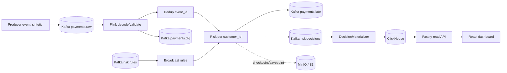

# Payment Risk — Piano tecnico di evoluzione verso la produzione

**Stato:** proposta iniziale con seconda analisi e interventi sul branch `feat/production-plan`  
**Data della review:** 9 ottobre 2026  
**Repository:** [acilione/payment-risk](https://github.com/acilione/payment-risk)  
**Baseline verificata:** branch `main`, commit [`9dfd9d6a063394039eed5951d5d0060a3bc92eee`](https://github.com/acilione/payment-risk/tree/9dfd9d6a063394039eed5951d5d0060a3bc92eee)  
**Destinatari:** Backend/Data Engineering, Platform/SRE, Security, Fraud/Risk, Data Governance  
**Ambito assunto per il piano:** *monitoraggio e valutazione antifrode asincroni*, non decisione sincrona nel percorso di autorizzazione.

> **Nota metodologica.** Questo documento distingue **AS-IS** (comportamento osservabile nel sorgente e nella CI), **TO-BE** (proposta) e **ipotesi da validare**. Il completamento della CI non equivale a una certificazione di produzione. Tempi, effort e SLO indicati come esempi sono stime progettuali da calibrare con il contesto aziendale, non caratteristiche già dimostrate.

---

> Le sezioni 1-11 descrivono la proposta e la baseline originarie. La [seconda analisi](#12-seconda-analisi-critica-e-interventi-sul-branch) distingue le modifiche implementate dai requisiti ancora da definire. Il dominio resta quello sintetico attuale, come concordato.

## 1. Executive summary

Payment Risk è una pipeline Java/Apache Flink che consuma eventi di pagamento Avro da Kafka, mantiene stato per cliente, applica cinque regole di rischio versionate e pubblica decisioni `APPROVE`, `REVIEW`, `REJECT`. Un consumer dedicato materializza le decisioni in ClickHouse; Fastify e React espongono dashboard analitiche, mentre Prometheus/Grafana supportano osservabilità. RocksDB e checkpoint su S3/MinIO consentono la ripresa dello stato.

Il progetto costituisce una **buona base tecnica per un sistema di monitoraggio antifrode asincrono**, con test su event-time, deduplica, snapshot/restore e recovery. Alla baseline indicata i workflow GitHub Actions `verify` e `website` risultano riusciti, inclusi i job di integrazione e deploy della demo. Non è dimostrata la preparazione a traffico reale su cluster produttivo, né l'efficacia statistica delle regole antifrode.

### Decisione raccomandata

1. **Preservare** Kafka, Flink e l'impostazione event-driven: non è necessaria una riscrittura dell'architettura per uno scenario asincrono.
2. **Priorità assoluta al modello di dominio:** separare evento, tentativo di pagamento, valutazione di rischio e proiezione della decisione corrente.
3. **Formalizzare la semantica operativa:** policy temporali per eventi pendenti/tardivi, replay/deduplica, applicazione deterministica delle policy, riconciliazione end-to-end.
4. **Rendere l'ambiente sicuro e gestibile:** IAM/RBAC, accessi ai dati, minimizzazione dei payload nelle DLQ, infrastruttura resiliente e procedure di disaster recovery.
5. **Validare comportamento e valore:** benchmark realistici, SLO, esiti fraudolenti etichettati, shadow mode e misura di falsi positivi/negativi prima di azioni automatiche.

### Semaforo di readiness per obiettivo

| Obiettivo | Valutazione | Motivazione |
|---|---|---|
| Portfolio / demo tecnica | **Pronto** | Architettura, documentazione, codice e CI integrata dimostrabili. |
| Proof of concept con traffico sintetico | **Pronto con limiti dichiarati** | Workflow `verify` e `website` riusciti su `main`. |
| Pilot controllato, non bloccante, con dati aziendali | **Condizionato** | Occorrono contratti di dominio, sicurezza, operazioni e riconciliazione. |
| Produzione di monitoraggio asincrono | **Non ancora qualificato** | Mancano SLO misurati, controlli dei dati, HA end-to-end, test a carico realistico. |
| Pre-autorizzazione sincrona / blocco pagamenti | **Fuori scope attuale** | Servono API di decisione sincrona, fresh feature store, budget di latenza e policy fail-open/fail-closed. |

---

## 2. Baseline tecnica AS-IS

### 2.1 Componenti e responsabilità



| Area | AS-IS | Punto di attenzione |
|---|---|---|
| Ingestion | Kafka + Avro, schemi Apicurio, validation | Non c'è una semantica completa del ciclo di vita del pagamento. |
| Elaborazione | Flink con `keyBy(event_id)` poi `keyBy(customer_id)` | Hot-key e costo crescente della ricostruzione dello storico. |
| Configurazione | Broadcast rule state con versioni monotone | Attivazione non deterministica su replay fra due stream indipendenti. |
| Delivery | Kafka sink `EXACTLY_ONCE`; consumer `read_committed` | Il materializer/ClickHouse sono fuori dalla transazione Flink/Kafka. |
| Analitica | ClickHouse `ReplacingMergeTree(source_offset)` per `transaction_id` | Retry tecnico e rivalutazione di business confluiscono nella stessa proiezione. |
| UI/API | Fastify read-only + React | Mancano auth/authz per visualizzare eventi aziendali reali. |
| Infrastructure | Compose locale; chart Flink K8s; S3 Terraform | Non esiste in repo un deployment completo HA di tutti i servizi. |
| Observability | Prometheus, Grafana, alert di checkpoint/lag/backpressure | SLO end-to-end, reconciliation e runbook operativi da completare. |

### 2.2 Stato dei test alla baseline

- Workflow [`verify`](https://github.com/acilione/payment-risk/actions/runs/37805656758): **success** (Java, integrazione/recovery, scan, Terraform).
- Workflow [`website`](https://github.com/acilione/payment-risk/actions/runs/37805656731): **success** (API/browser/build, scan container, deploy).
- La configurazione locale è riproducibile via Compose; non segue che una topologia multi-nodo sia stata testata in condizioni produttive.
- Benchmark **riportato dal README**, non ripetuto in questa review: 1.000 eventi, ~100 eventi/s di throughput riconosciuto dal producer, latenza p95 evento→visibilità Kafka ~20,793 s, ambiente WSL2 condiviso. Non rappresenta una misura di capacità sostenuta né una garanzia di SLO.

**Fonti principali:** [`PaymentRiskJob.java`](https://github.com/acilione/payment-risk/blob/9dfd9d6a063394039eed5951d5d0060a3bc92eee/src/main/java/com/portfolio/paymentrisk/PaymentRiskJob.java), [`CustomerRiskProcessor.java`](https://github.com/acilione/payment-risk/blob/9dfd9d6a063394039eed5951d5d0060a3bc92eee/src/main/java/com/portfolio/paymentrisk/processor/CustomerRiskProcessor.java), [`README.md`](https://github.com/acilione/payment-risk/blob/9dfd9d6a063394039eed5951d5d0060a3bc92eee/README.md).

---

## 3. Modello dati: AS-IS e criticità

### 3.1 Contratti attuali

| Stream/topic | Schema | Identità / chiave | Uso |
|---|---|---|---|
| `payments.raw` | `Transaction` | `event_id` nel payload; producer Kafka key `customer_id` | Fatti di pagamento in ingresso. |
| `risk.rules` | `RiskRule` | `rule_id` | Aggiornamenti delle cinque regole. |
| `risk.decisions` | `RiskDecision` | Kafka key `customer_id`; `decision_id = risk_ + transaction_id` | Valutazioni del rischio. |
| `payments.dlq` | `DeadLetter` | `error_id = topic:partition:offset` | Errori di validazione/deserializzazione. |
| `payments.late` | `LateEvent` | Kafka key `customer_id` | Eventi rifiutati dopo la frontiera di finalizzazione. |

- **`Transaction`**: `event_id`, `transaction_id`, `customer_id`, `merchant_id`, `device_id`, `amount_minor`, `currency`, `country`, `status` (`APPROVED`/`DECLINED`), `event_time`, `producer_time`. EUR only, importi in unità minori.
- **`RiskRule`**: `rule_id`, `version`, `type`, `enabled`, `score`, `window_seconds`, `threshold`, `currency`, `updated_at`.
- **`RiskDecision`**: identificatori, importo, score, classificazione, regole attivate, reason codes, `rules_fingerprint`, `event_time`, `processed_at`.
- **State Flink**: `pending` (evento + snapshot regole), `history` (feature per cliente: 1 h), `devices` (ultima osservazione: 30 giorni), `finalizedThrough`, deduplica per `event_id` con TTL di 24 h in processing-time.
- **ClickHouse**: `risk.decisions` con `ReplacingMergeTree(source_offset) ORDER BY transaction_id`, esposta tramite `risk.decisions_current` con `FINAL`.

### 3.2 Problemi da risolvere prima di dati reali

**MD-01 — Lifecycle non esplicito.** `status` contiene un esito (`APPROVED`/`DECLINED`) ma non distingue un'autorizzazione, un tentativo, un capture, un refund, un reversal o un chargeback. Più eventi per `transaction_id` possono essere legittimi; non devono essere confusi con duplicati.

**MD-02 — Identità della valutazione insufficiente.** `decision_id` è derivato da `transaction_id` e non distingue le rivalutazioni. La proiezione ClickHouse conserva una sola riga logica per transazione e quindi non costituisce un audit trail completo.

**MD-03 — Semantica di versione legata a Kafka.** `source_offset` è monotono soltanto dentro una partizione, non è una revisione di business globale. Cambiando partitioning oppure la relazione tra cliente e transazione possono emergere versionamenti inappropriati.

**MD-04 — Spiegabilità parziale.** La decisione conserva `matched_rules` e fingerprint, ma non i valori osservati delle feature, le soglie valutate, né la definizione immutabile delle regole collegata allo specifico risultato.

**MD-05 — Assenza di outcome.** Non esistono esiti fraudolenti/chargeback/revisione umana collegati alle decisioni; quindi il progetto non permette di misurare precision, recall, falsi positivi o costi di investigazione.

**MD-06 — Retention con finalità diverse.** La TTL di deduplica (24 h), lo stato di storico (1 h e 30 giorni) e la retention Kafka locale (7 giorni) sono indipendenti. Occorre formalizzare replay, rettifiche, durata dell'audit e cancellazioni/privacy.

---

## 4. Modello target TO-BE

### 4.1 Entità logiche proposte

| Entità | Chiave proposta | Responsabilità | Storage suggerito |
|---|---|---|---|
| `PaymentEvent` | `event_id` | Evento immutabile con tipo, causa e timestamp | Kafka + archivio append-only controllato |
| `PaymentAttempt` | `attempt_id` | Tentativo di autorizzazione, collegato alla transazione | Modello dell'upstream o proiezione dedicata |
| `RiskEvaluation` | `evaluation_id` | Una valutazione immutabile, anche se ripetuta/corretta | Kafka + ClickHouse append-only |
| `CurrentRiskDecision` | `(transaction_id, attempt_id)` oppure chiave di business stabilita | Ultima valutazione secondo ordinamento esplicito | Proiezione query-oriented |
| `RiskPolicyVersion` | `(policy_id, version)` | Configurazione approvata, attivazione, autore, checksum | Config store durevole/versionato |
| `RuleEvidence` | `(evaluation_id, rule_id)` | Feature, soglia, esito e contributo allo score | Annidato in RiskEvaluation o tabella separata |
| `RiskOutcome` | `outcome_id` | Frode confermata, chargeback, revisione, false alarm | Stream/tabelle dedicati |
| `ReplayAction` | `replay_id` | Audit del rigioco: ragione, origine, finestra, esito | Metadata store / audit log |

> Le entità sono **logiche**: non implicano l'introduzione obbligatoria di altrettanti microservizi o database. I campi vanno validati con i sistemi di pagamento upstream e con Fraud/Risk.

### 4.2 Schema concettuale di un `PaymentEvent` v2

```json
{
  "event_id": "evt_01...",
  "transaction_id": "txn_01...",
  "attempt_id": "att_01...",
  "customer_id": "cust_...",
  "merchant_id": "mer_...",
  "event_type": "AUTHORIZATION_DECLINED",
  "amount_minor": 90000,
  "currency": "EUR",
  "device_id": "dev_...",
  "event_time": 1791500000000,
  "producer_time": 1791500000350,
  "source_system": "payments-api",
  "correlation_id": "trace_...",
  "schema_version": 2
}
```

**Vincoli proposti:** `event_id` globale e immutabile; `attempt_id` richiesto dove esiste un tentativo; `event_type` definito da un vocabolario condiviso; `correlation_id` per tracciamento; `event_time` come tempo del fatto di business, `producer_time` come tempo di emissione. Separare status del pagamento da decisione di rischio. Stabilire quali `event_type` attivano effettivamente una valutazione ed evitare che aggiornamenti non monetari incrementino impropriamente contatori/importi.

### 4.3 Schema concettuale di una `RiskEvaluation` v2

```json
{
  "evaluation_id": "eval_01...",
  "event_id": "evt_01...",
  "transaction_id": "txn_01...",
  "attempt_id": "att_01...",
  "customer_id": "cust_...",
  "policy_id": "payment-risk-eu",
  "policy_version": 3,
  "policy_fingerprint": "sha256:...",
  "risk_score": 65,
  "risk_band": "REVIEW",
  "evaluation_mode": "FINAL",
  "rule_evidence": [
    {
      "rule_id": "R002",
      "rule_version": 3,
      "feature": "amount_10m_minor",
      "observed": 345000,
      "threshold": 300000,
      "matched": true,
      "score_contribution": 35
    }
  ],
  "evaluated_at": 1791500001800,
  "engine_version": "payment-risk/0.x"
}
```

**Nota:** esempi di *contratti concettuali*, non file Avro già validi o implementati. Lo schema finale dovrà includere tipi Avro, nullability/default, codici causali stabili, policy di compatibilità e minimizzazione dei dati. `evaluation_mode` è utile solo se si sceglie una politica di decisioni provvisorie/finali; non va aggiunto senza definirne l'effettivo ciclo di vita.

### 4.4 Persistenza consigliata

1. **Append-only `risk_evaluations`**: nessuna perdita delle valutazioni legittime. Attributi di provenienza (`topic`, `partition`, `offset`, `ingested_at`) separati dalla versione di business.
2. **`risk_current` query model**: `argMax`/aggregazioni o proiezione aggiornata secondo una chiave e una revisione *di business* esplicite, non con l'offset Kafka preso isolatamente. Definire quale evento è "corrente" in presenza di correzioni, tentativi e retry.
3. **Idempotenza d'ingestion**: usare una chiave di evento/valutazione stabile per riconoscere una consegna ripetuta; introdurre una verifica di riconciliazione che distingua le righe fisiche dai record logici. Per ClickHouse scegliere e testare strategia di deduplica in base ai carichi: insert dedup tokens/semantica della tabella, vista per chiave o upsert controllato. Nessuna tecnica da sola deve essere dichiarata exactly-once end-to-end senza prova.
4. **Gestione della retention** per casi d'uso: raw events, audit risk, metadati PII, outcome, checkpoint e analytics hanno durate e autorizzazioni diverse.

### 4.5 Evoluzione compatibile, non breaking in-place

La policy nel repository richiede test sugli historical writer schemas e topic versionati per cambiamenti incompatibili. Raccomandazione:

- Conservare `payments.raw`, `risk.decisions` e relativi consumer v1 durante la transizione.
- Introdurre topic v2 (`payments.raw.v2`, `risk.evaluations.v2`) e contratti registrati con policy di compatibilità esplicita.
- Impiegare **dual publish o adapter** in staging; la necessità di dual-write in produzione va valutata rispetto ai rischi di inconsistenza.
- Eseguire in parallelo v1 e v2 in **shadow mode**, confrontando quantità e classificazioni mediante `event_id`, `attempt_id`, `evaluation_id`.
- Migrare dashboard e letture solo dopo riconciliazione, poi dismettere v1 secondo una finestra concordata.
- Per lo stateful Flink, testare restore con savepoint e serializer/UID; **non** rinominare descriptor o modificare semantica del JSON dello stato senza strategia di migrazione.

---

## 5. Backlog tecnico con impatto, rischio e acceptance criteria

### Legenda

- **P0:** necessario prima di un pilot non bloccante su dati reali, oppure decisione architetturale bloccante.
- **P1:** necessario per qualificare un servizio produttivo affidabile.
- **P2:** ottimizzazione o evoluzione successiva, subordinata alle misure.
- **Effort:** S / M / L / XL, grandezze relative, **non** giornate-uomo.
- **Impatto:** `Dati` (schema/retention), `Correttezza`, `Latenza`, `Operazioni`, `Sicurezza`.

| ID | Priorità | Miglioria | Impatto positivo principale | Rischio/costo della modifica | Effort |
|---|---|---|---|---|---|
| PR-01 | P0 | Contratti `PaymentEvent`/`PaymentAttempt` v2 | Correttezza dominio, integrazione upstream | Breaking schema e modifiche ai producer | L |
| PR-02 | P0 | Valutazioni immutabili + current projection | Audit, replay, storico, idempotenza | Migrazione ClickHouse e query | L |
| PR-03 | P0 | Semantica eventi pending/late | Completezza e tempi di decisione prevedibili | Accuratezza event-time vs tempestività | L |
| PR-04 | P0 | Policy versionate, approvate, riproducibili | Explainability e determinismo | Schema/ordine delle regole, state migration | L |
| PR-05 | P0 | AuthN/AuthZ, accesso dati e PII/DLQ | Protezione dei dati e segregazione ruoli | Nuove dipendenze di identity e governance | L |
| PR-06 | P0 | Reconciliation + replay controllato | Individuazione e recupero di record mancanti | Doppie emissioni, errori di backfill | M/L |
| PR-07 | P1 | Hardening materializer/ClickHouse | Stabilità con outage e retry | Semantica di versioning e throughput | M/L |
| PR-08 | P1 | Deployment HA end-to-end, backup/DR | Availability e recovery | Costo infra, gestione cluster | XL |
| PR-09 | P1 | SLO, metriche end-to-end e runbook | Operabilità e incident response | Strumentazione e false alert | M |
| PR-10 | P1 | Load test, hot-key e state profiling | Capacity planning e costi prevedibili | Performance regression, tuning | M/L |
| PR-11 | P1 | Outcomes / verifica efficacia regole | Qualità antifrode misurabile | Qualità label, delay degli outcome | L |
| PR-12 | P2 | Feature incrementali e state optimization | Minore CPU/latenza a carico elevato | Complessità dei contatori e migrazioni | L/XL |
| PR-13 | P2 | Modularizzazione dashboard/API | Manutenibilità e testabilità | Refactor, regressioni UI | M |
| PR-14 | Condizionale | Decisioning sincrono pre-auth | Blocco del rischio prima dell'autorizzazione | Ripensamento SLA/failure mode; non è evoluzione banale | XL |

### PR-01 — Distinguere evento, tentativo e transazione

**Modifiche:** aggiungere `attempt_id` e `event_type`, definire vocabolario e regole di unicità/immutabilità, distinguere eventi che alimentano feature da eventi informativi e da correzioni. Coinvolgere gli owner del payment lifecycle.

**Impatto:** migliora deduplica e calcoli di velocity; evita contare più volte la stessa operazione economica. Richiede nuovi contratti e adattamenti ai producer, al motore e ai test. **Criterio di accettazione:** casi fixture approvazione/rifiuto/retry/reversal/refund documentati; ogni evento ha trattamento univoco, conteggi e importi attesi riconciliati.

### PR-02 — Separare lo storico delle valutazioni dalla proiezione corrente

**Modifiche:** `evaluation_id` stabile, stream delle valutazioni append-only, archivio analitico append-only, proiezione `current` con chiave/versione di business definita. Migrare le API verso la proiezione e mantenere una query audit dettagliata.

**Impatto:** elimina la perdita logica di valutazioni legittime e rende il replay ispezionabile. Aumenta volume persistito e richiede migrazione SQL, retention e query. **Criterio di accettazione:** due eventi legittimi della stessa transazione producono due valutazioni rintracciabili; un retry tecnico non aumenta il numero logico di valutazioni; la proiezione corrente sceglie la versione definita dal contratto.

### PR-03 — Definire un contratto per pending, watermark e lateness

**Problema AS-IS:** eventi in coda possono non essere emessi quando tutte le partizioni sono idle; gli eventi troppo tardivi non generano una nuova decisione e non modificano lo storico.

**Opzioni da valutare:**

1. **Conservativa:** finalizzazione solo in event-time con watermark; esporre esplicitamente il backlog pending e i tempi massimi osservati, e richiedere avanzamento dello stream per svuotare la coda.
2. **Deadline processing-time:** emettere un risultato marcato `PROVISIONAL` a una scadenza, seguito da eventuale `FINAL` o da una policy di gestione delle correzioni. Serve definire downstream che distingua i due stati.
3. **Fonte di watermark/heartbeat controllata:** gestione per partizione, con semantica validata per non finalizzare erroneamente eventi ancora legittimi.

**Raccomandazione:** scegliere con Fraud/Risk un vincolo misurabile di freschezza e un contratto su late/corrections prima di implementare timer aggiuntivi. **Criterio:** test delle code idle, ripartenze, out-of-order e long pause; nessun evento ammesso rimane indefinitamente `pending` senza stato/alert conforme alla policy.

### PR-04 — Policy versionate e deterministiche

**Modifiche:** conservare `policy_id`, versione, configurazione completa firmata/approvata, timestamp di attivazione e audit dell'autore; derivare la policy applicabile da regole riproducibili, non dall'interleaving occasionale del topic `risk.rules`. Salvare `policy_version`/`engine_version` in output e rule evidence.

**Impatto:** replay e audit più stabili. Richiede scelta tra semantica `effective_at` per event-time e applicazione per processing-time, pianificazione degli update e migrazione stato. **Criterio:** rigiocando lo stesso dataset e lo stesso catalogo versionato di policy, ogni `event_id` restituisce lo stesso esito salvo correzioni espressamente versionate.

### PR-05 — Accessi, privacy e sicurezza applicativa

**Modifiche:** proteggere Fastify con identity provider/OIDC o gateway verificato, RBAC per dashboard e regole, account ClickHouse separati per lettura/scrittura, credenziali gestite e rotazione, Kafka ACL least privilege, restrizioni K8s/rete, cifratura dati a riposo in base al rischio; classificazione e retention di identifier e payload.

**Nota DLQ:** `raw_payload` contiene Base64 di fino a 4.096 byte dell'evento; **Base64 non è cifratura**. Per dati reali preferire payload redatto o riferimento con accesso controllato e TTL, a seconda delle esigenze di diagnostica e replay.

**Impatto:** migliora protezione e controllo accessi; introduce integrazioni IAM, policy e test di penetrazione. **Criterio:** utente non autorizzato non accede a API/metriche sensibili; privilegi di servizio minimi; audit accessi; revisione privacy e controlli applicabili (GDPR e, se pertinente al perimetro dati, PCI DSS) documentati.

### PR-06 — Riconciliazione, DLQ/late remediation e replay

**Modifiche:** contatori con chiavi stabili e dashboard di reconciliation tra input validi, duplicati soppressi, late, DLQ e valutazioni finalizzate; command o job versionato per replay selettivo con `replay_id`, dry-run, range temporali, rate-limit e audit.

**Impatto:** permette di individuare e recuperare lacune; rischia duplicazioni se il replay non conserva l'identità dell'evento. **Criterio:** a fronte di failover e reinserimento degli stessi messaggi, numero atteso di valutazioni invariato; ogni gap ha motivazione o ticket operativo; la procedura di replay è ripetibile e interrompibile.

### PR-07 — Materializer e archivio analitico robusti

**Modifiche:** retry con exponential backoff/jitter, gestione di record non decodificabili senza bloccare indefinitamente un'intera partizione, misure consumer lag e insert latency, idempotenza testata, read/write identity separati, versioning del modello current. Valutare batching adattivo, parallelismo e partizionamento database sulla base dei risultati.

**Impatto:** minori interruzioni e maggior trasparenza; nuovi casi di errore e nuove migrazioni. **Criterio:** stop ClickHouse e restart materializer non causano perdita logica né incremento di record `RiskEvaluation` univoci; i ritardi sono osservabili e gli allarmi si attivano; le query danno lo stesso risultato prima/dopo replay.

### PR-08 — Deployment HA e disaster recovery

**Modifiche:** staging con Kafka replicato/gestito, registry e metadata store affidabili, Flink Operator con checkpoint/savepoint su object storage, ClickHouse con backup verificati e disponibilità adatta al carico, materializer/API isolati e schedulati, secrets, network policy, storage lifecycle, capacity limits e upgrade/rollback definiti. Per produzione preferire object storage gestito; la build locale di MinIO non è una raccomandazione di gestione di MinIO produttivo.

**Impatto:** riduce single point of failure; aumenta costo e complessità operativa. **Criterio:** test documentati di loss di worker, restart cluster, recovery S3, ripristino database, rollback applicativo e backfill; RTO/RPO misurati rispetto ai target concordati.

### PR-09 — SLO, KPI e runbook

**Modifiche:** definire indicatori per event-to-evaluation, event-to-Kafka-visible, event-to-ClickHouse-visible, pending age, customer state size, DLQ/late ratios, freshness della policy, Kafka lag, checkpoint duration/failures, consumer error rate, gap di riconciliazione. Aggiornare dashboard e alert con owner e playbook.

**Impatto:** rende operabile il servizio, con effort relativamente contenuto. **Criterio:** dashboard di servizio e di dominio disponibili; alert con soglie basate su baseline e destinatari reali; esercizio di incidente condotto con evidenza. **Esempio non vincolante di SLO iniziale:** 99,9% degli eventi validi classificati entro 60 s in uno specifico profilo di traffico; accettare solo dopo benchmark e requisito di business.

### PR-10 — Performance test realistici

**Modifiche:** load generator concorrente, metriche per ack e throughput effettivo, scenari steady/hot-key/high-cardinality/out-of-order/late/spike, profilo di checkpoint, CPU/memoria, latenza p50/p95/p99 e costi. Distinguere misure di `RiskEngine.evaluate` dalla latenza end-to-end (watermark + checkpoint + Kafka + materializer + ClickHouse).

**Impatto:** rende possibili decisioni di scaling giustificate; può rivelare colli di bottiglia. **Criterio:** report ripetibili versionati con commit, configurazione, dimensioni dati e risultati; test prolungato senza accumulo illimitato di lag/stato; saturazione e degradazione documentate.

### PR-11 — Outcome antifrode e rule effectiveness

**Modifiche:** raccogliere label con `transaction_id`/`attempt_id`/`evaluation_id` e timestamp di disponibilità; gestire ritardi e correzioni degli outcome; introdurre cohort e segmentazione, metriche di precision/recall, false-positive rate, alert rate, review cost, leakage e drift. Eseguire **shadow mode** prima di automatizzare azioni sui pagamenti.

**Impatto:** trasforma un motore funzionante in prodotto misurabile; comporta qualità e governance degli outcome. **Criterio:** confronto con baseline e performance per segmento; soglie di falso positivo approvate; processo di validazione/versionamento delle policy ripetibile.

### PR-12 — Feature incrementalizzate (dopo profiling)

**Modifiche:** evitare scansioni ripetute dell'intero storico cliente per ogni evento; mantenere rolling counters/sums e set/cardinalità dei device con finestre e TTL; eventualmente bucket temporali con granularità verificata. Valutare ottimizzazioni della rappresentazione state JSON e skew delle hot-key.

**Impatto:** CPU, latenza e costi migliori in workload densi; aumenta complessità e il rischio di regressioni sui boundary delle finestre. **Criterio:** equivalenza esatta degli score rispetto a fixture/oracle, inclusi boundary, restore, late e same-timestamp; miglioramento misurabile sui profili hot-key senza peggiorare correttezza.

### PR-13 — Refactor frontend/API

**Modifiche:** spezzare `web/src/main.tsx` (circa 1.300 righe alla baseline) in feature e componenti; tipizzare meglio le risposte API; paginazione/server-side filtering per interrogare oltre gli ultimi 100 record caricati; test browser/API per autorizzazioni e audit.

**Impatto:** migliore manutenzione e usabilità; non è prerequisito per una pipeline di monitoraggio tecnicamente corretta. **Criterio:** comportamento UI invariato, test verdi e query paginabili entro limiti di costo concordati.

### PR-14 — Decisioning sincrono (solo se richiesto)

**Modifiche:** servizio pre-autorizzativo con API request/response, idempotency key, feature online fresche, timeout rigorosi e policy `fail-open`, `fail-closed` o `step-up` definite dal business; Flink rimane pipeline di aggiornamento feature e analytics.

**Impatto:** cambia il prodotto, il rischio operativo e l'architettura di latenza; non basta ridurre i checkpoint. **Criterio:** budget di latenza e SLA definiti, test di fallback, failure injection, tracciabilità e controllo delle decisioni automatiche.

---

## 6. Matrice impatti trasversali

| Cambiamento | Schemi/eventi | Stato Flink | Kafka | ClickHouse/API | Operatività e rischio |
|---|---|---|---|---|---|
| PaymentEvent v2 | **Alto**: contratto breaking | Medio: feature e dedup | Nuovi topic/producer | Medio: nuovo mapping | Rischio mismatch upstream/downstream |
| RiskEvaluation append-only | **Alto**: nuovo output | Basso/medio | Nuovo topic eval | **Alto**: nuove tabelle/query | Migrazione dati + aumento storage |
| Policy deterministiche | Medio/alto | **Alto**: broadcast e restore | Versionamento topic/store | Medio: audit metadata | Cambia timing e risultato di scoring |
| Deadlines/late policy | Medio (nuovi stati eventuali) | **Alto**: timer/watermark | Output correttivi eventuali | Medio/alto: proiezione | Trade-off precisione vs tempestività |
| Materializer idempotente | Basso/medio | Nessuno | Consumer semantics | **Alto**: identity/versioning | Riduce duplicati, richiede reconciliation |
| Security + RBAC | Basso | Basso | ACL/credenziali | **Alto** per API | Richiede identity provider e gestione segreti |
| HA + disaster recovery | Nessuno | Restore/upgrade | Cluster replicato | Backup/HA | Aumenta costo, riduce downtime |
| Feature incrementalizzate | Nessuno o minimo | **Alto**: state migration | Nessuno | Nessuno | Rischio regressione score |
| Outcome e validazione | Nuovo contratto outcomes | Eventuale join futuro | Nuovi eventi | Nuove metriche/tabelle | Necessita qualità e disponibilità label |

**Rischio di compatibilità:** i maggiori rischi risiedono nella modifica della semantica delle chiavi, dello stato serializzato Flink e dell'ordine applicativo delle decisioni; questi punti richiedono test di migrazione con dati reali anonimizzati o sintetici rappresentativi.

---

## 7. Piano di implementazione e migrazione

### Fase 0 — Decisioni/contratti prima del codice

**Deliverable:** RFC approvata che definisce modalità asincrona, semantica transazioni/tentativi, politica late, identity e versioning delle valutazioni, retention e audit, SLO da misurare.

**Gate:** Fraud/Risk, piattaforma pagamenti, Security e Data Platform concordano gli esempi di ciclo di vita e le condizioni di fallimento. Nessuna modifica breaking parte senza questo gate.

### Fase 1 — Correttezza dominio e audit (PR-01, PR-02, PR-04)

1. Creare schemi Avro v2 e fixture contract test.
2. Introdurre event types e identificazione dei payment attempts.
3. Produrre valutazioni con ID proprio, versione policy e rule evidence.
4. Aggiungere append-only storage e proiezione current con semantica definita.
5. Allestire un tool di confronto v1/v2 per eventi sintetici e dataset di staging.

**Gate:** confronti degli output spiegabili; nessuna perdita di valutazioni legittime; replay tecnico logicamente idempotente; compatibilità upstream validata.

### Fase 2 — Semantica dei tempi, recovery e dati problematici (PR-03, PR-06, PR-07)

1. Applicare e testare la policy su pending/late/timeouts.
2. Implementare riconciliazione su ogni categoria di output.
3. Aggiungere retry e diagnosi per materializer.
4. Implementare replay selettivo e controllato con audit.
5. Coprire fault injection su Kafka/ClickHouse e restore Flink.

**Gate:** ogni input viene classificato o registrato in un percorso eccezionale entro una policy misurabile; replay ripetuti non alterano i conteggi logici.

### Fase 3 — Staging realistico e sicurezza (PR-05, PR-08, PR-09)

1. Deploy del sistema end-to-end su infrastruttura non locale.
2. Abilitare auth/authz, identità per componente, network controls, policy PII.
3. Eseguire restore da backup, rollback ed esercizi di incidente.
4. Pubblicare dashboard SLO, ownership e runbook.

**Gate:** security review positiva, RTO/RPO provati, data access auditabile, allarmi con percorso di escalation.

### Fase 4 — Performance e valore di business (PR-10, PR-11, PR-12)

1. Benchmark con carico/stato realistici e profiling hot-key.
2. Ottimizzare lo stato solo dove dimostrato necessario.
3. Ingestire outcome etichettati; valutare regole per segmento.
4. Attivare shadow mode su eventi reali prima di alert e azioni automatizzate.

**Gate:** SLO soddisfatti nel profilo di traffico target; rule effectiveness documentata; false positive accettabili secondo Fraud/Risk; rollback immediato disponibile.

### Strategia di rollback raccomandata

- Mantenere versioni v1 e v2 parallele fino alla riconciliazione completa.
- Distribuire i nuovi consumer leggendo topic nuovi; evitare il cambio simultaneo di producer, schema, state backend e dashboard.
- Conservare savepoint/checkpoint compatibili con la versione da ripristinare e testare **davvero** il restore.
- Per divergenze su decisioni, riportare downstream alla proiezione v1 e conservare gli output v2 per analisi, senza sovrascriverli.
- Non affidare il rollback a un semplice `git revert` quando sono cambiati schema Kafka, tabelle o serializer Flink.

---

## 8. Test plan e criteri di release

| Famiglia | Scenari minimi | Gate previsto |
|---|---|---|
| Contract/schema | Evolution v1→v2, tipi/eventi sconosciuti, default/null | Test Avro e consumer compatibility in CI |
| Domain | Auth decline, retry, approval, reversal, refund, repeated event | Una semantica di conteggio determinata per fixture |
| Event-time | In-order, out-of-order, same timestamp, idle, super-late | Decisioni coerenti e deadline/late policy rispettata |
| Policy | Activate/update/disable, restart, replay, version collision | Regole riproducibili con stessa configurazione |
| Delivery | Crash pre/post Kafka commit, inserimento CH riuscito ma offset non committato | Nessuna perdita logica; duplicati rilevati/gestiti |
| Replay | Stesso `event_id`, stessi dati in batch multipli, replay dopo TTL | Comportamento esplicito e coerente col contratto |
| Security | Utente anonimo, tenant/ruolo non autorizzato, secret rotation | Accesso negato e audit registrato |
| HA/DR | TaskManager kill, Kafka broker outage, ClickHouse outage, restore S3 | RTO/RPO e reconciliation entro target |
| Load | Steady, burst, hot-key, high-cardinality, >durata retention test | Nessun lag incontrollato; profilo risorse noto |
| Observability | Metric endpoint down, checkpoint stalled, DLQ surge, policy stale | Alert verificati e runbook eseguibili |
| Fraud effectiveness | Outcome maturati, label lag, segmenti e soglie | Precision/recall e costi confrontati con baseline |

### Definition of Done per intervento

Ogni ticket di produzione deve includere: modifica dei contratti e relativa versione; test positivi/negativi e di regressione; piano migrazione/rollback; benchmark se impatta lo stato o la latenza; nuove metriche; security/privacy impact; documentazione operativa; criteri di attivazione e owner del servizio.

### Gate di go-live per pilot reale (non bloccante)

- [ ] Definizione del ciclo di vita eventi e delle identità approvata.
- [ ] Risk evaluations immutabili e audit consultabile.
- [ ] Policy temporalmente riproducibili e relativo audit.
- [ ] Gestione documentata di pending, late, DLQ e replay.
- [ ] Accesso autenticato e segregazione dei permessi ai dati reali.
- [ ] Riconciliazione end-to-end con scostamenti e casi eccezionali visibili.
- [ ] HA, backup e restore testati su staging simile alla produzione.
- [ ] SLO misurati sul profilo di carico target.
- [ ] Test di security e privacy review completati.
- [ ] Regole eseguite inizialmente in shadow mode, senza bloccare autorizzazioni reali.

---

## 9. Decisioni aperte (ADR da produrre)

| ADR | Domanda | Effetto della risposta |
|---|---|---|
| ADR-001 | Risk monitoring asincrono o decisioning pre-auth? | Definisce latency budget, API e failure mode. |
| ADR-002 | Qual è la semantica di `transaction_id`, `attempt_id`, `event_id`? | Chiavi, deduplica, conteggi, audit e reprocess. |
| ADR-003 | Quali eventi alimentano ciascuna regola? | Correttezza dei contatori e importi cumulativi. |
| ADR-004 | Quale deadline per evento pending? E dopo la deadline? | Watermark, late correction, SLA e proiezioni. |
| ADR-005 | Come viene attivata la policy: event-time o processing-time? | Determinismo in replay e audit. |
| ADR-006 | Qual è l'identità di una valutazione e cos'è la 'current' decision? | Schema Kafka e storage analitico. |
| ADR-007 | Per quanto conservare raw, audit, PII, DLQ e checkpoint? | Costi, GDPR/privacy, replay possibile. |
| ADR-008 | Chi può visualizzare dati, cambiare policy ed eseguire replay? | IAM, RBAC, segreti, separazione responsabilità. |
| ADR-009 | Quali RTO/RPO, throughput e SLO hanno valore di business? | Topologia, costi e test di qualificazione. |
| ADR-010 | Quando una regola è sufficientemente efficace per generare un'azione? | Metriche di frode, approvazioni e rollout. |

---

## 10. Priorità pragmatica se il team è piccolo

Per evitare over-engineering, raccomando di non partire da nuovi microservizi, feature store esterni o ML. La sequenza di maggior valore è:

1. **Dominio/chiavi e immutabilità delle valutazioni** (`PR-01`, `PR-02`): sblocca audit e reprocess senza dati ambigui.
2. **Policy e temporalità** (`PR-03`, `PR-04`): impedisce sorprese di correttezza nei restore/replay.
3. **Accessi + reconciliation** (`PR-05`, `PR-06`): prerequisiti reali per dati sensibili e operazioni.
4. **Hardening e staging HA** (`PR-07`, `PR-08`, `PR-09`): trasforma una demo funzionante in servizio operabile.
5. **Misure e qualità antifrode** (`PR-10`, `PR-11`): dimostra il valore e orienta l'ottimizzazione (`PR-12`).

**Non prioritarie** prima di misure concrete: riprogettazione completa in microservizi; machine learning; riscrittura frontend; database aggiuntivi per ogni entità; tuning sofisticato di RocksDB senza profilo di carico.

### Impatto atteso complessivo

| Dimensione | Oggi | Dopo le fasi 1–4 (obiettivo, non garanzia) |
|---|---|---|
| Correttezza | Regole testate sul contratto sintetico corrente | Semantica dei tentativi e riproducibilità dei risultati formalizzate |
| Audit | Decisione corrente + fingerprint | Storico immutabile e rule evidence confrontabile |
| Idempotenza | Kafka exactly-once + projection ClickHouse con assunzioni sul partitioning | Reconciliation e chiavi applicative con semantica esplicita |
| Latenza | Misura limitata; pending può attendere watermark | SLO per profilo definito, politica di finalizzazione documentata |
| Disponibilità | Recovery Compose verificato in CI | HA, backup e rollback testati nello staging target |
| Sicurezza | Controlli di base e deployment local-only | Identity, least privilege, retention e audit adeguati a dati reali |
| Valore antifrode | Score di regole senza ground truth | Efficacia misurata su outcome e validata in shadow mode |

---

## 11. Riferimenti nel repository

- [README e architettura](https://github.com/acilione/payment-risk/blob/9dfd9d6a063394039eed5951d5d0060a3bc92eee/README.md)
- [Pipeline Flink](https://github.com/acilione/payment-risk/blob/9dfd9d6a063394039eed5951d5d0060a3bc92eee/src/main/java/com/portfolio/paymentrisk/PaymentRiskJob.java)
- [Risk engine](https://github.com/acilione/payment-risk/blob/9dfd9d6a063394039eed5951d5d0060a3bc92eee/src/main/java/com/portfolio/paymentrisk/domain/RiskEngine.java)
- [Gestione stato cliente](https://github.com/acilione/payment-risk/blob/9dfd9d6a063394039eed5951d5d0060a3bc92eee/src/main/java/com/portfolio/paymentrisk/processor/CustomerRiskProcessor.java)
- [Deduplica](https://github.com/acilione/payment-risk/blob/9dfd9d6a063394039eed5951d5d0060a3bc92eee/src/main/java/com/portfolio/paymentrisk/processor/Deduplicate.java)
- [Schema Transaction](https://github.com/acilione/payment-risk/blob/9dfd9d6a063394039eed5951d5d0060a3bc92eee/schemas/transaction.avsc)
- [Schema RiskRule](https://github.com/acilione/payment-risk/blob/9dfd9d6a063394039eed5951d5d0060a3bc92eee/schemas/risk-rule.avsc)
- [Schema RiskDecision](https://github.com/acilione/payment-risk/blob/9dfd9d6a063394039eed5951d5d0060a3bc92eee/schemas/risk-decision.avsc)
- [Policy compatibilità schemi](https://github.com/acilione/payment-risk/blob/9dfd9d6a063394039eed5951d5d0060a3bc92eee/schemas/compatibility-policy.yaml)
- [DDL ClickHouse](https://github.com/acilione/payment-risk/blob/9dfd9d6a063394039eed5951d5d0060a3bc92eee/infrastructure/docker/clickhouse.sql)
- [DecisionMaterializer](https://github.com/acilione/payment-risk/blob/9dfd9d6a063394039eed5951d5d0060a3bc92eee/src/main/java/com/portfolio/paymentrisk/tools/DecisionMaterializer.java)
- [API overview](https://github.com/acilione/payment-risk/blob/9dfd9d6a063394039eed5951d5d0060a3bc92eee/web/server/overview.mjs)
- [Docker Compose](https://github.com/acilione/payment-risk/blob/9dfd9d6a063394039eed5951d5d0060a3bc92eee/docker-compose.yml)
- [Helm deployment](https://github.com/acilione/payment-risk/blob/9dfd9d6a063394039eed5951d5d0060a3bc92eee/infrastructure/helm/payment-risk/templates/deployment.yaml)
- [Prometheus alerts](https://github.com/acilione/payment-risk/blob/9dfd9d6a063394039eed5951d5d0060a3bc92eee/observability/prometheus/alerts.yml)
- [Workflow verify riuscito](https://github.com/acilione/payment-risk/actions/runs/37805656758)
- [Workflow website riuscito](https://github.com/acilione/payment-risk/actions/runs/37805656731)

---

**Conclusione:** il principale investimento non è aggiungere tecnologie: è rendere **esplicito il dominio**, **immutabile l'audit**, **deterministiche le policy** e **misurabile l'operatività**. Con questi interventi Payment Risk può evolvere ragionevolmente verso un servizio antifrode asincrono utilizzabile, mantenendo l'architettura streaming di base. L'uso nel percorso di autorizzazione rimane un progetto distinto, con requisiti di latenza e disponibilità significativamente più stringenti.


## 12. Seconda analisi critica e interventi sul branch

### 12.1 Giudizio generale

La resilienza non è un requisito trascurabile. Un sistema di analisi finanziaria che conta due volte una transazione o perde una decisione può produrre allarmi, statistiche e indagini sbagliati anche se non autorizza direttamente il pagamento. Tuttavia, "iper resiliente" non è una specifica verificabile: occorre distinguere correttezza dei risultati, perdita di dati, disponibilità e ritardo di pubblicazione.

Per il dominio attuale privilegio la correttezza: davanti a un'identità contraddittoria fermo l'elaborazione interessata o la pubblicazione dei totali; durante un guasto di storage lascio gli offset non confermati e accetto un aumento del ritardo. Questo non determina se approvare o rifiutare un pagamento reale. La pipeline rimane asincrona e i suoi nomi APPROVE/REVIEW/REJECT non rappresentano un'autorizzazione bancaria.

Il piano individua problemi reali. Le correzioni più urgenti sono identità, conservazione dei risultati, conflitti, configurazione delle regole, confine di commit e riconciliazione. Non e invece giustificato aggiungere subito tentativi, capture, refund, tenant, identità aziendali o una piattaforma cloud immaginaria: non sono disponibili contratti reali, IdP o staging. Il lavoro su questo branch conserva tale vincolo.

### 12.2 Quattro significati diversi di "duplicato"

| Caso | Risposta implementata | Limite |
| --- | --- | --- |
| Stesso `event_id`, stessi dati, nuovo offset | Lo stato Flink sopprime il retry senza aggiornare la scadenza. Il fingerprint ignora solo `producer_time`. | TTL di 24 ore; non è un registro permanente. |
| Stesso `event_id`, dati diversi | Errore `EVENT_IDENTITY_CONFLICT` prima dell'aggiornamento delle feature. | Serve correzione del produttore e ripresa controllata; un restart da solo non risolve il dato. |
| Altro evento che riusa `transaction_id` | Secondo controllo keyed, con errore `TRANSACTION_IDENTITY_CONFLICT`, prima dello stato cliente. | Valido per l'attuale contratto di un risultato di autorizzazione per transazione; un futuro lifecycle deve cambiarlo esplicitamente. Anche questo controllo ha TTL. |
| Decisione già inserita, risposta HTTP o commit Kafka persi | Si ripete l'inserimento; l'archivio conserva le consegne e la vista espone una sola valutazione logica. | Le righe fisiche possono ripetersi; non si dichiara un vincolo UNIQUE di ClickHouse. |

L'identità della valutazione deriva da `(event_id, engine_version, policy_id, policy_version)`, con codifica JSON canonica e SHA-256. Il risultato, il fingerprint delle regole e le feature osservate **non** entrano nell'identità. Se vi entrassero, una rielaborazione incoerente genererebbe semplicemente un'altra identità e il conflitto sparirebbe. Il contenuto viene confrontato separatamente, includendo il fingerprint dell'input. Timestamp di elaborazione e coordinate Kafka restano metadati di consegna.

L'archivio distingue `evaluations` (consegne), `evaluations_logical` (identità e varianti di contenuto), `transaction_integrity` e `integrity_conflicts`. La vista corrente ammette solo transazioni non ambigue. Se esistono conflitti o decisioni in quarantena, l'API restituisce 503 invece di pubblicare la somma del sottoinsieme rimasto. Il controllo riguarda tutto l'archivio, anche se la finestra richiesta è breve. Cache e aggiornamento del browser restano asincroni; non è una lettura contabile atomica.

Questo risolve il doppio conteggio dei retry nel modello analitico, non l'unicità fisica assoluta. Non esiste una garanzia illimitata senza definire conservazione, autorità dell'identità e comportamento dopo la perdita dello stato. Gli hash hanno inoltre le normali assunzioni crittografiche, non sono una prova matematica di assenza di collisioni.

### 12.3 Alternative quando il requisito è più forte

**Registro transazionale dell'ingresso.** Se servono identità durature anche dopo il TTL, l'opzione preferibile è un database transazionale dedicato con vincolo unico sulla chiave business, hash del contenuto e outbox nella stessa transazione. Un retry con contenuto uguale restituisce l'esito già registrato; contenuto diverso genera un incidente di integrità. Non basta fare SELECT e poi INSERT: inserimenti concorrenti richiedono un vincolo atomico. Il relay dell'outbox può consegnare più volte, quindi i consumatori devono comunque essere idempotenti. Servono retention approvata, backup, restore e alta disponibilità del registro. Non riutilizzerei silenziosamente database e credenziali di Apicurio: hanno responsabilità e permessi diversi.

**Deduplica Flink senza scadenza.** Tecnicamente semplice, ma cresce senza limite e aumenta costo e tempi di ripristino. Una retention estesa è sensata solo dopo aver definito il periodo massimo di retry/replay e misurato lo stato. Un Bloom filter da solo non va bene: i falsi positivi possono sopprimere pagamenti validi. Un topic compattato può trasportare un indice, ma non costituisce da solo un vincolo atomico fra produttori concorrenti.

**Deduplica degli insert ClickHouse.** Token e finestre di deduplica possono ridurre copie fisiche, ma hanno limiti di finestra, batch e configurazione. Sono un'ottimizzazione, non il contratto di identità del pagamento. `ReplacingMergeTree`, `FINAL` e `argMax` non rendono unica una chiave business. Per l'analisi è accettabile conservare consegne duplicate e contare una sola valutazione verificata; per un registro finanziario autorevole sceglierei il registro transazionale precedente.

**Rivalutazioni.** Non scegliere "l'ultima" tramite offset globale o orologio di macchina. Quando esisteranno requisiti reali, introdurre una revisione assegnata da un'autorità, motivo, stato e riferimento alla valutazione sostituita. Due revisioni concorrenti dello stesso livello devono essere un conflitto. Per ora una nuova policy non autorizza a reinterpretare automaticamente lo storico corrente.

### 12.4 Valutazione delle proposte

| Proposta | Valutazione e lavoro svolto | Passo ancora necessario |
| --- | --- | --- |
| PR-01, modello lifecycle | Problema corretto; rinviato lo schema v2. Aggiunto il controllo di identità della transazione per il dominio esistente. | Chiarire con il produttore evento, tentativo, transazione, correzione e refund prima di introdurre campi obbligatori. |
| PR-02, storico e proiezione | Implementati archivio di consegne, valutazioni logiche, conflitti, identità stabile e dati di spiegazione. Eliminata la scelta del risultato tramite offset. | Definire la revisione business per ammettere rivalutazioni. Archivio append-only non significa immutabilità contro un amministratore. |
| PR-03, pending e late | Mantenuta finalizzazione solo in event time; aggiunti watchdog e alert delle code pendenti. | Se serve una scadenza finita, usare completezza dichiarata dalla fonte oppure un esito provvisorio esplicito con successiva revisione. Non avanzare il watermark perché e trascorso tempo di parete. |
| PR-04, policy deterministiche | Catalogo completo per deployment, ID/versione, soglie, checksum opzionale, snapshot nei pending e nell'output. Obbligatorio fuori dal locale. | Approvazione e firma del rilascio. `effective_at` da solo non dimostra che siano arrivate tutte le policy applicabili; servono un catalogo completo o una barriera di attivazione. |
| PR-05, accessi e privacy | Payload DLQ omesso per default; hash, lunghezza e coordinate conservati. Capture consentita solo localmente. | IdP/RBAC, identità DB distinte e accessi ai dati late/audit restano necessari prima di dati reali. Non si dichiara implementata l'autenticazione. |
| PR-06, riconciliazione/replay | Replay delle sole decisioni con dry run, limiti, offset finali fissati, motivazione, manifest e digest delle coordinate. Test di riconciliazione fra Kafka decisioni e ClickHouse. | Riconciliazione completa fra ingressi accettati, duplicati, pending, late, DLQ e decisioni; archivio durevole dei manifest. I contatori Flink non sono una contabilita persistente. |
| PR-07, materializer | Backoff con jitter e budget finito, metriche, quarantena durevole dei record invalidi, commit dopo tutti gli insert, errori infrastrutturali propagati. | Misurare catch-up e retention su guasti lunghi; garantire durabilità/replica dello storage nel cluster effettivo. |
| PR-08, HA/DR | Proposta corretta, non realizzata con un falso staging locale. Restano i manifest e i controlli di deployment esistenti. | Kafka replicato, quorum, registry/DB, Flink HA, object store e ClickHouse ridondanti; prove di perdita nodo/zona e restore completo. |
| PR-09, SLO | Aggiunti indicatori e alert per materializer, quarantena e pending. | Stabilire SLI misurabili e obiettivi condivisi. 99,9% e 60 secondi nel piano sono esempi, non risultati acquisiti. |
| PR-10, carico | Necessario, ma nessun nuovo numero di capacità viene dichiarato. | Test sostenuto, hot key, backlog, checkpoint grandi, saturazione disco e tempi di recupero. Il benchmark locale esistente non basta. |
| PR-11, efficacia antifrode | Corretto; non implementabile con etichette inventate. | Esiti reali, ritardo delle etichette, precision/recall, costi dei falsi positivi e shadow mode. Correttezza tecnica non implica efficacia delle regole. |
| PR-12, feature incrementali | Non riscrivere lo stato senza profiling. | Ottimizzare solo mantenendo finestre, eventi con uguale timestamp, overflow e compatibilità dei savepoint; confrontare con l'algoritmo di riferimento. |
| PR-13, frontend/API | Utile ma secondario all'integrità. Aggiunto il blocco dei totali ambigui. | Paginazione server e componenti più piccoli quando servono dati oltre gli ultimi 100 risultati. |
| PR-14, percorso sincrono | Fuori scope e da non confondere con questo lavoro. | Prodotto distinto, latenza e fallback approvati, feature sufficientemente aggiornate e test dedicati. |

### 12.5 Resilienza: confini e priorità

1. **Produttore ? Kafka.** Un'identità stabile deve nascere dal produttore. Conferma solo dopo scrittura durevole, replica e minimum in-sync replicas adatti alla tolleranza richiesta. Il broker unico Compose non sopravvive alla perdita del suo disco.
2. **Kafka ? Flink ? Kafka.** Checkpoint, stato e sink transazionali coordinano il recovery, ma non eliminano un nuovo record business duplicato pubblicato dal produttore. Il ripristino deve usare stato e posizioni coerenti; timeout delle transazioni e retention devono coprire l'interruzione prevista.
3. **Kafka ? ClickHouse.** Il consumer può ripetere una consegna, ma non conferma una scrittura fallita. Il crash dopo insert e prima di commit è previsto. Quarantena e risultati devono essere persistiti prima del commit. Una risposta positiva non prova da sola che esistano repliche e backup: dipende dal deployment.
4. **Archivio ? dashboard.** Niente scelta arbitraria fra risultati incompatibili. L'API blocca la pubblicazione se l'archivio segnala problemi; cache e aggiornamenti periodici comportano una visibilità ritardata. La disponibilità e subordinata alla correttezza dei totali.
5. **Disastro e recupero.** Definire RPO e RTO per ogni confine e testare anche Kafka, schemi, checkpoint e archivio insieme. Replicare non sostituisce un backup contro errori logici. Senza ambiente e requisiti non assegno valori numerici fittizi.

Resta una lacuna importante: dopo la scadenza della deduplica, un vecchio evento può entrare di nuovo nello stato live, specialmente se anche lo storico cliente e stato eliminato. Il controllo nell'archivio protegge i totali pubblicati quando rileva contraddizioni, ma non rende corrette retroattivamente tutte le feature calcolate. Per traffico reale con retry oltre il TTL occorre il registro d'ingresso durevole oppure un contratto di retention verificabile. Questo è un requisito di progetto, non una nota da ignorare perché i test passano.

Fermarsi su un conflitto preserva la correttezza ma consente a un singolo produttore errato di interrompere il job. In un deployment multi-cliente si potrebbe isolare il cliente o la partizione e continuare gli altri, purche la sospensione e la successiva riconciliazione siano esplicite. Non basta saltare il record e mantenere il sistema apparentemente sano.

### 12.6 Migrazione e verifica

Il README contiene procedura di migrazione, replay e rollback. Gli schemi Avro aggiungono campi con default; UID e descrittori precedenti sono preservati. Il nuovo indice per `transaction_id` non ha storia in un vecchio savepoint. Il vecchio stato Boolean per gli eventi non contiene il fingerprint: un retry non verificabile ferma il job invece di essere trattato come sicuramente uguale. I vecchi pending senza watchdog non vengono sorvegliati finche non arriva altro input per quella chiave. Queste limitazioni richiedono una prova di upgrade con dati rappresentativi, oltre al restore fra due esecuzioni della stessa versione.

La vecchia tabella può avere già eliminato valutazioni tramite merge. Mantenerla facilita il confronto, ma non ricostruisce ciò che e stato perso: per il backfill serve il log Kafka ancora conservato o un archivio. Nessuna migrazione deve aprire la dashboard prima della riconciliazione della copertura.

I test aggiunti coprono identità stabile, variazione del contenuto, conflitto fra eventi della stessa transazione, evidenze Avro, policy congelata rispetto all'ordine di broadcast, watchdog senza finalizzazione, risposta HTTP persa, errore della quarantena senza commit, replay e confronto esatto delle coordinate archiviate. La CI esegue anche test SQL con retry fra partizioni, conflitti di risultato e transazioni ambigue. Test e CI non dimostrano HA multi-zona, unicità senza scadenza o correttezza antifrode su casi reali.

### 12.7 Riferimenti tecnici per la review

- [ClickHouse ReplacingMergeTree](https://clickhouse.com/docs/reference/engines/table-engines/mergetree-family/replacingmergetree): la rimozione avviene durante i merge e non equivale a un vincolo di unicità.
- [Flink Broadcast State](https://nightlies.apache.org/flink/flink-docs-release-2.2/docs/dev/datastream/fault-tolerance/broadcast_state/): gli aggiornamenti devono essere deterministici; l'ordine degli input non è un contratto globale di attivazione.
- [Kafka consumer configuration](https://kafka.apache.org/43/generated/consumer_config.html): isolamento, intervallo massimo fra poll e comportamento degli offset appartengono al contratto operativo del consumer.
