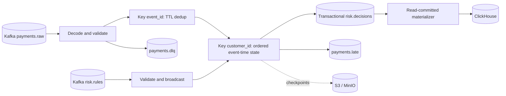

# Architecture and specification improvements

## Ordering and finality

Arrival-order evaluation would compute incorrect prior-history features for out-of-order payments. Accepted events are buffered by millisecond timestamp, sorted by event ID on ties, and evaluated when event-time timers fire. Windows are lower-exclusive and upper-inclusive. Current contributes to count, amount and unique-device features; preceding events determine new-device and decline-sequence matches.

Validation runs in the Kafka record deserializer before source-split watermark assignment, preventing corrupt and grossly future-dated timestamps from poisoning progress. The downstream validation operator emits metrics and routes rejected envelopes. Events more than five minutes ahead of observation are rejected. Each Kafka split uses ten-second disorder and sixty-second idleness; a fast partition cannot hide another active partition's older events. An active partition containing only invalid data can stall event time and must be investigated through DLQ and watermark alerts.

The rule control input marks itself idle on records and periodic callbacks, so it cannot block payment timers or advance business time when payment inputs become idle. Emitting a maximum watermark here is unsafe: when the payment side becomes idle, it can finalize all timers and make resumed input permanently late. No processing-time timer fabricates business-time progress. An entirely idle payment stream leaves its buffered tail pending. A synchronous authorization service needs a different latency/finality contract.

## State boundaries

Deduplication is globally keyed by event ID, with Flink processing-time TTL of 24 hours, OnCreateAndWrite and NeverReturnExpired. Duplicate reads do not refresh expiry; downtime counts toward expiry. This is not permanent uniqueness.

Customer history retains only timestamp, amount, currency, device and status for one hour; device last-seen values survive thirty days. Per-customer pending/history caps and device cardinality caps fail visibly rather than silently discarding risk evidence. Rules cannot request horizons larger than retained history. Equal timestamps share state and evaluation timers. One additional cleanup timer per customer targets the next expiry; idle state and zero-valued counters are cleared.

Explicit String/Long/Integer serializers and named JSON state avoid accidental Kryo/Java-record evolution. JSON changes remain migration-sensitive. Stable UIDs and max parallelism 128 are restore contracts. Exact-history scans are linear in retained events per customer; this auditable baseline requires bucket aggregation and equivalence testing before claiming large hot-key capacity.

## Rule activation and replay

Customer finalization timestamps are checkpointed while customer history is retained. Source watermarks restart from their initial value after recovery; this stored boundary prevents older input from retroactively mutating retained history. Once all customer history, devices and pending events expire, its boundary is removed too. This is not a permanent global event-time rejection ledger.

Five deployment-controlled rule IDs bound broadcast state and metric labels. Typed rule parameters, currency, score and horizons are validated. Version 1 is packaged; higher versions replace prior state, and disable uses a higher version with enabled=false. Stale/equal versions are ignored.

Each admitted event checkpoints its full rule snapshot. Later updates cannot alter already buffered events. Fingerprints include sorted full payloads, disabled flags and classification thresholds, not only IDs/versions.

Separate Kafka payment/rule inputs have no common transaction order. Replaying records after a checkpoint can change cross-input interleaving and therefore the snapshot admitted for those records. Exactly-once Kafka visibility does not guarantee globally deterministic rule activation. Outputs expose the policy used. Deterministic historical re-evaluation requires effective-time rule history plus an activation barrier, or upstream assigned rule-set IDs. Compaction here supports current-policy activation, not all historical policies.

## Failure boundaries

Malformed records and unknown schemas produce transactional DLQ evidence with source positions and capped base64 payload. Registry network/auth/server failures propagate for recovery rather than quarantining valid data. Unexpected engine, overflow and state failures also fail visibly.

KafkaSource progress, managed state and KafkaSink transactions participate in checkpoints. Sink prefixes are unique per deployment and topic. All committed-output consumers must use read_committed. The transaction timeout is fifteen minutes; checkpoint plus outage/recovery must fit within it. Local single-broker Kafka is a demonstration topology.

ClickHouse is outside this atomic boundary. Materialization inserts synchronously before committing Kafka offsets. Replays use a stable source offset version and transaction-ID key; `FINAL` resolves repeats before physical merges. Topic partition count and transaction-to-customer mapping must stay stable. No time partition is used that could split a business key across independent merge domains.

EUR-only validation and integer cents prevent mixed-currency and rounding errors. This is not a generic rules language, ML model, payment gateway or compliance certification.
