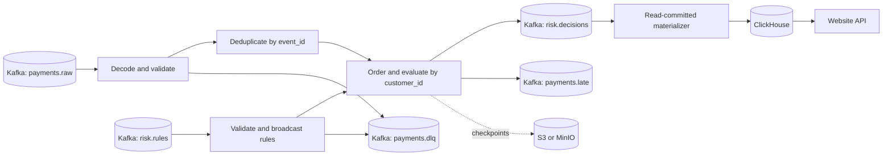

# Payment risk technical guide

Payment risk reads synthetic payment events from Kafka, evaluates five rules in Apache Flink, and writes decisions to Kafka. A separate consumer copies committed decisions into ClickHouse for the website and reporting. Amounts are integer EUR cents. The application does not process payment authorizations or transfer money.

Start with the [README](../README.md) to run the local stack.

## Contents

- [Architecture](#architecture)
- [Data model](#data-model)
- [Risk rules](#risk-rules)
- [Configuration](#configuration)
- [Operations](#operations)
- [Deployment](#deployment)
- [Website](#website)
- [Verification](#verification)
- [Performance](#performance)
- [Dependencies](#dependencies)

## Architecture



### Event time and ordering

The Kafka deserializer validates records before assigning source watermarks. Invalid records, including timestamps more than five minutes ahead of observation, cannot advance event time. Validation errors go to `payments.dlq` with source positions and diagnostic data. Registry network, authentication and server failures fail the job for recovery instead of classifying otherwise valid records as malformed.

By default, each payment partition allows ten seconds of disorder and becomes idle after sixty seconds without input. The minimum watermark across active partitions controls progress. A fast partition cannot make an older active partition's records appear complete. A partition that continues receiving only invalid records can stall event time; inspect the DLQ and partition activity in that case.

Accepted events are buffered by millisecond timestamp and evaluated when their event-time timers fire. Events with the same timestamp are processed in `event_id` order. The windows are `(event_time - horizon, event_time]`: the lower boundary is excluded and the upper boundary is included. Earlier events with an equal timestamp can contribute to later events in that order.

An event at or behind the watermark goes to `payments.late` and does not change completed decisions. Each customer also retains its last finalized timestamp in checkpointed state. This rejects older input after recovery even though source watermarks restart from their initial value. That timestamp is removed when all retained history, devices and pending events for the customer have expired; it is not a permanent rejection record.

The rule input marks itself idle rather than advancing payment time. Processing-time timers do not finalize payments. If every payment partition becomes idle, the last buffered events remain pending until valid events advance the watermarks. This behavior matters for finite test runs and prevents using the current pipeline as a synchronous authorization service.

### Deduplication and retained state

A separate Flink operator groups records by `event_id` before grouping them by `customer_id`. Its default processing-time TTL is 24 hours, with `OnCreateAndWrite` and `NeverReturnExpired`. Reading a duplicate does not extend its expiry; downtime counts toward the TTL. Deduplication applies across customers for the same event ID, but does not enforce permanent uniqueness.

Customer state keeps one hour of payment history and thirty days of device last-seen timestamps by default. History stores the timestamp, amount, currency, device and status used by the rules. Per-customer event and device limits cause a visible job failure when exceeded; they do not silently remove evidence. Dynamic rules cannot request windows longer than the configured retention.

Events with equal timestamps share evaluation timers. One additional cleanup timer per customer targets the next expiry. Cleanup removes expired history and devices, idle customer state and counters that no longer hold data. Event-time cleanup requires watermark progress; deduplication TTL has separate processing-time semantics.

Embedded RocksDB stores managed state, with incremental checkpoints in object storage. Explicit String, Long and Integer serializers and named JSON state avoid accidental generic serialization. JSON state still requires compatibility testing when fields or meanings change. Stable operator UIDs, state descriptor names and maximum parallelism 128 are part of the restore contract.

### Rules and replay

Five permitted rule IDs bound broadcast state and metric labels. The application starts with packaged version-1 rules. A valid update with a higher version replaces the previous rule; equal and lower versions are ignored. Disable a rule by publishing a higher version with `enabled: false`.

When an event is admitted to customer state, the job saves its complete rule snapshot alongside it. Later updates do not change the policy applied to that buffered event. Decisions contain a SHA-256 fingerprint of the sorted full rule payloads, including disabled flags and classification thresholds.

Payment and rule topics have no shared transaction order. Replaying records after a checkpoint can change their cross-input interleaving and therefore which rule snapshot is attached to newly admitted records. Transactional Kafka output does not make rule activation globally deterministic. Reproducible historical re-evaluation would require effective-time rule history with a coordinated activation point, or a rule-set ID assigned upstream. The compacted topic retains current rules rather than a complete policy history.

### Delivery and recovery

Kafka source positions, Flink managed state and Kafka sink transactions participate in checkpoints. Decisions, dead-letter records and late records use transactional sinks. Each deployment needs a unique transaction prefix; the job adds the topic to separate its sinks. Consumers that require committed output must use `isolation.level=read_committed`.

The Kafka transaction timeout is fifteen minutes. Broker settings must permit it, and checkpoint duration plus outage and recovery time must fit within that budget. Unexpected engine errors, arithmetic overflow and state errors fail the job instead of producing incomplete decisions.

ClickHouse is outside the Flink/Kafka transaction. The materializer reads committed decisions, inserts them synchronously, then commits consumer offsets. Repeated inserts are resolved by transaction ID and source offset when querying `risk.decisions_current`. Topic partition counts and transaction-to-customer assignments must remain stable; changing them requires a materialization migration. The table has no time partition that could split the same transaction across separate merge groups.

### Design choices

| Choice | Reason and consequence |
|---|---|
| Event time with ordered timers | Rules use payment timestamps and prior history. Ten seconds of disorder and idle tails add latency. |
| Separate event-ID deduplication | Producer duplicates are independent of Kafka delivery guarantees. Global event-ID state adds a repartitioning step. |
| RocksDB with durable incremental checkpoints | State can exceed heap capacity. Serialization, local disk and checkpoint I/O need capacity monitoring. |
| Exact retained payment history | Rule behavior is straightforward to inspect and test. Evaluation cost grows with retained events per customer. |
| Typed broadcast rules | Rules can change while the job runs. Only five IDs and known rule types are accepted. |
| Transactional Kafka output | Kafka decisions are the recoverable output record. ClickHouse has its own replay handling. |
| EUR integer cents | Rules avoid rounding and mixed-currency sums. Other currencies are rejected. |
| Savepoints and stable state identifiers | Compatible upgrades preserve buffered payments and history. State changes still require migration tests. |

## Data model

Kafka carries five Avro record types: payments, rule updates, decisions, rejected records and late payments. Flink maintains the customer history needed to evaluate payments. ClickHouse stores decisions for queries and dashboards.

Customer, merchant and device IDs are references supplied by the payment producer. This project does not maintain separate customer, merchant or device tables.

### Identifiers and relationships

| Identifier | Meaning |
| --- | --- |
| `event_id` | Identifies a payment event. Flink suppresses repeated event IDs across all customers for the configured deduplication period. |
| `transaction_id` | Identifies the business transaction. ClickHouse uses it to select one current decision per transaction. |
| `customer_id` | Groups payments for risk evaluation. It is also the Kafka key for payment producers provided by this project and for decision and late-event outputs. |
| `decision_id` | Generated as `risk_` followed by `transaction_id`. It is not an independently generated identifier. |
| `rule_id` | Identifies one rule configuration. Supported IDs are `R001` through `R005`. |
| `error_id` | Identifies a rejected source record as `<topic>:<partition>:<offset>`. |

A customer can have many payment events. Each evaluated event produces a decision containing its event, transaction and customer IDs. Invalid payments go to the dead-letter topic; late payments go to the late-event topic; duplicates are suppressed.

Deduplication checks `event_id`, not `transaction_id`. Two events with different event IDs and the same transaction ID can both be evaluated, but ClickHouse will expose one current row for that transaction. Producers must therefore keep the meaning and customer assignment of each transaction ID consistent.

### Types and timestamps

The schemas are defined in [`schemas/`](../schemas). Avro `long` and `int` are signed 64-bit and 32-bit integers. All fields are non-null. Only the dead-letter fields `source_timestamp` and `schema_id` have defaults, both `-1`.

Timestamps are Unix epoch milliseconds. `Transaction.event_time` explicitly uses Avro's `timestamp-millis` logical type; other timestamps use plain `long`. `window_seconds` is a duration in seconds, and `lateness_ms` is a duration in milliseconds.

Amounts use integer minor units. The application accepts EUR only, so `amount_minor: 12345` means €123.45.

### Payment event

Schema: [`transaction.avsc`](../schemas/transaction.avsc).

| Field | Avro type | Meaning and validation |
| --- | --- | --- |
| `event_id` | `string` | Event identifier; nonblank, at most 128 characters. |
| `transaction_id` | `string` | Business transaction identifier; nonblank, at most 128 characters. |
| `customer_id` | `string` | Customer whose history is evaluated; nonblank, at most 128 characters. |
| `merchant_id` | `string` | Merchant reference; nonblank, at most 128 characters. |
| `amount_minor` | `long` | Amount in cents, from 1 to 1,000,000,000,000 inclusive. |
| `currency` | `string` | Must be `EUR`. |
| `country` | `string` | Must be a country code in Java's ISO country list. |
| `device_id` | `string` | Device reference; nonblank, at most 128 characters. |
| `status` | `PaymentStatus` enum | `APPROVED` or `DECLINED`, supplied by the payment source. |
| `event_time` | `long`, `timestamp-millis` | Business event time. Must be positive and no more than five minutes ahead of validation time. |
| `producer_time` | `long` | Producer-supplied timestamp. The risk calculation and event-time ordering do not use it; there is no additional range validation. |

The input `status` describes the payment event. It is separate from the risk engine's output `decision`.

Merchant and country values remain in the pending payment record but are not used by the current rules or copied into the decision. After evaluation, customer history retains only the fields needed for later calculations.

### Rule configuration

Schema: [`risk-rule.avsc`](../schemas/risk-rule.avsc). The JSON file supplied to the rule-update CLI has the same fields.

| Field | Avro type | Meaning and validation |
| --- | --- | --- |
| `rule_id` | `string` | `R001` through `R005`. |
| `version` | `long` | Positive configuration version. An update must exceed the stored version to take effect. |
| `type` | `RuleType` enum | `TX_COUNT_VELOCITY`, `AMOUNT_VELOCITY`, `UNIQUE_DEVICES`, `NEW_DEVICE_HIGH_AMOUNT` or `DECLINE_THEN_APPROVAL`. |
| `enabled` | `boolean` | Whether the rule contributes to decisions. |
| `score` | `int` | Points added when the rule matches, from 0 to 100. |
| `window_seconds` | `long` | Positive lookback duration. Cannot exceed retained device history for `NEW_DEVICE_HIGH_AMOUNT`, or retained transaction history for other types. |
| `threshold` | `long` | Nonnegative trigger value. Its meaning depends on the rule type: event count, device count or amount in cents. |
| `currency` | `string` | Must be `EUR`. |
| `updated_at` | `long` | Nonnegative update timestamp. It does not schedule activation. |

The application starts with version 1 of each rule. Higher versions replace the current configuration; equal or older versions are ignored. Disable a rule by publishing a higher version with `enabled: false`.

Each admitted payment stores a complete rule snapshot in pending state. A later update does not alter that snapshot. Decisions record the snapshot's fingerprint, not its full contents. The fingerprint includes all rule fields and the review and reject thresholds.

### Risk decision

Schema: [`risk-decision.avsc`](../schemas/risk-decision.avsc).

| Field | Avro type | Meaning |
| --- | --- | --- |
| `decision_id` | `string` | `risk_` followed by the transaction ID. |
| `event_id` | `string` | Input event identifier. |
| `transaction_id` | `string` | Input business transaction identifier. |
| `customer_id` | `string` | Input customer identifier. |
| `amount_minor` | `long` | Input amount in cents. |
| `currency` | `string` | Input currency, currently `EUR`. |
| `risk_score` | `int` | Sum of matching rule scores, capped at 100. |
| `decision` | `string` | `APPROVE`, `REVIEW` or `REJECT`, based on the configured score thresholds. |
| `matched_rules` | `array<string>` | IDs of matching rules, sorted by rule ID. Empty when no rules match. |
| `reason_codes` | `array<string>` | Rule types corresponding to `matched_rules`, in the same order. |
| `rules_fingerprint` | `string` | SHA-256 fingerprint of the rule snapshot and classification thresholds, encoded as 64 hexadecimal characters. |
| `event_time` | `long` | Copied from the payment. |
| `processed_at` | `long` | Time at which the engine evaluated the payment. |

### Rejected and late records

Schema: [`dead-letter.avsc`](../schemas/dead-letter.avsc). Payment and rule validation failures share this record type.

| Field | Avro type | Meaning |
| --- | --- | --- |
| `error_id` | `string` | Source topic, partition and offset joined with colons. |
| `source_topic` | `string` | Topic containing the rejected record. |
| `source_partition` | `int` | Source Kafka partition. |
| `source_offset` | `long` | Source Kafka offset. |
| `observed_at` | `long` | Time the rejection was recorded. |
| `error_code` | `string` | Validation category, such as `INVALID_AMOUNT`, `SCHEMA_ERROR` or `DESERIALIZATION_ERROR`. |
| `error_message` | `string` | `Rejected payment record` or `Rejected rule record`. |
| `raw_payload` | `string` | Base64 encoding of up to the first 4,096 bytes of the original Kafka value. Empty for a null value. |
| `payload_truncated` | `boolean` | Whether the original value exceeded 4,096 bytes. |
| `source_timestamp` | `long` | Kafka record timestamp, or `-1` when unavailable. |
| `schema_id` | `int` | Schema ID read from a valid-looking wire header, or `-1` when unavailable. It need not refer to a registered schema. |

Schema: [`late-event.avsc`](../schemas/late-event.avsc).

| Field | Avro type | Meaning |
| --- | --- | --- |
| `transaction` | `string` | Complete decoded payment serialized as JSON inside a string. |
| `customer_id` | `string` | Input customer identifier. |
| `watermark` | `long` | Effective event-time cutoff used to reject the payment. |
| `lateness_ms` | `long` | `watermark - event_time`; zero for an event exactly at the cutoff. |
| `observed_at` | `long` | Time the payment was classified as late. |
| `reason` | `string` | Currently `TOO_LATE`. |

The effective cutoff is the greater of the current watermark and the customer's retained last evaluation timestamp. Late records do not modify customer history or produce a new risk decision.

### Kafka contracts

| Default topic | Value schema | Kafka key | Purpose |
| --- | --- | --- | --- |
| `payments.raw` | `Transaction` | `customer_id` in the provided producers | Payment input. |
| `risk.rules` | `RiskRule` | `rule_id` in the rule-update CLI | Compacted rule configuration topic. |
| `risk.decisions` | `RiskDecision` | `customer_id` | Decision output. |
| `payments.dlq` | `DeadLetter` | `error_id` | Rejected payment and rule records. |
| `payments.late` | `LateEvent` | `customer_id` | Payments that arrived after their evaluation cutoff. |

Keys are UTF-8 strings. The Flink source reads identifiers from the decoded value and does not validate input Kafka keys. Producers must supply the documented keys, especially for rule-topic compaction.

Values use Confluent-compatible framing: a zero magic byte, a four-byte schema ID, then the Avro binary record. Registry subjects use `<topic>-value`. Topic names are configurable. Output consumers must use `read_committed` to exclude uncommitted Kafka transactions.

### Flink state

Flink stores the following managed state:

| Scope | Stored data | Retention |
| --- | --- | --- |
| Per `event_id` | Boolean indicating that the event has been seen. | Processing-time TTL, 24 hours by default. Duplicate reads do not extend it. |
| Per customer, pending payments | Map from event timestamp to a JSON array of payments and their rule snapshots. | Until event-time evaluation. |
| Per customer, transaction history | Map from event timestamp to a JSON array containing `event_time`, `amount_minor`, `currency`, `device_id` and `status`. | Event-time retention, one hour by default. |
| Per customer, devices | Map from `device_id` to its latest evaluated event timestamp. | Event-time retention, 30 days by default. |
| Per customer, control state | Pending, history and device counts; next cleanup timestamp; latest evaluated timestamp. | Cleared as customer state expires. |
| Broadcast to processors | Map from `rule_id` to the latest accepted rule JSON. | Current overrides of the packaged defaults. |

Pending payments and transaction history each have a default limit of 100,000 events per customer. Device state has a default limit of 10,000 devices per customer. Exceeding a limit fails the job rather than discarding records.

Event-time cleanup requires watermark progress. An idle stream can retain pending payments and customer history until event time advances. These state structures and their timers are checkpointed; changing their names, serializers or JSON contents requires restore compatibility checks.

### ClickHouse storage

[`clickhouse.sql`](../infrastructure/docker/clickhouse.sql) creates the physical table `risk.decisions` and the query view `risk.decisions_current`.

The table contains every decision field, plus `source_partition UInt32` and `source_offset UInt64` from the decision's Kafka record. IDs and fingerprints use `String`; currency and decision use `LowCardinality(String)`; amounts and timestamps use `Int64`; the score uses `UInt8`; rule IDs and reasons use `Array(String)`.

The materializer reads committed Kafka decisions, inserts a batch into ClickHouse, then commits its Kafka offsets. If it stops after insertion but before committing offsets, the batch can be inserted again.

The table uses `ReplacingMergeTree(source_offset) ORDER BY transaction_id`. Physical rows can therefore include retries and older decisions until merges occur. `risk.decisions_current` applies `FINAL` to select the highest source offset for each transaction at query time. Dashboards and business counts should use this view.

Kafka offsets are ordered only within a partition. The decision topic's partition count, producer partitioning and transaction-to-customer mapping must remain stable so that a transaction's decisions stay in the same partition. `source_partition` is stored for tracing; it is not part of the replacement key or version. The table has no time partition, which keeps all rows for a transaction in the same merge domain.

## Risk rules

The following conditions are packaged defaults. The website describes these defaults; it does not read the currently active broadcast state.

| ID | Type | Default condition | Score |
|---|---|---|---:|
| R001 | `TX_COUNT_VELOCITY` | More than 5 payments in 2 minutes | 25 |
| R002 | `AMOUNT_VELOCITY` | Total amount greater than EUR 3,000 in 10 minutes | 35 |
| R003 | `UNIQUE_DEVICES` | At least 3 distinct devices in 15 minutes | 20 |
| R004 | `NEW_DEVICE_HIGH_AMOUNT` | Device has not appeared within the previous 30 days, and the payment is at least EUR 800 | 30 |
| R005 | `DECLINE_THEN_APPROVAL` | An approved payment with at least 4 preceding declined payments in 10 minutes | 40 |

Count, amount and unique-device rules include the current payment. The new-device rule checks previous device activity; a last-seen timestamp exactly at its lower boundary counts as unseen. The decline rule counts preceding declines in the window; they need not be consecutive. Input payment status and the resulting risk decision are separate fields.

The engine adds the scores of matching enabled rules and caps the result at 100. With the default thresholds, scores below 30 produce `APPROVE`, scores from 30 through 69 produce `REVIEW`, and scores of 70 or more produce `REJECT`. Decisions include the matched rule IDs and type-based reason codes.

## Configuration

Application settings come from environment variables. Flink runtime settings are in [Compose](../docker-compose.yml) and the [Helm chart](../infrastructure/helm/payment-risk/templates/deployment.yaml). Keep secrets in the generated local environment file or an environment-managed Secret.

| Variable | Default or requirement |
|---|---|
| `KAFKA_BOOTSTRAP_SERVERS` | `localhost:29092` |
| `SCHEMA_REGISTRY_URL` | `http://localhost:28081/apis/ccompat/v7` |
| `KAFKA_GROUP` | `payment-risk-v1`; the sources add `-payments` and `-rules` |
| `TRANSACTIONAL_PREFIX` | `payment-risk-local-v1`; use a unique deployment value in production |
| `PAYMENTS_TOPIC` / `RULES_TOPIC` / `DECISIONS_TOPIC` | `payments.raw` / `risk.rules` / `risk.decisions` |
| `DLQ_TOPIC` / `LATE_TOPIC` | `payments.dlq` / `payments.late` |
| `STARTUP_OFFSETS` | `earliest`; production payment input requires `committed` |
| `OUT_OF_ORDER_MS` / `IDLE_TIMEOUT_MS` | `10000` / `60000` |
| `DEDUP_TTL_MS` | `86400000` (24 hours) |
| `HISTORY_MS` / `DEVICE_HISTORY_MS` | `3600000` (1 hour) / `2592000000` (30 days) |
| `MAX_EVENTS_PER_CUSTOMER` / `MAX_DEVICES_PER_CUSTOMER` | `100000` / `10000` |
| `REVIEW_THRESHOLD` / `REJECT_THRESHOLD` | `30` / `70` |
| `APP_ENVIRONMENT` | `local` |
| `KAFKA_PROPERTIES_FILE` | Optional mounted Java properties file; production requires `SSL` or `SASL_SSL` |
| `REGISTRY_BEARER_TOKEN` | Optional secret |
| `CLICKHOUSE_URL` / `CLICKHOUSE_USER` | `http://localhost:28123` / `risk`; Compose supplies the internal URL |
| `CLICKHOUSE_PASSWORD` | Required secret |
| `MATERIALIZER_GROUP` | `risk-clickhouse-v1` |
| `KAFKA_REPLICATION_FACTOR` / `KAFKA_MIN_ISR` | `1` / `1` for local bootstrap; use environment-appropriate replicated settings for production |

Configuration requires HISTORY_MS >= 15 minutes, DEVICE_HISTORY_MS >= 30 days, and HISTORY_MS <= DEVICE_HISTORY_MS <= 365 days. These limits cover the packaged rule windows. Validation rejects invalid thresholds, limits and topic names; topic names must be distinct. Production configuration requires an HTTPS registry, TLS Kafka settings, committed payment offsets and an explicit deployment transaction prefix.

Runtime workers look up existing schemas; they do not register them. `PlatformCli bootstrap` creates missing topics and registers schema versions. It does not change the configuration of existing topics. Run it under a separate provisioning identity, and register a new output contract before submitting the corresponding job. The registry enforces backward compatibility; tests also check every historical writer schema stored in the repository against the current reader.

### Flink runtime defaults

| Setting | Compose | Helm |
|---|---|---|
| Parallelism / worker slots | 2 / 2 per worker | 4 / 2 per worker |
| TaskManagers | 1 | 2 |
| JobManager / TaskManager process memory | `1600m` / `2048m` | `2048m` / `4096m` |
| State backend | RocksDB, incremental | RocksDB, incremental |
| Checkpoint interval / minimum pause | 10 seconds / 2 seconds | 30 seconds / 10 seconds |
| Checkpoint timeout / concurrent checkpoints | 2 minutes / 1 | 2 minutes / 1 |
| Checkpoint mode | `EXACTLY_ONCE` | `EXACTLY_ONCE` |
| Restart policy | 10 attempts, 5-second delay | 10 attempts, 10-second delay |
| Checkpoints / savepoints | `s3://payment-risk/checkpoints` / `s3://payment-risk/savepoints` | Configured bucket, `/checkpoints` and `/savepoints` |
| JobManager high availability | None | Kubernetes HA; recovery data at `s3://<bucket>/ha` |

Retained external checkpoints survive job cancellation. When no runtime checkpoint interval is set, the job enables checkpoints at thirty seconds.

## Operations

### Local startup and builds

Use Linux or WSL, Docker Compose, Python 3, Java 17 or later and Maven. Containers run Java 21. Allow at least 8 GB available memory and approximately 15 GB free disk for initial images, build cache and data. On WSL, check both host and guest free space.

```bash
make test
make up
make run-job
make integration-test
make generate-load
```

`make up` generates random credentials in the ignored `.env` file, builds images, starts services and bootstraps topics and schemas. Job submission is explicit. `make down` stops the stack while preserving its volumes.

| Service | Local endpoint |
|---|---|
| Website | http://localhost:23001 |
| Flink | http://localhost:28082 |
| Grafana | http://localhost:23000 |
| Prometheus | http://localhost:29090 |
| Registry compatibility API | http://localhost:28081/apis/ccompat/v7 |
| ClickHouse | http://localhost:28123 |
| MinIO console | http://localhost:29001 |
| Kafka | `localhost:29092` |

Host ports bind to localhost. Grafana uses `admin` and the generated `GRAFANA_ADMIN_PASSWORD`. Credentials should not be copied to logs or committed.

Behind a corporate TLS proxy, supply a trusted Java certificate store as a Docker build secret:

```bash
python3 scripts/init-env.py
docker build --secret id=maven_truststore,src=/etc/ssl/certs/java/cacerts \
  -f infrastructure/docker/Dockerfile -t payment-risk:0.1.0 .
docker compose build website
docker compose up -d --no-build
```

Alternatively, `make image-local` tests and packages the host-built JAR into the runtime image, avoiding Maven downloads inside Docker. Then build the website with `docker compose build website` and start services with `docker compose up -d --no-build`.

### Load generation and rule updates

The load CLI accepts `generate SCENARIO COUNT RATE [RUN_ID]`. Scenarios are `steady`, `burst`, `hot-key`, `high-cardinality`, `duplicates`, `out-of-order`, `late`, `malformed` and `fixture`. `make generate-load`, `make inject-duplicates`, `make inject-late-events` and `make spike-load` provide configured examples. Use unique run IDs for reconciliation. Keep valid traffic advancing on every input partition so event-time timers can finalize the test records.

To publish the example count-rule update:

```bash
docker compose cp config/rule-count-v2.json jobmanager:/tmp/rule.json
docker compose exec -T jobmanager java -cp /opt/flink/usrlib/risk-engine.jar \
  com.portfolio.paymentrisk.tools.PlatformCli rule /tmp/rule.json
```

The example uses version 2. The integration rule scenario uses higher timestamp-based versions and restores baseline parameters afterward. Once it has run, version 2 is stale: edit the example to use a version greater than the last accepted version before publishing a manual update. Disabling and restoring a rule also require increasing versions.

### Missing or delayed output

Check the Flink UI and `docker compose logs --tail=100 jobmanager taskmanager`. Inspect running vertices, validated input, Kafka lag, watermarks, backpressure and checkpoints. Transactional output becomes visible after checkpoints; an idle finite input also leaves a pending watermark tail.

Check registry and Kafka reachability separately. Registry outages cause failure and retry rather than a flood of invalid-record reports. Missing production payment offsets require an intentional consumer-group bootstrap or savepoint restore; production has no automatic earliest fallback.

Prometheus exposes input validation, duplicate and late counts, rule updates, stale updates, rule matches, decision counts, processed amounts and evaluation latency. Grafana provisions streaming operations and risk dashboards. `make verify-observability` checks every provisioned panel query against live metrics. Alerts cover unavailable Flink metrics, stalled checkpoints, excessive invalid or late records, and backpressure. Confirm these expressions against the target deployment's metric names and labels.

### Invalid and late records

Use the DLQ's source topic, partition, offset and error code to investigate producers. Raw payload evidence is base64 encoded and capped at 4096 bytes, with a truncation flag. Fix the producer before re-emitting corrected data with new event identities.

Late records have already passed deduplication. Reusing a late event's ID within the TTL suppresses it. Inspect producer clocks, timestamp distributions, partition imbalance and the disorder allowance. Late data requires reconciliation outside this job; it does not revise existing decisions.

### Failed checkpoints and recovery

Check object-store DNS, TLS, identity, bucket availability, the S3 plugin, local disk, state size and backpressure. Do not delete individual incremental checkpoint objects: newer checkpoints may reference them. Preserve the complete set of referenced state files.

The broker's `transaction.max.timeout.ms` must allow `900000`. Recovery must complete within that transaction budget. Repeated restarts beyond it require deliberate restoration and output reconciliation.

`make kill-taskmanager` requires an existing checkpoint, kills this Compose project's worker, restarts it and waits for running vertices. `make recovery-test` also reconciles committed IDs across a worker interruption. `python3 scripts/operations.py kafka-interruption` tests broker restart.

`make idle-resume-test` pauses producers for 75 seconds and reconciles resumed traffic. Run it separately from other load producers so all payment partitions become idle.

Standalone Compose does not provide JobManager high availability. After JobManager loss, resubmit from retained state. The Kubernetes deployment uses the Flink operator and durable HA metadata, which still require testing in the target cluster.

### Stateful upgrades

```bash
make stop-job
make restore
make integration-test
```

`make stop-job` takes a non-draining savepoint, preserving pending timers and customer history, and records its location in ignored `artifacts/last-savepoint.txt`. Deploy the compatible replacement image between stop and restore. `make savepoint` takes a snapshot while the job continues; do not start a second copy with the same transaction prefix while the original is active.

Keep operator UIDs, state descriptors, serializer semantics and maximum parallelism stable. Restore with `allowNonRestoredState: false`. Test the old-to-new image transition and compare exact output before removing rollback assets. Kafka retention must cover the offsets needed for restoration.

### State growth and ClickHouse

Inspect active customer counts, retention windows, hot customers, stalled watermarks and checkpoint size. State caps fail the job instead of dropping risk history. Increasing Kafka partitions cannot divide one customer's keyed state. Increase limits only after measuring memory and checkpoint capacity.

Failed ClickHouse inserts leave Kafka offsets uncommitted. Query `risk.decisions_current` for logical transaction counts; raw table rows can include replayed inserts until merges occur. Changes to partition counts or transaction-to-customer assignments require a versioning migration. A production materializer also needs lag alerts, backups and separate insert and read identities.

Compose rotates logs using the local driver, with three 10 MB files per service. No operation target deletes data volumes.

## Deployment

Compose includes one Kafka broker, one JobManager, one two-slot TaskManager, Apicurio with PostgreSQL storage, MinIO, ClickHouse, the materializer, the website, Prometheus and Grafana. Its single-broker and standalone JobManager setup is for local development.

The application Helm chart requires an existing Flink Kubernetes Operator 1.15.0 installation and CRDs. It does not install Kafka, the registry, object storage or production analytics services.

```bash
helm repo add flink-operator https://downloads.apache.org/flink/flink-kubernetes-operator-1.15.0/
helm upgrade --install flink-kubernetes-operator flink-operator/flink-kubernetes-operator \
  --version 1.15.0 --namespace flink-system --create-namespace
helm template payment-risk infrastructure/helm/payment-risk \
  --namespace payment-risk --values environment-values.yaml > rendered.yaml
kubectl apply --dry-run=server -f rendered.yaml
```

Set an immutable application image digest, TLS broker addresses, HTTPS registry endpoint, checkpoint bucket, unique transaction prefix, existing Secret and permitted endpoint CIDRs. The original deployment baseline uses replication 3 and minimum ISR 2; configure broker and transaction-topic replication for the required fault tolerance.

The Secret provides `kafka.properties` and optionally `REGISTRY_BEARER_TOKEN`. Configure SASL credentials and truststores in the owning environment. Restrict topic and transactional-ID permissions, and use a separate identity for rule publishers. Use federated workload identity for S3 instead of static access keys. Keep topic mappings consistent across the job, generator and materializer.

Production payment groups need existing committed offsets or a savepoint; there is no offset-reset fallback. The rule source always starts from the earliest available compacted records. The chart configures RocksDB, external state, Kubernetes HA metadata, savepoint upgrades, CPU and memory budgets, non-root pods, dropped capabilities, restricted egress and a disruption budget. The Flink image requires writable configuration directories; a read-only filesystem needs a separately tested configuration bootstrap.

[Terraform](../infrastructure/terraform/main.tf) defines a protected, versioned, encrypted S3 bucket and denies insecure transport. Attach its IAM policy output to a federated workload identity. It creates neither static access keys nor age-based deletion of checkpoint objects. Initialization, formatting and validation have been checked; plan and apply have not run against a cloud account.

Production Prometheus must discover the annotated Flink pods or use an environment-managed `PodMonitor`. Before release, verify the CRDs, TLS, workload identity, worker and JobManager recovery, old-to-new restore, rescaling, sustained capacity, alert metrics, materializer monitoring and vulnerability reports in the target environment.

## Website

The [public demo](https://acilione.github.io/payment-risk/) is a static React application with labeled synthetic sample data. It has no operational API. The local website at http://localhost:23001 uses a Fastify API to read ClickHouse, Flink REST and Prometheus.

Both modes support the overview, transaction search and filters, decision details, baseline rule descriptions and architecture page. The window selector applies to decision finalization time. In live mode, the transaction list shows the latest 100 decisions in that window; the demo contains 48 sample decisions. Dates use the browser's timezone. Amounts are stored in cents and displayed as euros with two decimal places.

### Development and builds

`make up` includes the website. To build and start it against an existing local stack, use `make website`.

For frontend development, use the Node version in [web/.nvmrc](../web/.nvmrc). Stop the Compose website to free port 23001, then run:

```bash
npm --prefix web ci
npm --prefix web run dev
```

Vite serves port 23001 and proxies `/api` to port 23002. Run the API in another terminal with Node loading the generated local credentials:

```bash
node --env-file=.env web/server/index.mjs
```

For a standalone demo build:

```bash
VITE_DEMO_MODE=true npm --prefix web run build
npm --prefix web run preview
```

### API behavior and access

Live data refreshes every fifteen seconds. The API shares concurrent requests and caches each of the three allowed windows for five seconds. ClickHouse queries use the `FINAL` view, fixed SQL, read-only settings, four-second execution limits and five-second upstream deadlines.

Failed analytics requests return HTTP 503. If the website has a previous successful result, it marks that result stale; live mode never falls back to sample data. Failed health probes remain unavailable even when analytics can still render.

Kafka status is inferred from Flink source lag metrics rather than a direct broker probe. The Flink indicator requires the named running job. The separate Checkpoints indicator requires a completed checkpoint within three minutes. These indicators complement the Prometheus alerts. Rule descriptions show packaged defaults; a decision's fingerprint identifies the policy recorded during evaluation.

Credentials remain in the API process. Never put a secret in a `VITE_*` variable because Vite embeds those values in public JavaScript. The server uses generic upstream errors, restrictive security headers, request size and rate limits, a non-root user and a read-only container filesystem. Its Compose port binds only to localhost.

The local API has no authentication. Before exposing live data to other users, add authentication and authorization at a trusted gateway, use a separate ClickHouse identity with SELECT access only, and configure TLS to upstream services.

## Verification

Use these commands to verify the application.

| Area | Test or command |
|---|---|
| Rules, score thresholds and validation | `RiskEngineTest` |
| Event ordering, timers, late output, rule snapshots and dedup TTL | `StateOperatorsTest` |
| Avro framing and historical writer compatibility | `SchemaCompatibilityTest` |
| Formatting, build and Java tests | `make check` |
| Kafka input through Flink to committed output, including duplicates, malformed and late records | `make integration-test` |
| Worker interruption and exact committed-ID reconciliation | `make recovery-test` |
| Non-draining savepoint stop and restore | `make stop-job restore integration-test` |
| All-idle payment input followed by resumed traffic | `make idle-resume-test` |
| Kafka interruption | `python3 scripts/operations.py kafka-interruption` |
| Live dashboard metrics | `make verify-observability` |
| Alert expressions | Run `promtool test rules alerts.test.yml` from `observability/prometheus` |
| Helm rendering and Operator CRD validation | `make verify-deployment` |
| Website API tests, TypeScript and build | `make website-check` |
| Website navigation and browser behavior | `python3 scripts/verify-website.py`, with `--static` for demo-only checks |

The core CI workflow runs Java checks, Compose validation, schema checks, deployment validation, alert tests, container integration, recovery, savepoint restore, idle/resume and observability checks. It also creates an SBOM, scans dependencies and validates Terraform with the committed provider lock. Website CI checks formatting, backend tests, npm dependencies, the static build and Playwright browser behavior, and builds and scans the operational image. Tag releases test and scan the application image, run the failure and restore scenarios against that image, then publish it. Workflow definitions are in [.github/workflows](../.github/workflows).

### Recorded local results: 2026-09-09

| Check | Recorded result |
|---|---|
| Java build | `mvn spotless:check verify cyclonedx:makeAggregateBom` passed 16 rule, state, source-validation and schema tests. The optional Kafka MiniCluster test also passed with the real broker and registry. |
| Topic and schema bootstrap | Passed with Kafka 4.3.1 and Apicurio 3.3.2 backed by PostgreSQL. The compatibility API reported `BACKWARD`. |
| Container integration | Six expected committed decisions, zero duplicates, all five rules on the sixth payment, exact source-position DLQ data and explicit late output. |
| Dynamic rules | Update, disable, stale-version rejection and baseline-parameter restoration passed without a job restart. |
| Worker failure | SIGKILL recovery restored checkpoint 205 and resumed checkpoints. Exact fixture IDs reconciled; local evidence was written to `artifacts/recovery.json` and `recovery-test.jsonl`. |
| Savepoint restore | Non-draining stop and restore passed, including an updated application image. The final run restored savepoint 212 and passed the integration and live-rule checks afterward. |
| ClickHouse replay | Replaying decisions twice increased physical rows from 18 to 36 while logical rows remained 18. |
| Monitoring | Both Grafana dashboards were provisioned; all 18 panel queries returned live series. Alert tests passed. |
| Idle/resume | The 75-second all-idle scenario produced six expected committed decisions, zero duplicates and exactly the deliberately late record on the late output. |
| Broker restart | Checkpointing resumed in 19.912 seconds after broker SIGKILL and restart. |
| Deployment files | Helm rendering validated against the official Operator 1.15.0 CRD. Terraform 1.16.1 and locked AWS provider 6.63.0 passed initialization, formatting and validation without warnings. |
| Image scan | After Jackson BOM alignment to 2.21.4, Trivy 0.74.0 reported zero fixable HIGH/CRITICAL findings in detected OS and Java packages. Reports were recorded in `artifacts/image-scan.json` and `target/bom.json`. |
| Website | Browser checks reconciled 1,601 live decisions with the API and exercised search, filters, decision details, navigation, keyboard dismissal, upstream failures and 390-pixel mobile layouts. Four backend tests and both builds passed. npm reported no known dependency vulnerabilities during that run. |

State regression tests also cover source watermark reset after recovery and idle rule inputs. Integration fixtures wait for committed decisions before injecting deliberately late records.

No Kubernetes cluster or cloud account was deployed during this run. Cross-version state restoration, rescaling, TLS, workload identity, JobManager failover, sustained load and long-term state behavior still need testing in the deployment environment. The image scan covered fixable HIGH and CRITICAL findings.

Screenshots in [docs/screenshots](screenshots) include labeled demo images. Recreate Grafana and Flink captures with `scripts/capture-dashboards.py` using Playwright/Chromium. Browser evidence from `scripts/verify-website.py` is written under ignored `artifacts/website/`.

## Performance

### Recorded baseline: 2026-09-09

The bounded measurement used:

```bash
python3 scripts/benchmark.py --count 1000 --rate 100
```

The machine ran WSL2 Linux 6.6.87.2 with 20 logical CPUs and 15.46 GiB guest memory. The producer used Java 17.0.20 and containers used Java 21.0.12. Other project services were running on the same development machine. Image and job identifiers were recorded in ignored `artifacts/benchmark.json`.

The run used three payment partitions, Flink parallelism 2, one worker with two slots, 2048 MiB worker memory and 1600 MiB JobManager memory. RocksDB held one hour of exact history and thirty days of device activity. Watermark disorder and checkpoint interval were both ten seconds, checkpoint timeout was two minutes, and Kafka transactions allowed fifteen minutes.

| Measurement | Observed |
|---|---:|
| Acknowledged / committed / duplicate IDs | 1,000 / 1,000 / 0 |
| Acknowledged producer rate | 99.99 events/second over 10.001 seconds |
| Arrival to read-committed visibility, p50 / p95 / p99 | 16.329 / 20.793 / 21.192 seconds |
| Event time to finalized evaluation, p50 / p95 / p99 | 10.797 / 11.257 / 11.334 seconds |
| Rolling rule-evaluation p95, subtasks 0 / 1 | 541.6 / 530 microseconds |
| Completed / failed checkpoints during the measurement | 4 / 0 |
| Last checkpoint duration / full state size | 357 ms / 324,865 bytes |
| End-of-run maximum partition lag / backpressure | 0 / 0 ms per second |

The evaluation histogram excludes event buffering, state preparation and Kafka transaction visibility. Per-subtask quantiles are not global end-to-end percentiles. Ten-second event-time finalization cannot provide committed decisions within 250 ms. Lower latency would require changing the disorder and checkpoint contract, or implementing a separate provisional decision path.

This benchmark covers 100 events/second. Capacity at 10,000 events/second and long-term state stability remain untested. The producer waits synchronously for each acknowledgment, and the engine scans exact customer history. Both limit throughput. The worker recovery fixture restored checkpoint 205 and later completed checkpoint 209 with all six expected IDs and zero duplicates. Its 52.971-second test interval includes reconciliation observation time; it is an upper bound rather than a precise time to the first recovered decision.

### Measuring a new workload

Use steady, burst, hot-key, high-cardinality, duplicate-heavy and out-of-order scenarios with unique run IDs. Keep all input partitions advancing and measure across completed checkpoints. `make benchmark` records IDs, latency, environment details and checkpoint metrics in `artifacts/benchmark.json`.

Record CPU and RAM, container limits, image digest, partitions, parallelism, workers and slots, state backend, watermark and checkpoint settings, and the exact generator command. Measure acknowledged and committed IDs, duplicates, lag, p50/p95/p99 arrival-to-visible-output latency, evaluation time, state size, checkpoint duration and recovery time. Include a long-running or accelerated-retention state-expiry test.

History scans cost O(retained events per customer), and equal-time buckets rewrite JSON arrays. A hot customer remains on one subtask. Increasing total parallelism does not remove that limit. A possible improvement is aggregated time buckets with exact records at window boundaries; it requires equivalence tests against the current rules and a tested state migration. Correctness fixtures and producer rates alone do not establish application capacity.

## Dependencies

The repository pins the following versions.

| Component | Pin |
|---|---|
| Apache Flink | 2.2.1 |
| Flink Kafka connector | 5.0.0-2.2 |
| Flink Kubernetes Operator | 1.15.0 |
| Java | 21 container runtime; 17 bytecode |
| Kafka broker | 4.3.1 |
| Avro / Jackson | 1.12.1 / 2.21.4 |
| Apicurio / PostgreSQL | 3.3.2 / 18.6 |
| ClickHouse | 26.8.2.7 |
| Prometheus / Grafana | 3.14.0 / 13.2.0 |
| MinIO | `RELEASE.2025-09-07T16-13-09Z` |
| Website Node runtime | 24.20.0, with a pinned container manifest digest |
| Helm / Terraform | 4.2.4 / 1.16.1 |
| Terraform AWS provider | 6.63.0, locked in the repository |
| PyYAML / jsonschema | 6.0.3 / 4.26.0 |
| Browser-test Playwright | 1.62.0 |
| Local image scanner | Trivy 0.74.0 |

Upgrade Flink core, connector, runtime and operator as a tested combination. The Kafka connector owns the Kafka client dependency. Test state restoration, schema compatibility and failure behavior after dependency changes.

Maven versions are explicit, with JUnit dependencies aligned through a BOM. Website packages are locked in [web/package-lock.json](../web/package-lock.json); Dependabot covers npm and container updates. GitHub Actions use commit-SHA pins. CI generates an SBOM and scans dependencies and images. Local container tags are concrete; production Helm requires an application image digest. Commit infrastructure provider locks and environment-specific image digests with the owning deployment configuration.

Version-specific upstream documentation is useful when planning changes: [Flink Kafka connector](https://nightlies.apache.org/flink/flink-docs-release-2.2/docs/connectors/datastream/kafka/), [Flink managed state](https://nightlies.apache.org/flink/flink-docs-release-2.2/docs/dev/datastream/fault-tolerance/state/), [watermarks](https://nightlies.apache.org/flink/flink-docs-release-2.2/docs/dev/datastream/event-time/generating_watermarks/), [savepoints](https://nightlies.apache.org/flink/flink-docs-release-2.2/docs/ops/state/savepoints/) and [Java compatibility](https://nightlies.apache.org/flink/flink-docs-release-2.2/docs/deployment/java_compatibility/).
